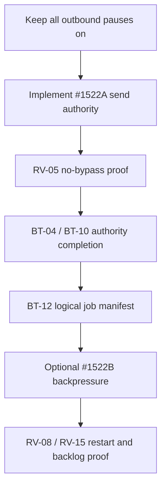

# Task #1522 — Audit, Existing-Task Overlap, and Disposition

**Prepared:** 2026-08-15  
**Input:** `Pasted markdown(5).md`  
**Repository:** `liberty-buildspec-audit`  
**Verified HEAD:** `4819cefac1478ae700c9996427174e822d97c5a5`  
**Review mode:** repository and audit files read-only; no pause, queue, Redis, data, provider, or deployment mutation performed

## Executive verdict

**Do not implement Task #1522 as written.** The proposal correctly identifies that the admin PATCH does not call BullMQ pause/resume and that the canonical sequence path hot-reads the database pause. Its proposed fix is incomplete and creates a new control bug: clearing the global pause would resume queues that may still be paused for manual, maintenance, incident, or automation-specific reasons.

The task also overstates coverage. Static code confirms 57 raw GHL send invocations across 27 files outside `ghl.ts`; the raw email/SMS primitives do not enforce the global pause. Six physical queues therefore cannot constitute a universal outbound kill switch. Several omitted queues initiate outreach or workflow enrollment, while some proposed queues mix outbound and non-outbound work.

Supersede the original task with:

1. **#1522A — Unavoidable Global Outbound Pause Authority**: the P0 safety fix. Make the database pause fail closed at every external send/enrollment primitive and correct startup/mutation races.
2. **#1522B — Reason-Scoped Logical Holds and Queue Backpressure**: an optional operational optimization after #1522A and the BT-12 logical-job manifest. It may reduce dequeues/log noise, but it is not the send-safety authority.

## Original VFC audit

| Original ID | Original claim | Verdict | Verified reality / correction |
| --- | --- | --- | --- |
| VFC-01 | Kill switch requires restart | MOSTLY FALSE | Canonical sequence/SDR paths hot-read the DB pause. The real gaps are bypassable raw transports, startup seeding order, and non-atomic mutation—not restart. |
| VFC-02 | All outbound workers check the kill switch | FALSE | A grep list of selected services is not universal. Raw GHL primitives lack the check, with 57 external invocation matches across 27 files. Broad predeploy exemptions hide many callers. |
| VFC-03 | Admin PATCH persists flag and audit log | CONFIRMED, BUT NON-ATOMIC | `activation.ts:1466-1510` saves requested settings with `Promise.all` and then writes an audit log. Opposing concurrent PATCHes can interleave; settings and audit are not one atomic state transition. |
| VFC-04 | `pauseQueue()` / `resumeQueue()` exist | CONFIRMED | They directly call BullMQ `queue.pause()` / `queue.resume()` and are exposed by operator routes. They have no reason/owner semantics. |
| VFC-05 | Automation registry cache gates outbound queues | PARTIAL | It gates the physical queue key, caches 30 seconds, and invalidates through its admin route. Missing rows and DB errors fail open. It is distinct from global/channel pause. |
| VFC-06 | Exactly six queues are subject to global pause | FALSE / INCOMPLETE | `discovery` can run daily outreach; `enrichment` has a promotional-enrollment job subtype; enrollment recovery can reactivate/send workflows; merchant success creates enrollments. Purpose and logical job—not a six-name physical list—must drive policy. |

## Additional findings missed by the pasted task

| ID | Finding | Priority | Evidence / impact |
| --- | --- | --- | --- |
| N-01 | Raw GHL email/SMS primitives do not check global pause | P0 | `ghl.ts:598-804`; direct callers can bypass queue and orchestrator gates. |
| N-02 | The current predeploy scan has broad exemptions | P0 | Raw transports, workflow/recovery paths, many services, and the entire route layer may pass without a mandatory pause boundary. |
| N-03 | Queue pause does not interrupt an already active processor | P0 design constraint | Send-time recheck remains mandatory. Queue backpressure is defense/efficiency only. |
| N-04 | Global unpause would clear independent physical pauses | P0/P1 | `resumeQueue()` has no reason ownership; the proposed PATCH blindly resumes all listed queues. |
| N-05 | Simultaneous opposing PATCH requests are not idempotent | P0/P1 | `true` and `false` writes/actions can interleave, leaving DB desired state and Redis pause state inconsistent. |
| N-06 | Best-effort queue pause conflicts with “all paused after response” | P1 | A successful DB write plus failed Redis operation cannot truthfully claim all queues paused. Response/audit must distinguish authoritative send state from backpressure state. |
| N-07 | Calling `getQueueManager()` is not a passive accessor | P1 | It may initialize all Queues, Workers, repeat jobs, and startup jobs. The PATCH must not lazily start workers just to apply a pause. |
| N-08 | Startup seeds pause rows after asynchronous QueueManager initialization starts | P0 | A missing row can coexist with running workers; null/error is not uniformly fail closed. |
| N-09 | `post-enrichment` is not purely outbound | P1 | It stamps/advances deals and writes next action in addition to enrollment; physical pause blocks non-outbound processing. |
| N-10 | `enrichment` is a mixed physical queue | P1 | It carries enrichment/scoring work and promotional-enrollment evaluation; pausing the whole queue is overbroad. |
| N-11 | Recovery queues are not categorically non-outbound | P1 | Sequence recovery reactivates paused enrollments; GHL recovery invokes workflow enrollment and may send an alert. Purpose-specific policy is required. |
| N-12 | Clearing queue pause can release a stale backlog/burst | P1 | Resume needs backlog preview, revalidation, rate/cap enforcement, and reason-hold reconciliation. |
| N-13 | A static “isPaused” smoke test does not prove send safety | P0 | It does not cover raw transports, active jobs, startup races, concurrent mutation, multiple processes, or provider dispatch. |

## Queue-policy audit

| Physical queue / path | Pasted disposition | Correct disposition |
| --- | --- | --- |
| `sequences` | Pause | Promotional logical work; eligible for backpressure, but send gateway remains authority. |
| `winback-outreach` | Pause | Promotional logical work; eligible after purpose/idempotency review. |
| `abandoned-statement` | Pause | Message-purpose classification required; may contain lifecycle/transactional communication. |
| `proposal-followup` | Pause | Message-purpose classification required; do not assume every proposal message is promotional. |
| `onboarding-reminder` | Pause | Mixed lifecycle/transactional purpose; classify before holding. |
| `post-enrichment` | Pause | Overbroad: handler also advances deal state and writes audit/next action. Gate/defer only the enrollment effect or split jobs. |
| `enrichment` | Omitted | Mixed queue contains promotional-enrollment evaluation; logical job gating required. |
| `discovery` | Excluded | Can invoke `runDailyOutreach()` when legacy outreach is enabled; runtime flag and purpose gate required. |
| `enrollment-recovery` | Excluded | Can reactivate deferred outreach; apply logical/purpose gate. |
| `ghl-enrollment-recovery` | Excluded | Invokes GHL workflow enrollment; apply purpose/exception policy. |
| `merchant-success` | Excluded | Creates sequence enrollments; classification required. |
| internal/partner digests and operational alerts | Excluded | May be legitimate transactional exceptions, but exceptions must be enumerated, authorized, logged, and tested. |

## Existing 15-task overlap

| Existing task | Overlap | Disposition |
| --- | --- | --- |
| **BT-04 — Unavoidable outbound authority** | Primary | #1522A is the global-pause slice of BT-04. It must not be tracked as an independent competing authority or be used to close full BT-04 contactability work. |
| **BT-10 — Consent/suppression projection** | Supporting | Global/channel pause is one separate input to contactability. #1522 does not resolve consent, DNC, PEWC, quiet hours, evidence conflicts, or channel eligibility. |
| **BT-12 — Scheduler/worker ownership** | Primary for #1522B | Logical-versus-physical identity and independent holds must come from the job manifest. Hardcoded physical queue lists will break under pooling. |
| **BT-06 — Protected release gate** | Supporting | Add no-bypass scans, concurrent mutation tests, startup ordering tests, and exact-release evidence. Existing broad exemptions must be removed/narrowed. |
| **BT-05 — Redis/BullMQ topology truth** | Minor/supporting | Queue readiness and physical paused-state observability are consumed by #1522B; capacity/topology is not fixed by #1522. |
| **RV-05** | Blocking runtime evidence | Current pause/channel values, sends by caller/gateway, blocked-send events, and bypass frequency. |
| **RV-08 / RV-15** | Blocking for queue optimization | Queue states, processes, repeat jobs, flags, pause states, logical ownership, and rolling-deploy behavior. |

## Coverage result

### What the pasted task genuinely covers

- The admin mutation path exists and is admin-only.
- Physical BullMQ pause/resume methods exist.
- Canonical sequence/SDR paths do not need a process restart to observe the DB pause.
- A queue-level backpressure layer could reduce no-op executions and log noise.
- A runtime no-restart test is useful after the architecture is corrected.

### What it does not cover

- Universal send-layer enforcement.
- Raw GHL/SMTP/Gmail/RVM/workflow transport callers.
- Full message-purpose and transactional-exception policy.
- Missing/unreadable pause fail-closed semantics.
- Startup seeding/order race.
- Concurrent mutation/versioning.
- Independent/manual/maintenance pause ownership.
- Mixed physical queues and future pooled queues.
- Active-job behavior and last-moment provider fence.
- Backlog release/revalidation/rate control.
- Multi-process/startup reconciliation.
- Full BT-04 contactability, BT-10 consent, or BT-12 scheduler ownership.

## Recommended execution order

## Original task disposition

- **Do not merge** the original six-queue pause/resume implementation.
- **Retain** the observation that queue-level backpressure is absent.
- **Replace** “resume all six when global=false” with reason-scoped hold removal and reconciliation.
- **Replace** the six-name constant with effect/purpose metadata in the logical-job manifest.
- **Move** send safety into #1522A/BT-04.
- **Treat** physical BullMQ pause as optional optimization, never canonical compliance enforcement.

## Global kill lines

- Do not claim a global kill switch while raw provider primitives can bypass it.
- Do not resume a queue merely because one pause reason cleared.
- Do not trigger QueueManager initialization from a control PATCH.
- Do not treat Redis pause failure as send-safety failure if the fail-closed send authority is intact; report the layers separately.
- Do not return a green “all paused” state when physical reconciliation is partial or unknown.
- Do not pause a mixed queue as a substitute for logical/purpose gating.
- Do not unpause or send externally during implementation or tests.
- Do not close BT-04, BT-10, or BT-12 from this task alone.

## Deliverable manifest

- `00-TASK-1522-AUDIT-OVERLAP-AND-DISPOSITION.md`
- `TASK-1522A-UNAVOIDABLE-GLOBAL-OUTBOUND-PAUSE-AUTHORITY.md`
- `TASK-1522B-REASON-SCOPED-LOGICAL-HOLDS-AND-QUEUE-BACKPRESSURE.md`

