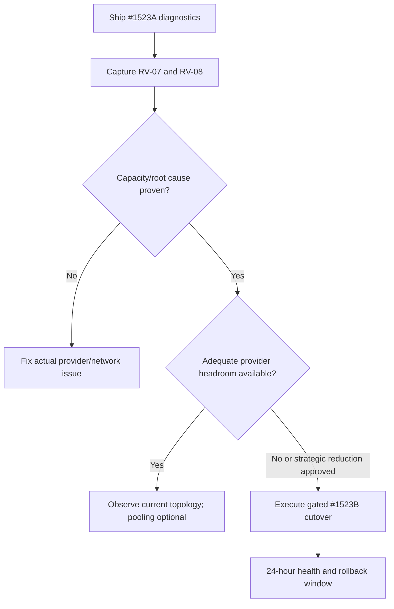

# Task #1523 — Corrected Decision and Execution Pack

**Prepared:** 2026-08-15  
**Repository:** `liberty-buildspec-audit`  
**Verified HEAD:** `4819cefac1478ae700c9996427174e822d97c5a5`  
**Review mode:** repository and audit files read-only; no application, migration, queue, Redis, provider, or deployment changes performed

## Decision

Supersede the original single Task #1523 with two separately deployable tickets:

1. **#1523A — Redis Capacity Truth and Safe Stabilization**: ship the low-risk observability and test corrections without changing queue topology.
2. **#1523B — Conditional Logical-Job Pooling and Safe Redis Cutover**: execute only if #1523A runtime evidence proves topology reduction is still necessary after provider-capacity remediation is considered.

Do not implement the original consolidation proposal as written. It contains an eight-versus-nine candidate mismatch, mixes Worker counts with connection counts, promotes an unverified provider limit and root cause to fact, and proposes removing old schedules without a complete unfinished-job drain or compatibility plan.

## Files in this pack

- `TASK-1523A-REDIS-CAPACITY-TRUTH-AND-STABILIZATION.md`
- `TASK-1523B-CONDITIONAL-LOGICAL-JOB-POOLING-AND-CUTOVER.md`

## Verified current-state baseline

| Fact | Static verdict | Evidence at verified HEAD |
| --- | --- | --- |
| Default physical Worker configurations | CONFIRMED | 23 entries in `QUEUE_CONFIGS`. |
| Legacy-GHL physical Workers | CONFIRMED formula | `activeConfigs()` removes only `GHL_SYNC`, producing 22. Runtime mode remains environment-dependent. |
| Single-process BullMQ estimate | CONFIRMED as an estimate | One shared IORedis client plus one blocking duplicate per Worker: approximately 24 default / 23 legacy-GHL. This is not the account-wide total. |
| Actual provider connection limit | NOT VERIFIED | Code hardcodes 20 and labels it Upstash free-tier capacity; provider/account plan requires runtime evidence. |
| Actual timeout cause | NOT VERIFIED | Timeout text alone does not prove provider connection rejection. |
| Queue-metrics estimate | CONFIRMED DEFECT | `Object.keys(metrics).length` counts two response fields, so the route diagnoses three estimated connections. |
| Resilience topology test | CONFIRMED DEFECT | It calls `diagnoseRedisCapacity(11)` despite 23 current configs. |
| Proposed pool candidates | CONFIRMED | The proposal lists nine jobs: three infrastructure plus six business/communications jobs. |
| Current candidate producers | PARTIALLY CONFIRMED | No static on-demand `Queue.add()` producer was found for the nine queue keys outside `queue-manager.ts`; direct manual handler routes exist and runtime queue contents still require verification. |
| Current kill-switch behavior | CONFIRMED RISK | Unknown registry keys and database errors fail open. Three proposed logical keys are missing from `AUTOMATION_SEEDS`. |
| Current Worker lifecycle telemetry | PARTIAL | One Worker `error` listener exists; no Worker `ready` or `closed` listener is registered. |

## Correct connection arithmetic

### Before pooling

| Mode | Physical Workers | Shared clients in process | Estimated process connections |
| --- | ---: | ---: | ---: |
| Default BullMQ | 23 | 1 | 24 |
| Legacy GHL claimed | 22 | 1 | 23 |

### After replacing nine Workers with two pools

| Mode | Formula | Physical Workers | Shared clients in process | Estimated process connections |
| --- | --- | ---: | ---: | ---: |
| Default BullMQ | `23 - 9 + 2` | 16 | 1 | 17 |
| Legacy GHL claimed | `22 - 9 + 2` | 15 | 1 | 16 |

These are single-process estimates. A two-process rolling deployment may temporarily approach 48 connections before pooling, 34 after pooling, or 52 during an additive old-plus-new-pool compatibility deployment, before other clients/probes. Actual topology and provider accounting must be measured; these formulas are planning bounds, not runtime facts.

## Required sequence

## Closure rules

### #1523A may close when

- topology metrics reflect actual instantiated Workers;
- provider limit is configured or represented as unknown;
- no safe/unsafe claim is made without a known limit;
- the hardcoded 11-queue test is gone;
- exact error, Worker lifecycle, process, observed-client, and estimate telemetry is available;
- the exact release SHA passes required checks; and
- RV-07/RV-08 evidence identifies the disposition: capacity remediation, non-capacity incident, or approved pooling requirement.

### #1523B may open only when

- #1523A is deployed and observed;
- actual plan/limit, process count, client count, and queue states are captured;
- increasing provider headroom has been evaluated and documented;
- the nine-job roster and handler side effects are approved;
- cutover capacity can support old and new Workers concurrently, or an approved maintenance-window alternative exists;
- every candidate handler has an idempotency/concurrency result; and
- rollback has been rehearsed outside production.

### #1523B may close when

- 16 default / 15 legacy-GHL physical Worker topology is generated from one manifest;
- all nine logical jobs retain independent fail-closed controls, schedules, attempts, backoff, startup behavior, heartbeat, history, registry, DLQ, and cost attribution;
- no unfinished job or repeat scheduler remains under an abandoned queue;
- schedule ownership remains singleton through restart and rolling deployment;
- production runtime evidence remains healthy for 24 hours; and
- the rollback window closes with an approved evidence record.

## Global kill lines

- Do not treat 20 as the active provider limit without account evidence.
- Do not call connection capacity the verified root cause from static code or a timeout string.
- Do not change queue names, Worker count, schedules, retries, concurrency, or Redis keys in #1523A.
- Do not start #1523B merely to make a hardcoded `safeForUpstashFree` boolean green.
- Do not remove old repeat schedules while waiting, active, delayed, or retryable jobs remain without compatible consumers.
- Do not allow unknown pool/logical keys or kill-switch lookup errors to run fail open.
- Do not enable or unpause communications as part of either task.
- Do not deploy additive old and new Workers unless measured Redis headroom supports the transient topology.
- Do not hardcode a topology count in a test that should derive from the production manifest.

## Relationship to the consolidated audit pack

- #1523A implements the diagnostic portion of **BT-05 — Redis/BullMQ Topology Truth and Stability**.
- #1523B implements the pooling/cutover portion of **BT-12 — Scheduler and Worker Ownership**.
- #1523A contributes queue/topology checks to **BT-06 — Protected Release Gate**, but does not replace that task.
- Runtime evidence maps to **RV-07**, **RV-08**, and the scheduler/process portions of **RV-15/RV-16**.
- Conditional instantiation of feature-disabled Workers (currently relevant to `voicemail-sync`) remains a named BT-12 follow-up; neither ticket may claim that connection saving.
