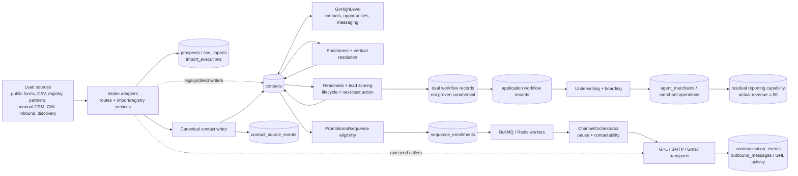

# Liberty Bancard — Current State Engineering Audit

**Audit date:** 2026-08-14 (America/New_York)  
**Repository:** `scottpstevenson/Liberty-Bancard-Website-and-CRM`  
**Verified branch:** `main`  
**Verified commit:** `4819cefac1478ae700c9996427174e822d97c5a5`  
**Review mode:** Read-only architecture, data, production-risk, revenue-operations, and release audit. No fixes were implemented.

## Scope and evidence standard

This report compares the two orientation documents against the GitHub repository at the commit above and against aggregate-only production metadata returned by the connected Replit application. No customer record values, credentials, tokens, or database-backup contents were inspected.

Evidence came from:

- the GitHub repository tree, history, branch settings, and file contents;
- a local clone pinned to the verified commit;
- the connected Replit application and aggregate-only database/worker queries;
- the checked-in Drizzle journal and migration runner;
- static inspection of routes, services, storage adapters, schemas, workers, and QA scripts.

Limitations:

- The clone has no installed `node_modules`, so `npm run check`, build, and test execution could not be performed without fetching dependencies. No dependency installation was done during this read-only audit.
- GitHub reports no pull-request-triggered workflow run for the current HEAD. Therefore the current commit does not have independently observed GitHub Actions evidence in this audit.
- Replit reports that the production database is at the repository migration head, but the latest migration ledger timestamp is `2026-10-08 22:53:20 UTC`, which is in the future relative to this audit. That timestamp anomaly remains unresolved.
- Historical task descriptions and comments were treated as claims until their current code paths or live aggregate state were verified.

## Executive summary

Liberty Bancard is a pre-revenue merchant-services venture with a vertically integrated sales and operations software platform, not merely a marketing website. The application combines public lead capture, bulk prospect intake, enrichment, CRM, lead scoring, readiness, campaign and sequence automation, GHL synchronization, statement analysis, deal management, merchant applications, underwriting/onboarding operations, partner/agent workflows, residual reporting, and merchant-success operations in one Express/React/PostgreSQL codebase. These are implemented capabilities, not evidence that the corresponding commercial workflows have produced customers or revenue.

The architectural direction is generally sound: Liberty has a canonical contact writer, a composite contactability fence, a central deal-stage service, a lifecycle service, durable BullMQ queues, provenance and audit tables, and fail-closed sequence-worker channel checks. Several roadmap items have genuinely shipped, including the vertical bulk-enrollment gate, the SDR pause refresh, a canonical vertical resolver, queue heartbeats, the Ready-for-Outreach queue, and portions of ZeroBounce enforcement.

The system is not ready for scaled outbound automation. The most important reasons are structural rather than cosmetic:

1. The GitHub repository is public and tracks database backups and bulk lead-export assets. This is an immediate incident-containment issue even though this audit did not inspect their contents.
2. Merchant application SSN and bank fields are ordinary text columns and the public finalize route writes request values directly. The live database currently reports zero populated SSN/bank values, but the storage path is not encrypted.
3. The intended outbound authority can be bypassed. Sequence enrollment is substantially safer than described in the old brief, but raw GHL send functions do not enforce the global pause or the complete contactability decision, and 57 call sites across 27 files invoke those primitives outside their defining module.
4. Production workers are currently degraded by Redis connection timeouts. Replit logs show continuing BullMQ failures and job-lock timeouts.
5. The CRM population is not campaign-ready: 153,943 contacts lack a GHL ID, 118,165 lack readiness, 156,588 have no provenance event, and only 255 have a provider-validated email status.
6. Identity quality is weak. There are 74 normalized-email duplicate groups affecting 173 rows and 11,702 normalized-phone duplicate groups affecting 98,056 rows. Shared business numbers may explain many phone matches, but they make phone unsafe as a unique person-level key.
7. The database contains 597 rows in `deals` and two rows in `merchant_applications`, but Liberty has had **zero actual deals and zero revenue**. Those rows must therefore be treated as synthetic, test, demonstration, imported, or otherwise noncommercial until individually classified. The absence of a trustworthy production/test discriminator is itself a critical RevOps data-quality failure.

The safest path is to contain repository exposure first, establish a single enforceable outbound gateway second, restore queue reliability third, and then repair identity/provenance/contactability data before lifting any pause or scaling campaigns. Revenue planning must start from a zero-revenue baseline; pipeline row counts cannot be used as sales traction.

### Confirmed business baseline

- Actual deals: **0**
- Actual merchant revenue: **$0**
- Verified paying/processing merchants: **0 identified in this audit**
- Database `deals` rows: **597 noncommercial/unclassified workflow records—not actual deals**
- Database `merchant_applications` rows: **2 unclassified records—not evidence of real merchant business**
- `Closed Won` rows: **62 database labels—not actual closed-won outcomes**

This correction comes from the business owner and supersedes any inference made from table or stage names. The database needs explicit production/test/demo lineage before it can support executive pipeline or revenue reporting.

## 1. Repository verification summary

| Item | Verified current state | Evidence |
|---|---|---|
| Repository | `scottpstevenson/Liberty-Bancard-Website-and-CRM` | GitHub repository metadata; `origin` in the connected Replit app |
| Visibility | **Public at audit time** | GitHub repository metadata |
| Default/current branch | `main` | GitHub metadata, local `git branch --show-current`, Replit Git state |
| Current commit | `4819cefac1478ae700c9996427174e822d97c5a5` | GitHub, local clone, and Replit all agree |
| Commit message | `Rotate the database backup file` | Git history |
| Branch protection | No required protection/status checks observed for `main` | GitHub branch metadata |
| GitHub Actions at HEAD | No PR-triggered workflow run returned for HEAD | GitHub workflow-run query |
| Replit app | `Liberty Bancard - Website & CRM`; Autoscale deployment | `.replit:1-23`; connected Replit metadata |
| Live URL | `https://dev.libertybancard.com` | Replit publish metadata |
| Runtime entry point | `tsx server/index.ts` in development; `node dist/index.cjs` in production | `package.json:6-11` |
| Server architecture | Express 5 monolith with modular route registrars and background workers | `server/index.ts`; `server/routes.ts:7-79`, `server/routes.ts:81-243` |
| Frontend entry/architecture | React 18 single-page application built by Vite, Wouter, TanStack Query, Tailwind/Radix | `client/src/App.tsx`; `package.json` |
| Database | PostgreSQL 16 via Drizzle ORM | `.replit:1`; `drizzle.config.ts:7-13`; `shared/schema.ts` |
| Queue technology | BullMQ with Redis, with selected interval fallbacks | `server/services/queue-manager.ts`; `server/index.ts:389-423` |
| Migration directory | Root `migrations/`, not `server/db/migrations/` | `drizzle.config.ts:7-10`; `server/db-migrate.ts:56-60` |
| Repository migration head | Journal index 135, tag `0132_outreach_queue_skipped_at` | `migrations/meta/_journal.json` |
| Live migration head | Ledger id 156, hash `c196392a…13aca`; Replit reports it matches journal head | Aggregate Replit query |
| Live migration anomaly | Latest ledger timestamp is two months in the future relative to audit date | Aggregate Replit query |
| Main schema size | One large shared schema file (about 5,510 lines) | `shared/schema.ts` |
| API surface | Approximately 74 route modules/registrars assembled into one Express app | `server/routes.ts:7-79`, `server/routes.ts:110-230` |

The knowledge brief records commit `2075729957…`. That object is not present in the current GitHub repository. The source tree has not materially changed since the brief import commit: excluding assets/backups, the diff from `f3af340` to HEAD contains only `.gitignore` and `README.md`. Most discrepancies below therefore existed when the brief was produced; they are not explained by later application-code changes.

### Repository exposure finding

The public repository tracks 771 files under `backups/` and `attached_assets/`: seven database backup objects and 764 assets, including bulk lead CSV/XLSX exports. One checked backup is a valid approximately 282 MB gzip archive (approximately 1.89 GB uncompressed); six later backup placeholders are 20-byte empty gzip files. The audit did not decompress or inspect database contents. `.gitignore:10-14` now ignores some ZIP/CSV assets, but already tracked files remain in the index and Git history, and `backups/` is not ignored.

Making the repository private reduces ongoing exposure but does not invalidate prior clones or remove sensitive objects from Git history. Containment must include an exposure assessment, credential rotation where applicable, and history cleanup—not just a visibility toggle.

## 2. Confirmed architecture

### Runtime shape

- A single Node 20 process starts Express, serves the API and frontend, runs migrations, seeds reference/configuration data, initializes queues, and starts schedulers (`server/index.ts`).
- `server/routes.ts` registers the authenticated CRM surface plus public, partner, merchant, admin, analytics, onboarding, content, and operational routes.
- The React application is a large SPA in `client/src`, with route composition centered in `client/src/App.tsx`.
- PostgreSQL is the primary system of record. Drizzle schema definitions and Zod insert schemas are centralized in `shared/schema.ts`.
- BullMQ/Redis runs GHL sync, sequences, enrichment, discovery, SLA, onboarding, merchant-success, digest, and other background work. Selected legacy intervals start when BullMQ initialization fails (`server/index.ts:389-423`).
- GHL is an external CRM/messaging mirror, not the canonical owner of Liberty compliance fields. Liberty is the default authority for opportunity stage changes.

### Business model

Liberty intends to sell merchant acquiring/payment-processing services to businesses, primarily SMB merchants. The code supports statement analysis and savings proposals, cash-discount/surcharge programs, terminals, funding, chargeback support, underwriting/boarding, ongoing portfolio management, and agent/partner referrals. At audit time, Liberty has not completed an actual deal and has generated no revenue.

The intended acquisition model brings prospects through public website forms, statement uploads, callbacks, equipment/application forms, partner referrals, registry and discovery pipelines, CSV lists, manual CRM entry, and GHL inbound sync. Sales representatives and operators are intended to qualify, enrich, score, sequence, converse with, and convert contacts into deals. The intended revenue model is processing residuals and related program economics, with schema support for net revenue, agent commissions, and partner commissions (`shared/schema.ts:1996-2043`). Those tables and fields prove product design only; they do not prove realized revenue.

The intended funnel is: acquire a business lead, establish a contactable identity and provenance, enrich and classify it, prioritize it, obtain a statement or discovery conversation, issue a proposal, obtain an application, complete underwriting and onboarding, activate processing, and retain/expand the merchant portfolio.

## 3. Knowledge Brief Accuracy Report

Status meanings: **CONFIRMED** means the central claim matches current code/live state; **PARTIALLY CONFIRMED** means the direction is right but important facts, coverage, or ownership differ; **OUTDATED** means the described state has since been superseded; **INCORRECT** means the claim does not match the audited repository.

| Brief section | Status | Verification, correction, and evidence |
|---|---|---|
| 0. Document Metadata | **INCORRECT** | The recorded Git SHA is not a GitHub object. Current verified SHA is `4819ce…`. Counts and dates are historical. Git/Replit verification. |
| 1. Executive Summary | **PARTIALLY CONFIRMED** | Product scope and dominant risks are directionally right. Two named P0 bugs are now fixed, while public-repository exposure, plaintext application fields, and current Redis degradation were absent or understated. |
| 2. What Liberty Bancard Is | **PARTIALLY CONFIRMED** | Website + CRM + SDR + onboarding + portfolio/residual capabilities are present, but the brief overstates operational maturity if it implies real deals, merchants, or revenue. Actual business baseline is zero deals and zero revenue. |
| 3. Business Goals | **CONFIRMED** | Acquisition, conversion, automation, compliance, partner distribution, and residual-growth goals are directly reflected in routes/services/schema. |
| 4. User / Operator Roles | **CONFIRMED** | Admin, manager, agent/SDR, partner, and merchant-facing flows are implemented. `server/routes.ts:91-108`; route guards and portal routes. |
| 5. Product & Service Offering | **CONFIRMED** | Processing, statement savings, equipment, surcharge/cash discount, funding, chargebacks, onboarding, and residual services are represented. |
| 6. Architecture Overview | **CONFIRMED** | Express/React/Postgres/BullMQ/GHL architecture is accurate. `package.json`; `.replit`; `server/index.ts`. |
| 7. Technology Stack | **CONFIRMED** | Node 20, Express 5, React 18/Vite, Drizzle/Postgres, BullMQ/Redis and listed integrations remain current. `package.json`; `.replit:1-23`. |
| 8. Repository Structure | **PARTIALLY CONFIRMED** | Main package boundaries are correct, but migrations are in root `migrations/`, not `server/db/migrations/`; the route surface is now larger than summarized. `drizzle.config.ts:7-10`; `server/routes.ts:7-79`. |
| 9. Canonical Entity Model | **PARTIALLY CONFIRMED** | The listed entities exist, but several “canonical” ownership statements are aspirational because direct writers remain. `shared/schema.ts`; direct-writer evidence below. |
| 10. Source-of-Truth Matrix | **PARTIALLY CONFIRMED** | Liberty Postgres is primary, but consent, identity, vertical, ownership, deal stage, and application status have competing fields/writers. See verified matrix below. |
| 11. Lead Acquisition & Intake | **CONFIRMED** | Public forms, CSV, GHL, partner, manual, registry, and discovery intake exist. `server/routes/public.ts`; `server/routes/imports.ts`; `server/routes/registry-import.ts`. |
| 12. Prospect Lifecycle | **PARTIALLY CONFIRMED** | Prospect tables/routes exist, but not every path demonstrably converts through one canonical contact pipeline. `shared/schema.ts:1034`; `server/routes/prospects.ts`. |
| 13. Contact Lifecycle | **CONFIRMED** | A forward-only lifecycle service and history are implemented. `server/services/lifecycle-service.ts`. |
| 14. CRM Architecture | **PARTIALLY CONFIRMED** | `writeContact()` is a strong canonical path, but imports, merchant applications, partner organizations, proposals, and generic storage paths still create contacts outside it. `server/services/contact-writer.ts:111-282`; `server/routes/imports.ts:1887-2009`; `server/routes/merchants.ts:319-343`. |
| 15. Merchant / SDR Architecture | **PARTIALLY CONFIRMED** | The subsystem is extensive and the SDR pause is refreshed per sweep now, but identity/vertical/consent interoperability remains fragmented. `server/services/sdr/orchestrator.ts:1367-1371`. |
| 16. Data Provenance | **PARTIALLY CONFIRMED** | Transactional provenance exists in the canonical writer, but 156,588 contacts (99.7%) have no matching source event and CSV events are written later, fire-and-forget. `contact-writer.ts:186-242`; `imports.ts:1984-2009`. |
| 17. Contact Readiness | **PARTIALLY CONFIRMED** | Service exists, but current fields are `dataReadinessScore`, `dataReadinessGrade`, `readinessBreakdown`, `readinessUpdatedAt`, and `readinessModelVersion`; 118,165 contacts are unscored. `shared/schema.ts:138-144`; `server/services/contact-readiness.ts`. |
| 18. Lead Scoring | **CONFIRMED** | Component and total scoring exist and feed deal priority/routing, though some callers bypass the full new-lead orchestrator. `server/services/lead-scoring.ts`; `server/services/process-new-lead.ts:78-109`. |
| 19. Enrichment | **CONFIRMED** | Enrichment jobs/runs, provider adapters, post-enrichment processing, and audit surfaces exist. `shared/schema.ts:1107`, `2967`; `server/services/post-enrichment-worker.ts`. |
| 20. Vertical Classification | **PARTIALLY CONFIRMED** | Multiple taxonomy risk remains, but a source-authority-aware canonical SDR resolver now exists. `server/services/sdr/canonical-vertical-resolver.ts`; `server/services/contact-readiness.ts:63-67`. |
| 21. Registry / Sunbiz / Discovery | **CONFIRMED** | Registry import, discovery, alias, and business ingestion infrastructure is present. `server/routes/registry-import.ts`; related schema/services. |
| 22. Deals / Pipeline | **INCORRECT** | The software and central transition service exist, but 597 database rows are not actual deals. They are noncommercial/unclassified records and include conflicting stage labels. `deal-stage-service.ts:21-284`; live aggregate plus owner correction. |
| 23. Applications / Merchant Onboarding | **PARTIALLY CONFIRMED** | Application, underwriting, boarding and onboarding features exist; only two applications are live, status has competing writers, and sensitive fields are not encrypted in the inspected path. `shared/schema.ts:1730-1816`; `merchants.ts:293-309`. |
| 24. Sequence Architecture | **CONFIRMED** | Durable enrollment, uniqueness, worker scheduling, pause checks, and channel dispatch are implemented. `shared/schema.ts:1504-1520`; `server/services/sequence-worker.ts`. |
| 25. Promotional Enrollment | **PARTIALLY CONFIRMED** | Eligibility service and durable enqueue exist; readiness/lead score are intentionally not eligibility gates. The former vertical bulk bypass has been fixed. `promotional-enrollment-eligibility.ts:208-335`; `campaigns.ts:1101-1255`. |
| 26. Outbound Queue / Workers | **PARTIALLY CONFIRMED** | Architecture is correct and all enrollments are paused, but live production BullMQ workers are degraded by Redis `ETIMEDOUT` failures. `queue-manager.ts`; aggregate Replit logs. |
| 27. Email Architecture | **PARTIALLY CONFIRMED** | Multiple transports and CAN-SPAM footer injection exist. ZeroBounce is partial/fail-open, and raw GHL functions remain widely callable outside the orchestrator. `ghl.ts:598-744`; `sequence-worker.ts:509-588`. |
| 28. SMS / Phone Architecture | **PARTIALLY CONFIRMED** | SMS feature and PEWC gates exist in contactability, but raw `sendGhlSms()` checks only phone and `consentSms`; A2P operational registration was not independently verified. `contactability.ts:586-742`; `ghl.ts:746-804`. |
| 29. Consent / Contactability / Suppression | **PARTIALLY CONFIRMED** | Composite fence is strong, but it is not the unavoidable send authority and live consent fields conflict. `contactability.ts:484-742`; aggregate counts below. |
| 30. GHL Integration | **PARTIALLY CONFIRMED** | GHL ID uniqueness/conflict handling and Liberty-owned field protection are present. Coverage remains 3,054/156,997 contacts (1.9%). `ghl-sync.ts`; `ghl.ts:415-491`; live aggregates. |
| 31. Public Forms | **PARTIALLY CONFIRMED** | Major website forms call `processNewLead()`, but the merchant-application finalize flow creates a contact through generic storage and directly persists application fields. `public.ts:357,523,783,1008,1169,1297`; `merchants.ts:293-343`. |
| 32. Import Systems | **PARTIALLY CONFIRMED** | Import execution and progress code exists, but live `import_executions` is zero and CSV contact creation still bypasses `writeContact()`. `imports.ts:1887-2009`; live aggregate. |
| 33. Campaign / Audience Architecture | **OUTDATED** | Audience/campaign design remains, but the highlighted vertical bulk-enrollment bypass is no longer present; preview and run paths call sequence eligibility. `campaigns.ts:1101-1255`. |
| 34. Scheduled Jobs / Recovery | **PARTIALLY CONFIRMED** | BullMQ, fallbacks, locks and recovery exist. Weekly digest locking and heartbeats have shipped, but production Redis is degraded and interval fallbacks remain. `index.ts:389-423`; `queue-manager.ts`. |
| 35. Authentication / RBAC | **CONFIRMED** | Replit auth/session integration, role guards, CSRF, partner restriction, and permissions audit are implemented. `routes.ts:3-5`, `85-108`, `227-230`. |
| 36. Database / Migrations | **INCORRECT** | The stated `server/db/migrations` path/count is wrong. There are 138 root SQL migration files and 136 journal entries; the custom runner also seeds/guards ledger state and applies runtime DDL. `drizzle.config.ts:7-10`; `db-migrate.ts:4-41`, `56-70`, `90-187`, `297-328`. |
| 37. Dashboard / Operator Experience | **PARTIALLY CONFIRMED** | Broad dashboards exist and Ready-for-Outreach shipped, but queue degradation and inconsistent funnel data reduce operational trust. `server/routes/outreach-queue.ts`; `client/src/App.tsx`. |
| 38. Analytics / Reporting | **PARTIALLY CONFIRMED** | Analytics/residual-reporting capabilities are broad, but there is no realized revenue and database stage counts do not represent actual commercial outcomes. Direct writers and duplicate stages further weaken reporting. |
| 39. Observability / Production Health | **PARTIALLY CONFIRMED** | Job registry, heartbeats, audit routes and Sentry exist; however observed Redis failures continue and current HEAD lacks observed CI evidence. |
| 40. External Integrations | **CONFIRMED** | GHL, Gmail/SMTP, enrichment/search, Sentry, Redis and processor adapters are present. `package.json`; `server/services`. |
| 41. Environment / Configuration | **PARTIALLY CONFIRMED** | Replit modules/deployment and env-driven behavior match, but secret completeness and third-party registration cannot be proven solely from source. `.replit`; `server/services/launch-readiness-full.ts`. |
| 42. Production Data Quality | **PARTIALLY CONFIRMED** | Current counts are 156,997 contacts, 597 noncommercial/unclassified deal rows, 409 source events, and 663 paused enrollments. Treating table counts as real pipeline was incorrect. |
| 43. Test / Dummy / Demo Data | **PARTIALLY CONFIRMED** | Demo seeding is production-gated, but tracked asset/backups require cleanup and live test-contact counts were not re-established. `index.ts:384-387`; Git tree. |
| 44. Security / Privacy | **PARTIALLY CONFIRMED** | Auth/security controls exist, but the brief omits the public repository exposure and direct plaintext handling of merchant SSN/bank fields. `schema.ts:1757,1765-1766`; `merchants.ts:293-309`. |
| 45. Existing Tests & QA Gates | **PARTIALLY CONFIRMED** | Thirty predeploy suites are declared, but broad exemptions include routes and raw transports, and CI runs only a subset. No workflow run was observed for HEAD. `scripts/pre-deploy.ts:67-246`, `418-534`; `.github/workflows/wave12-ci.yml`. |
| 46. Legacy / Deprecated Paths | **CONFIRMED** | Legacy/fallback paths still coexist with newer services; this remains a maintenance and ownership concern. `index.ts:404-423`; route comments. |
| 47. Known Bugs / Risks | **OUTDATED** | Vertical bulk enrollment and SDR pause refresh are fixed; direct GHL sends, email validation, imports, taxonomy, and Redis risks remain. New public-data and sensitive-field risks outrank the old list. |
| 48. Current Kill Lines | **PARTIALLY CONFIRMED** | All four live pause flags are true and active enrollments are zero. The claim is not universal because raw GHL sends do not query the global pause. `channel-orchestrator.ts:132-181`; `ghl.ts:598-804`. |
| 49. Recommended Audit Priorities | **OUTDATED** | The ordering must begin with repository/data containment, plaintext sensitive-field protection, raw-send authority, and live Redis restoration. |
| 50. Open Questions / Unverified Areas | **PARTIALLY CONFIRMED** | Several counts/migration/worker questions are now answered; A2P, external provider configuration, historical backup contents, and complete test execution remain unverified. |
| 51. Glossary | **CONFIRMED** | Terms align with current services and schema. |
| 52. Important File Index | **PARTIALLY CONFIRMED** | Most entries remain useful; migration paths and some newer route/worker components are missing or stale. |

## 4. Actual data lifecycle

| Transition | Owning service/path | Primary tables | Writers | Readers/consumers | Principal risks |
|---|---|---|---|---|---|
| Lead source → raw record | Public routes, imports, prospects, registry/discovery, partner/GHL adapters | `prospects`, `csv_imports`, `import_executions`, uploaded assets | Public route handlers; import/registry services; GHL sync | Intake UI, import reconciliation, conversion services | Public raw files; inconsistent validation; `import_executions` live count zero |
| Raw record → CRM contact | Intended: `writeContact()`; alternatives remain | `contacts`, `contact_source_events` | Contact writer, public routes, imports, merchant route, generic storage, partner/proposal services, GHL sync | CRM, GHL sync, scoring, readiness, campaigns | Duplicate identity; non-atomic provenance outside canonical writer; mixed normalization |
| Contact → enrichment | Enrichment queue/providers; registry/business ingestion | `enrichment_jobs`, `enrichment_runs`, `contacts`, business/alias tables | Enrichment workers and adapters | Readiness, scoring, SDR, routing | Provider completeness, stale values, multiple vertical writers |
| Contact → vertical | Canonical SDR resolver plus legacy classifiers/import mappings | `contacts.vertical`, enrichment evidence | Resolver, imports, forms, enrichment, operators, GHL-limited sync | Sequences, readiness, scoring, campaigns, content | Multiple taxonomies and authority rules; segment drift |
| Contact → readiness | `contact-readiness.ts`; queue hook from contact writer | readiness fields on `contacts` | Readiness service/worker | Ready-for-Outreach, operators, analytics | 75.3% unscored; imports bypass hook; field names differ from brief |
| Contact → lead score | `lead-scoring.ts`, `processNewLead()` | score fields on `contacts`; priority on `deals` | Scoring service; direct import caller; pipeline orchestrator | Smart router, SLA, reps, dashboards | Multiple invocation paths; score/readiness concepts are easy to conflate |
| Contact → campaign/audience | Campaign routes and filters | `campaigns`, audience/filter metadata, `contacts` | Campaign admin routes | Promotional eligibility, reporting | Data quality/vertical drift; preview/run consistency must remain tested |
| Campaign/contact → sequence enrollment | Promotional and sequence eligibility services | `sequence_enrollments`, sequence definitions/steps | Enrollment services and selected routes/workflows | Sequence worker, dashboards | Eligibility intentionally omits readiness/score; competing enrollment entry points |
| Enrollment → outbound send | Sequence worker → ChannelOrchestrator → transport | enrollments, outbound/communication/audit tables | Sequence worker and orchestrator | GHL/SMTP/Gmail; CRM activity | Central gate can be bypassed by raw send callers; validation can fail open |
| Inbound/outbound → conversation state | GHL webhooks/sync and local communication logs | `ghl_activity_log`, `communication_events`, `outbound_messages`, contact activity | GHL integration, transports, workflow handlers | Inbox, CRM timeline, workflow engine | Split external/local truth; direct merchant sends may lack a contact identity |
| Contact/conversation → opportunity record | Smart routing, manual/bulk/AI/SLA/workflow actions | `deals` | Central stage service plus direct `storage.updateDeal()` callers | Pipeline, analytics, GHL opportunity sync, lifecycle | Records are not actual deals; no production/test discriminator; bypassed side effects and split vocabulary |
| Deal record → application record | Merchant application public/admin routes | `merchant_applications` | Draft/finalize routes, admin/approval/e-sign/GHL workflows | Underwriting, processor adapters, onboarding | Records are not proven commercial; no canonical status-transition owner; sensitive text fields |
| Application → onboarding | Deal-stage service, boarding, underwriting, checklists | applications, onboarding deals/checklists/conditions, `agent_merchants` | Approval/underwriting/boarding services | Merchant portal, operations, processor adapters | Stage/status drift; direct stage writes; incomplete funnel state |
| Onboarded merchant → intended revenue | Portfolio/residual import/reporting | `agent_merchants`, `residual_reports`, `merchant_residuals` | Residual import and merchant operations | Executive, agent, partner, portfolio dashboards | No actual revenue exists; synthetic/unclassified records can create false revenue or commission reporting |

`processNewLead()` claims every intake source calls it, but observed call sites are the six public-form paths in `server/routes/public.ts`; bulk import instead calls scoring directly and does not run the full scoring → routing → lifecycle → NBA → SLA sequence (`process-new-lead.ts:1-15`, `57-206`; `imports.ts:1907-1944`).

## 5. Verified source-of-truth map

| Concept | Canonical field/system | Intended mutation owner | Competing writers / representations | Drift risk |
|---|---|---|---|---|
| Contact identity | `contacts.id` is Liberty's local identity | Contact writer/storage | Email, phone, GHL ID, prospects and business aliases are alternate match keys | **High**—no universal normalized person key |
| Email | `contacts.email` | `writeContact()` and guarded updates | Imports, generic storage, merchant/partner/proposal paths, GHL inbound | **High**—DB uniqueness is case-sensitive raw text; 74 normalized duplicate groups |
| Phone | `contacts.phone` | Contact writer/guarded updates | Same direct writers; GHL inbound | **Critical for SMS identity**—no unique normalized constraint; 98,056 affected rows |
| Consent | Composite of `consentTier`, `consentEmail`, `consentSms`, PEWC evidence/audit fields | Contactability/consent services | Forms, GHL, imports, operators, legacy fields | **High**—358 noncanonical PEWC tiers and reporting inconsistencies |
| DNC / suppression | Composite contactability decision over DNC, opt-out, status and suppression fields | `contactability.ts` plus unsubscribe/DNC handlers | `doNotContact`, `doNotAutoContact`, `optedOutEmail`, `emailStatus`, channel status, tier, global suppression | **High**—51 email-status/boolean conflicts; raw sends bypass composite decision |
| GHL identity | `contacts.ghlContactId` with partial unique index | GHL upsert/sync services | Contact writer pre-upsert, inbound sync, retry loop | **Medium/High**—conflict guard is good; 98.1% of contacts have no ID |
| Vertical | `contacts.vertical` | Canonical vertical resolver should arbitrate | Imports, forms, enrichment, operator, legacy mapping/scoring taxonomies | **High**—source authority exists but consumers use different vocabularies |
| Lead score | `contacts.leadScore` and component fields | `lead-scoring.ts` | Pipeline orchestrator and direct import invocations | **Medium**—single algorithm, multiple incomplete orchestration paths |
| Readiness score | `dataReadinessScore`, `dataReadinessGrade`, breakdown, model/version timestamps | `contact-readiness.ts`/readiness queue | Backfills and any direct updates | **High operational**—75.3% null |
| Provenance | `contact_source_events`; `contacts.primarySourceEventId` | `writeContact()` transaction | CSV later/fire-and-forget events, historical imports, GHL event upsert | **Critical data lineage**—99.7% have no matching event |
| Sequence enrollment | Active/paused row in `sequence_enrollments` with partial uniqueness | Promotional/sequence eligibility services | Campaigns, smart router, workflows, admin/manual paths | **Medium/High**—gates improved, but entry points remain distributed |
| Deal ownership | `deals.owner` for pipeline ownership | Deal services/operators | `contacts.assignedTo`, agent identity, `agent_merchants.agentId` | **High for RevOps**—email/string and FK ownership models can diverge |
| Deal stage | `deals.stage`, transitioned through `advanceDealStage()` | `deal-stage-service.ts` | Generic storage and statement/outreach services | **High**—bypasses lifecycle, analytics, GHL and onboarding side effects |
| Application status | `merchant_applications.status` plus underwriting/e-sign fields | No single verified owner | Public draft/finalize, admin, approval, e-sign and workflow handlers | **High**—three status domains and multiple writers |

## 6. Critical production-risk audit

### Contact integrity

The contact writer is a credible canonical implementation: it owns source-category values, writes the contact and source event in one transaction, updates the primary event pointer, emits an audit change, and schedules readiness and scoring (`contact-writer.ts:111-282`). It is not actually universal.

The CSV path builds contacts and inserts them directly (`imports.ts:1822-1861`, `1887-1957`). Its source events are written after all batches, fire-and-forget, and the contact's `primarySourceEventId` is not set (`imports.ts:1984-2009`). The merchant application path also calls `storage.createContact()` directly (`merchants.ts:319-343`). Other direct creation paths exist in partner organizations and proposal services.

`contacts.email` has a partial unique index on the stored string, while lookup code lowercases values. Without write-time canonicalization or a functional unique index, case/whitespace variants can coexist. `contacts.phone` has an index but no normalized uniqueness rule. The live duplicate aggregates confirm both failure modes.

The merge implementation rewires a limited set of older dependent tables before archiving a duplicate. The schema has since grown substantially, so newer contact foreign keys may remain attached to the archived duplicate. A complete FK inventory is required before relying on merge as identity repair.

### Outreach safety

The sequence path is materially safer than the brief suggests:

- vertical bulk campaign preview/run now calls sequence eligibility;
- active/paused enrollment uniqueness exists;
- the sequence worker reloads global/channel pause state;
- the worker calls contactability and ChannelOrchestrator;
- the live system has zero active enrollments and 663 paused enrollments;
- all four live pause flags are true.

However, the answer to **“Can any contact enter automated outreach without passing the intended gates?” is yes at the send layer**. A contact may not enter the canonical sequence path, yet an automated workflow/service can invoke `sendGhlEmail()`, `sendGhlEmailForMerchant()`, or `sendGhlSms()` directly. The raw email functions check contact/email or a raw email address and inject a footer, but they do not check global pause, DNC, consent tier, suppression, or contactability (`ghl.ts:598-744`). Raw SMS checks only phone and `consentSms`, not global pause, DNC, PEWC audit evidence, quiet hours, A2P/feature flags, or rate limits (`ghl.ts:746-804`). There are 57 such invocation matches across 27 files outside `ghl.ts`.

The predeploy compliance scan does not eliminate this risk. It exempts raw transports, GHL, campaign/workflow paths, transactional services, SDR downstream services, and the route layer (`scripts/pre-deploy.ts:418-534`). The lower-level compliance scan also contains an extensive allowlist. A 30/30 green run therefore means the declared checks passed, not that every send must cross one authoritative decision point.

ZeroBounce in the sequence worker blocks invalid/unsafe results when the provider succeeds. It proceeds when the daily budget is exhausted, no validation credit is acquired, or the provider errors (`sequence-worker.ts:509-588`). With 156,382 contacts at the default `active` status and only 255 at `valid`, the current semantics are unsafe for broad email activation.

### Live suppression state

All outbound pause settings are `true`; active enrollments are zero. The data itself still contains representational conflicts:

- 752 contacts have at least one suppression flag;
- 199 have `do_not_contact=true` but a nonsuppressed `consent_tier`;
- 51 have `email_status=opted_out` without `opted_out_email=true`;
- 358 have `pewc`/`PEWC` rather than canonical `pewc_full_automation` and will fail exact-tier SMS/voice checks (`contactability.ts:115-138`, `586-596`).

The composite fence reads several of these signals, so no positive “channel enabled while suppressed” conflicts were found in the aggregate query. Any boolean-only or tier-only caller remains unsafe.

### Data quality

| Metric | Current live result | Operational implication |
|---|---:|---|
| Contacts | 156,997 | Large acquisition asset, not yet a safe addressable audience |
| Missing GHL ID | 153,943 (98.1%) | GHL cannot reliably act as execution/engagement mirror |
| Null readiness | 118,165 (75.3%) | Ready-for-Outreach prioritization covers a minority |
| No matching provenance event | 156,588 (99.7%) | Source ROI, suppression lineage, and import accountability are weak |
| Provider-validated email status | 255 (0.16%) | Broad email activation would carry deliverability/reputation risk |
| Default `active` email status | 156,382 (99.6%) | “Active” primarily means unvalidated, not deliverable |
| Normalized-email duplicate groups | 74 groups / 173 rows | Conflicting identity, consent and GHL mappings possible |
| Normalized-phone duplicate groups | 11,702 groups / 98,056 rows | Phone cannot be used as a person-level unique identity; shared business lines likely common |
| Contact source events | 409 | Provenance implementation covers only recent writes |
| `import_executions` | 0 | Historical imports cannot be reconciled through the intended ledger |

### Revenue workflow

The central deal-stage service correctly couples stage changes with lifecycle, GHL opportunity sync, analytics, proposal follow-up, onboarding kickoff, portal invitation, and underwriting initialization (`deal-stage-service.ts:21-284`). Multiple direct writers bypass that contract: outreach queue, statement upload/acquisition, and generic batch storage updates among them (`outreach-queue.ts:368`; `statement-upload-chain.ts:188,620`; `statement-acquisition.ts:219,412,424`; `storage/deals.ts:319`).

The database's deal-record distribution is below. These are **not actual deals or commercial outcomes**:

| Pipeline/stage | Count |
|---|---:|
| Sales — Proposal Sent | 173 |
| Sales — Statement Received | 147 |
| Sales — New Lead | 72 |
| Sales — Closed Won label | 62 |
| Sales — `proposal` (stale name) | 51 |
| Sales — Statement Requested | 46 |
| Onboarding — Go-Live Scheduled | 46 |

Two application records exist: one `in_progress`, one `submitted`. Neither the application rows nor the 597 deal rows may be counted as real pipeline. The more fundamental issue is that test/demo/imported workflow data is not cleanly separated from commercial truth. Until that is repaired, conversion rates, stage velocity, win rate, merchant count, and revenue forecasts are invalid.

Merchant application fields `owner_ssn`, `bank_routing_number`, and `bank_account_number` are text columns (`shared/schema.ts:1757`, `1765-1766`). The finalize route copies allowed request values directly into a Drizzle update (`merchants.ts:293-309`). `CREDENTIAL_ENCRYPTION_KEY` is used by credential/OAuth services, but no encryption call is present in this application write path. Live aggregates show zero populated SSN, bank-routing, and bank-account values and one populated EIN, which reduces current exposure but does not make the design acceptable.

## 7. Existing task and roadmap reality

| Roadmap item/group | Verified state | Evidence/remaining work |
|---|---|---|
| P0-1 vertical bulk enrollment | **Shipped** | Preview/run call eligibility in `campaigns.ts:1101-1255`. |
| P0-2 SDR global pause restart gap | **Shipped** | Pause is reloaded per sweep in `sdr/orchestrator.ts:1367-1371`. |
| P0-3 ZeroBounce before lift | **Partially shipped** | Sequence-time validation exists but fails open on budget/provider errors; creation-time coverage is absent. |
| P0-4/P4-1 direct GHL migration | **Partially shipped** | ChannelOrchestrator exists, but 57 raw calls remain in 27 external files. |
| P0-5 A2P registration | **Operationally unverified** | Feature/contactability gates exist; external registration status was not proven. |
| P1-1 GHL reconciliation | **Not complete** | 153,943 contacts still lack a GHL ID. |
| P1-2 readiness backfill | **Partially complete** | 38,832 contacts appear scored; 118,165 remain null. |
| P1-3 test/QA cleanup | **Unverified/incomplete** | Live test-contact count not re-established; tracked data assets remain. |
| P1-4 historical import ledger | **Not shipped** | `import_executions` contains zero rows. |
| P1-5 phone duplicate audit | **Problem quantified, not resolved** | 11,702 groups affect 98,056 rows. |
| P2-1 imports through contact writer | **Not shipped** | Direct insert remains in `imports.ts:1887-1957`. |
| P2-2 public form validation | **Partially shipped** | Major forms are structured; merchant finalize still directly accepts/writes sensitive allowed fields. |
| P2-3 prospect review | **Partially complete/unverified** | Prospect subsystem exists; canonical conversion coverage is not established. |
| P3-1 vertical harmonization | **Partially shipped** | Canonical resolver exists; readiness/scoring/import consumers still use different vocabularies. |
| P3-2 bulk enrichment | **Not verified as complete** | Infrastructure exists; current completeness was not proven. |
| P3-3 creation-time ZeroBounce | **Not shipped** | Validation is lazy in sequence worker, not guaranteed at contact creation. |
| P3-4 email status semantics | **Not shipped** | `active` still means mostly unvalidated. |
| P4-2 job idempotency | **Partially shipped** | Weekly digest has a DB lock; not every scheduled path was proven. |
| P4-3 Upstash upgrade | **Not complete** | Production logs show ongoing connection timeouts consistent with the current cap. |
| P4-4 BullMQ heartbeat | **Shipped** | Worker health/job registry exists; it is surfacing real degradation. |
| P4-5 content optimization | **Planned/ongoing** | Content exists; conversion experiments were not verified end to end. |
| P5 revenue funnel | **Software shipped; commercial outcome absent** | Statement, proposal, application and pipeline features exist, but there have been zero actual deals and zero revenue. Existing records are not trustworthy commercial funnel evidence. |
| P6 operator experience | **Partially shipped** | Ready-for-Outreach queue is shipped; inbox/briefing/engagement enhancements vary by feature. |
| P7 conversion optimization | **Mostly planned/partially instrumented** | Analytics events exist; trustworthy stage and attribution data is a prerequisite. |
| P8 cleanup/hardening | **Incomplete** | Tracked backups/assets, legacy scheduling, documentation drift, and source-of-truth bypasses remain. |

## 8. Top 20 production risks

1. **P0 — Public repository with tracked data artifacts.** Database backups and bulk lead exports are publicly reachable and persist in Git history.
2. **P0 — Sensitive merchant application fields are not encrypted at rest by the application path.** SSN and bank fields are plain text columns/direct updates; currently empty live values do not remove future exposure.
3. **P0 — Outbound authority is bypassable.** Raw GHL email/SMS functions do not enforce the complete pause/contactability policy and have 57 external call sites.
4. **P1 — Production Redis/BullMQ is actively degraded.** Repeated worker `ETIMEDOUT` and job-lock failures make background execution unreliable.
5. **P1 — `main` lacks enforced branch protection/status checks.** Direct pushes can deploy without required CI or review; no workflow run was observed for HEAD.
6. **P1 — Migration truth is nonstandard and hard to reproduce.** Baseline seeding, guarded migrations, duplicate/missing journal indices, runtime DDL repair, and a future ledger timestamp weaken release confidence.
7. **P1 — Email identity is not normalized atomically.** Case/whitespace variants bypass raw-string uniqueness; 173 rows are affected by normalized duplicates.
8. **P1 — Phone identity is massively ambiguous.** 98,056 rows share a normalized phone with another row; SMS consent cannot safely be inferred across those identities.
9. **P1 — CSV import bypasses canonical contact creation.** Readiness, full new-lead orchestration, atomic provenance, normalization, and GHL behavior diverge.
10. **P1 — Historical provenance is nearly absent.** 99.7% of contacts lack a source event, undermining ROI attribution, auditability, and safe list governance.
11. **P1 — Email validation is mostly absent and fails open.** Only 255 addresses are provider-validated; default `active` is misleading.
12. **P1 — Consent/suppression representations conflict.** DNC/tier and email-status/boolean mismatches allow inconsistent reports and unsafe simplified callers.
13. **P1 — GHL identity coverage is only 1.9%.** Sync, conversation linkage and external opportunity automation cannot cover most CRM records reliably.
14. **P1 — Readiness coverage is only 24.7%.** Ready-for-Outreach and rep prioritization are incomplete for most inventory.
15. **P1 — Deal stages have competing writers.** Direct updates bypass lifecycle, analytics, GHL sync, onboarding and go-live side effects.
16. **P1 — The CRM lacks trustworthy commercial truth.** It contains 597 deal rows and `Closed Won` labels despite zero actual deals; test/demo/imported data cannot be safely distinguished from real pipeline, and application status also lacks one transition owner.
17. **P2 — Contact merge may leave newer relationships on archived duplicates.** The merge rewires only a subset of dependent tables.
18. **P2 — Vertical remains a multi-taxonomy field.** A canonical resolver exists, but readiness, scoring, imports and campaigns do not share one enforced vocabulary.
19. **P2 — Startup pause seeding races queue initialization.** Queue initialization starts asynchronously before missing pause rows are seeded; null pause is not uniformly fail-closed outside sequence workers (`index.ts:389-423`, `475-506`).
20. **P3 — QA gates can create false confidence.** Broad exemptions and limited CI coverage allow risky send paths and large modules to remain green without proving end-to-end policy enforcement.

## 9. Compliance risks

- Publicly tracked backups/lead exports require immediate privacy, legal/compliance triage, and Git-history containment.
- SSN, EIN, and bank data should not be accepted into plain text application fields; field-level encryption/tokenization, redaction, access logging, retention and processor handoff boundaries are required.
- The ChannelOrchestrator/contactability service must become the unavoidable send authority for promotional email/SMS/voice—not an optional wrapper.
- DNC, opt-out, consent tier, PEWC evidence, channel consent, status, global suppression and unsubscribe state need one documented evaluation contract and mutation workflow.
- The 358 noncanonical PEWC values must not be silently interpreted as permission. Resolve evidence and migrate only after an auditable consent review.
- SMS must remain paused until A2P/10DLC status, PEWC evidence, quiet hours, number ownership, and provider configuration are verified operationally.
- CAN-SPAM footer injection exists, but `sendGhlEmailForMerchant()` can send to a raw email without a contact ID, weakening signed-unsubscribe linkage and audit correlation.
- Production pause state is currently safe at the canonical sequence path, but it is not a system-wide kill switch while raw transports remain callable.

## 10. Revenue blockers and top 10 opportunities

1. **Establish commercial truth.** Add an auditable production/test/demo classification and quarantine the 597 existing deal rows from executive pipeline and revenue reporting.
2. **Prove the first-sale funnel manually.** Define one real ICP, one offer, one qualification path, one statement-analysis workflow, and one application/boarding path before scaling automation.
3. **Build a small validated outreach cohort.** Start with identity-clean, provider-validated, provenance-known, readiness-scored contacts—not the full 156,997-record database.
4. **Make statement acquisition the primary conversion event.** Measure real prospect → conversation → statement received → proposal → application, with operator ownership and follow-up SLAs.
5. **Restore queue reliability.** Redis timeouts make enrichment, SLA, sequence, onboarding and digest automation unreliable even before the first customer arrives.
6. **Backfill readiness selectively.** Score the best-evidenced ICP segments first rather than spending resources across 118,165 unready records indiscriminately.
7. **Reconcile GHL selectively.** Sync only real, identity-clean, contactable prospects; do not export 153,943 ambiguous contacts simply to increase coverage.
8. **Normalize identity before SMS/calling.** Resolve shared numbers, entity-vs-person semantics, ownership, and consent for duplicate-phone populations.
9. **Unify vertical and message taxonomy.** Use one ICP/vertical map so messaging experiments can produce interpretable first-revenue evidence.
10. **Instrument first revenue end to end.** When the first real merchant advances, link source, contact, deal, statement, proposal, application, underwriting, activation, ownership, and residual revenue without synthetic records contaminating metrics.

## 11. Recommended build roadmap

Priority is ordered by (1) immediate risk reduction, (2) revenue unlock, and (3) architectural leverage. Each task should begin with a dry-run/inventory and a migration/rollback plan. No task should lift outbound pauses as a side effect.

### Next five engineering tasks

1. **Repository and sensitive-data containment.** Make the repository private; inventory exposed objects without copying record contents; rotate potentially exposed database/API credentials; remove backups and raw exports from the current tree and Git history using a coordinated history rewrite; add backup/asset policies and secret/data scanning; document notification/legal review. Preserve a controlled forensic copy.
2. **Enforce one outbound send authority.** Make raw GHL/SMTP/Gmail transport functions internal, route every automated send through ChannelOrchestrator/contactability, require an explicit transactional-vs-promotional policy and contact identity, make global pause fail closed, remove broad exemptions, and add tests that fail when a new bypass appears.
3. **Restore background-job reliability and release controls.** Upgrade/resize Redis, verify connection counts and workers, add alert thresholds, make fallback ownership explicit, protect `main`, and require typecheck/build/critical compliance/integration tests for every deploy.
4. **Canonicalize contact identity and intake.** Define normalized-email and normalized-phone semantics; dry-run duplicate classification; inventory every contact FK before merge; route imports and all creation paths through a batch-capable canonical writer; write provenance/readiness/scoring atomically or durably; add carefully staged functional indexes/migrations.
5. **Create a trustworthy first-revenue state machine.** Classify/quarantine every existing deal and application record, force future stages through `advanceDealStage()`, add a production/test discriminator, establish one application-status transition service, and instrument the first real prospect through activation and residual revenue.

### Release gates before outbound activation

Outbound automation should remain paused until all of the following are evidenced:

- repository exposure is contained and credentials are reviewed/rotated;
- no automated send can bypass global pause/contactability;
- Redis workers are healthy for a sustained observation window;
- identity, DNC, consent, and suppression conflicts are reconciled for the target cohort;
- target emails are validated under explicit fail-closed semantics;
- SMS/A2P/PEWC evidence is independently verified before any SMS cohort is enabled;
- a canary cohort passes duplicate, provenance, readiness, unsubscribe, bounce, complaint, rate-limit, and audit-log checks;
- protected-branch CI runs the critical gate suite against the exact release commit;
- rollback and immediate global-kill procedures are rehearsed.

## 12. Final disposition

The prior knowledge brief is useful as orientation but is not a reliable release record. Its business and high-level architecture descriptions are strong. Its migration inventory, source-of-truth certainty, QA assurance, current bug list, and “kill line” guarantees are materially inaccurate or incomplete.

Liberty's best existing architectural assets are the contact writer, contactability service, sequence-worker gates, deal-stage service, lifecycle service, queue registry, and audit/provenance schemas. The next phase should strengthen and enforce those owners rather than create parallel CRM, outreach, or workflow systems.

No implementation work should begin until the repository exposure is contained and the five-task plan is accepted with named owners, dry-run criteria, rollback criteria, and production verification steps.
