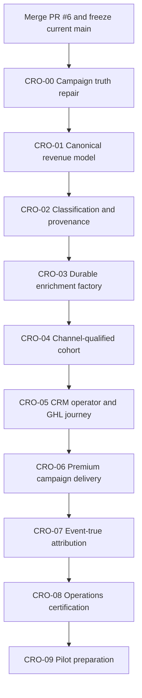

# Liberty Bancard Consolidated Revenue CRM and Cold-Outreach Audit

**Date:** 2026-08-27  
**Repository:** `scottpstevenson/Liberty-Bancard-Website-and-CRM`  
**Authority:** Consolidated planning and finding-disposition source  
**Revision:** 2 — preserves Tasks 1694, 1695 and 1696 without creating parallel implementation authorities  
**Scope:** Tasks 1694–1697 retained requirements + cold-outreach audit/OR program + authenticated-production CRM audit/CR program  
**Business objective:** Build one trustworthy path from raw business evidence to a qualified decision maker, premium outreach, statement review, application, activated merchant, and processor-confirmed revenue.  
**Current decision:** **CRM NO-GO; EMAIL PILOT NO-GO; SMS NO-GO; MASS OUTREACH NO-GO.**

## 1. Executive disposition

Task #1697 must remain **SUPERSEDED / HOLD** as an execution task. It contains valuable runtime, operations, campaign-approval, provider-feedback, rate-control, and exact-release requirements, but it predates two later audits that exposed missing campaign-send defects, fragmented lead populations, misleading enrichment/readiness semantics, broken CRM operator flows, active promotional seed risks, false engagement, and fabricated attribution.

Tasks 1694, 1695 and 1696 contain narrower user-observed acceptance criteria that the first consolidation only covered partially. Revision 2 preserves every such criterion through `CAR-045`–`CAR-047` and the mandatory traceability record. They must remain **PRESERVED / HOLD** and must not execute independently; they become fully superseded only after the assigned successor CRO task represents every source requirement in its preflight and final VFC and passes it.

The original OR and CR master prompts must also remain as supporting evidence rather than be executed independently. Their overlapping schema, services, migrations, and UI work must not be built by separate agents or branches as competing implementations.

This document normalizes all source bodies of work into:

- one consolidated findings register;
- one owner for every finding;
- ten non-overlapping build/certification tasks (`CRO-00` through `CRO-09`);
- an explicit dependency order;
- one set of safety boundaries, acceptance gates, and launch kill lines;
- a separate, future authorization boundary for production enrichment and outreach.

### Authoritative program order

No task in this program authorizes a real-recipient send, production unpause, production classification/backfill, paid-provider run, GHL mutation, or production canary. Those actions require separate reviewed run plans and explicit authorization.

## 2. Source set and evidence hierarchy

### Consolidated sources

| Source | Contribution | Disposition |
|---|---|---|
| Tasks 1694–1696 — Dashboard reliability, actionable CRM tasks, campaign lifecycle and preview quality | Null-safe dashboard rendering, Pipeline diagnostics/correlation/retry, automatic-task identity/eligibility/deduplication/UX/reviewed cleanup, safe campaign deletion/archive/test isolation and sandboxed render parity | Preserve every acceptance criterion through `CAR-045`–`CAR-047`; do not execute as parallel tasks |
| Task #1697 — Launch Quality-Enriched Outreach | Operations visibility, job inventory, complete DLQ facts, immutable campaign approval, provider feedback, distributed caps, isolated certification, exact-SHA runtime proof | Retain valid requirements; supersede its monolithic build/deploy/canary execution plan |
| Cold-Outreach Full Codebase Audit at `78ae07e8…` | `OR-AUD-001` through `OR-AUD-025`, campaign/send defects, enrichment architecture, content, reply truth, attribution, deliverability | Retain as source-code finding authority |
| OR-00 through OR-05 program | Campaign repairs, canonical cohort, durable enrichment, CRM/GHL operations, premium content, attribution/pilot control | Map into `CRO-00`, `CRO-03`–`CRO-09` |
| Authenticated Production CRM Audit | Live population reconciliation, People/Prospects/Lead Ops split, Ready queue, Pipeline, Inbox, Tasks, Portfolio, GHL, sending identity | Retain as authenticated production evidence |
| CR-01 through CR-06 program | Canonical CRM model, classification/provenance, enrichment/readiness, operator journey, campaigns, pilot packet | Map into `CRO-01`–`CRO-09` |
| BT-01 through BT-12 and current canonical owners | Existing safety, pause, contactability, writer, queue, provider, classification, identity and migration primitives | Preserve; extend rather than replace |
| PR #6 certification correction | Disposable DB/Redis/provider-denial/browser certification tooling and runtime-register evidence | Merge first; use as certification foundation, not as outreach implementation |

### Evidence precedence

1. Exact-current production runtime evidence for one deployed SHA and environment.
2. Authenticated production aggregates and bounded read-only UI/API observations.
3. Exact-current source inspection and isolated executable reproductions.
4. Isolated stateful tests with disposable PostgreSQL/Redis and fake providers.
5. Static tests and documentation.

Source inspection cannot prove production behavior. Mocked tests cannot prove provider or deployment readiness. Sampled or capped UI data cannot establish global totals. Unavailable evidence must remain unavailable, not be converted to zero or pass.

## 3. Baseline facts that must be recaptured

The last mutually reconciled audit state was:

| Fact | Last observed value |
|---|---|
| Reviewed source baseline | `78ae07e8c5ffb643467a93dc42b95834d65289a8` |
| Public production SHA | `f2cfa4aade9b24435128c9bd5787ad01f5281563` |
| PR #6 reviewed head | `a16fdc2a46e9402faf30dc95fc907a33051c651d` |
| PR #6 state | Squash-merged 2026-08-27; current `origin/main` was rechecked at `0e947faac9f7cd6aafbd634366e38e2dcd912f25` during Revision 2 |
| Global outbound | Paused |
| Safe current launchable cohort | Zero |

Before any consolidated task begins, the executor must fetch `origin/main`, verify its relationship to the last known merged anchor, record the exact current main SHA and migration/journal head, require a clean task-owned branch, and preserve unrelated uploads. None of the historical SHAs or counts may be hard-coded as current truth.

## 4. Verified platform assets to preserve

The program is not a greenfield rebuild. Preserve and extend:

- canonical contact writer and source-event primitives;
- contact field authority, identity observations, and reversible merge ledger;
- commercial record-classification authority;
- consent, suppression, and contactability authorities;
- outbound pause authority and final pre-provider epoch checks;
- durable sequence enrollment and frozen campaign preview semantics;
- sender policy, SMTP CAN-SPAM/List-Unsubscribe support, and GHL transport boundaries;
- BullMQ queue topology, logical job manifest, singleton fencing, and recovery primitives;
- Serper gateway, ZeroBounce controls, provider activation/budget patterns, and paid-provider scanner;
- migration integrity, CI capability manifest, compliance scan, GHL pause gates, and provider-denial certification tooling.

No task may create a competing contact, business, classification, consent, suppression, contactability, pause, campaign, sequence, queue, provider, revenue, or migration authority.

## 5. Reconciled production populations

These are audit observations, not fixed acceptance constants:

| Population or surface | Observed count | Meaning and defect |
|---|---:|---|
| People / `contacts` | 155,356 | Canonical CRM contact inventory; all previously classified `unknown` |
| Contacts with primary source pointer | 144 | Only 0.09% had primary provenance |
| Contacts with current `valid` email status | 32 | Positive validation evidence was extremely limited |
| Prospects / current Leads tab | 12,711 | Separate staging table, not canonical CRM Leads |
| Prospect-to-contact links | 1,559 | Only 12.3% of prospects linked to contacts |
| Prospects marked enriched | 12,686 | Label overstated readiness; only 1,362 had email and 2,103 owner evidence |
| Lead Ops discovery pool | 1,919,454 | Separate discovery/enrichment universe |
| Lead Ops enriched | 292,680 | Not equivalent to qualified/contactable |
| Lead Ops contactable | 2,098 | Tiny fraction of discovery pool |
| Lead Ops pending | 968,179 | Worker was inactive when observed |
| Outbound Prospects | 152,496 | Separate cold-contact audience projection |
| Ready for Outreach | 153,643 | Permissive queue predicate; sample included synthetic/unassigned/cold records |
| GHL linked contacts | 1,921 | Broad GHL identity/attribution unavailable |
| GHL missing | 153,435 | Resolve only for approved qualified cohorts |
| Campaigns | 13 | All observed send/open/reply metrics were zero; test records were mixed in |
| Deals | 1,571 in aggregate; zero in Reporting | Unknown-class data and reporting authority conflict |

The correct model is not to duplicate all contacts into prospects. The target lifecycle is:

`discovery evidence → prospect staging → canonical business/contact → qualified lead/open deal → statement/proposal/application → activated merchant → reconciled revenue`

## 6. Consolidated normalized findings register

### A. Release, operations, and runtime truth

| ID | Priority | Normalized finding | Source mapping | Assigned task |
|---|---|---|---|---|
| CAR-001 | P0 | Production served a stale SHA, so current source cannot be claimed as live | OR-AUD-009; #1697 VFC-26; authenticated audit | CRO-08 |
| CAR-002 | P0 | Stateful/server certification previously lacked approved disposable DB/Redis/provider isolation | #1697 VFC-25; PR #6 correction | CRO-08 |
| CAR-003 | P1 | BullMQ, intervals, cron, durable commands, retries and recovery owners lack one complete exclusivity inventory | #1697 VFC-03, VFC-06 | CRO-08 |
| CAR-004 | P1 | DLQ and failure evidence is sampled/incomplete and cannot certify an empty backlog | #1697 VFC-08 | CRO-08 |
| CAR-005 | P1 | Operations/readiness truth is hidden behind Dev Mode and fragmented across pages/APIs | #1697 VFC-01, VFC-02, VFC-09; authenticated audit | CRO-08 |

### B. Canonical CRM population and commercial truth

| ID | Priority | Normalized finding | Source mapping | Assigned task |
|---|---|---|---|---|
| CAR-006 | P0 | People, Prospects, Lead Ops, `master_leads`, Outbound Prospects and Ready use different populations and meanings | Authenticated audit; CR-01 | CRO-01 |
| CAR-007 | P0 | Current Leads is prospect staging, not a canonical lead/contact-plus-open-deal view | Authenticated audit; CR-01 | CRO-01 |
| CAR-008 | P0 | UI cards treat 100/500 fetch caps as totals and partial counts are mislabeled | Authenticated audit; CR-01/02 | CRO-01 |
| CAR-009 | P0 | Pipeline, Reporting, Statements, Applications, Portfolio and GHL stages do not share one deal/merchant authority | Authenticated audit; CR-01/04 | CRO-01 |
| CAR-010 | P0 | All 155,356 contacts and observed prospects/deals/companies remain commercially `unknown`; test/synthetic records contaminate operational views | OR-AUD-003; authenticated audit; CR-02 | CRO-02 |
| CAR-011 | P0 | Historical provenance/import accounting is nearly absent: 144 primary pointers, 146 source events and zero import executions | OR-AUD-004; #1697 VFC-11; CR-02 | CRO-02 |
| CAR-012 | P1 | Prospect conversion is one-way and contacts created elsewhere lack durable links to discovery/import evidence | Authenticated audit; CR-01/02 | CRO-02 |
| CAR-013 | P1 | Person/business identity, decision-maker role and organization relationships are incomplete and inconsistent | OR-AUD-005; CR-01/03 | CRO-02 |
| CAR-014 | P1 | GHL linkage, required handoffs and pipeline-stage mappings are materially incomplete | OR-AUD-024; authenticated audit; CR-04/05 | CRO-05 |

### C. Enrichment, provider evidence, and qualification

| ID | Priority | Normalized finding | Source mapping | Assigned task |
|---|---|---|---|---|
| CAR-015 | P0 | Existing contact batch enrichment is capped, process-local and request-detached; it cannot resume or reconcile 155k records | OR-AUD-010; OR-02 | CRO-03 |
| CAR-016 | P0 | Lead Ops has a 968,179 pending queue, inactive worker evidence and contradictory success metrics | Authenticated audit; CR-03 | CRO-03 |
| CAR-017 | P1 | Serper/Sunbiz and other adapters can write canonical fields without universal provider-observation arbitration and projection invalidation | OR-AUD-011; #1697 VFC-13; OR-02 | CRO-03 |
| CAR-018 | P1 | Enriched/hot/warm labels measure activity or scoring, not business identity, decision-maker evidence, contactability or campaign readiness | Authenticated audit; CR-03 | CRO-03 |
| CAR-019 | P1 | Paid providers lack one atomic approval, budget, cost, receipt and yield ledger; Outscraper is explicitly unapproved and Apollo/Proxycurl unconfigured | #1697 VFC-14; OR-02; CR-03 | CRO-03 |
| CAR-020 | P1 | ZeroBounce controls exist, but positive current validation coverage and production budget/readiness are unproven | #1697 VFC-15/16; OR-AUD-023; CR-03 | CRO-03 |
| CAR-021 | P0 | Data completeness, ICP fit, channel eligibility and campaign readiness are conflated | OR-AUD-005, 014, 015; #1697 VFC-17; OR-01; CR-03 | CRO-04 |
| CAR-022 | P0 | Ready for Outreach admits unknown, synthetic, unassigned, stale and email-ineligible records; one phone branch admitted an opted-out email row | OR-AUD-015; authenticated audit; CR-03 | CRO-04 |
| CAR-023 | P1 | Campaign UI criteria (`targetScores`, `filterCriteria`, readiness threshold) do not share one server-enforced meaning | OR-AUD-012/013; OR-01 | CRO-04 |

### D. Campaign, sequence, delivery, and feedback truth

| ID | Priority | Normalized finding | Source mapping | Assigned task |
|---|---|---|---|---|
| CAR-024 | P0 | Both CRM-contact campaign SMTP paths omit `contactId` and fail the commercial-classification gate | OR-AUD-001; OR-00 | CRO-00 |
| CAR-025 | P0 | Campaign and SMTP layers can inject duplicate compliance footers | OR-AUD-002; OR-00 | CRO-00 |
| CAR-026 | P0 | Campaign mutation APIs are broader than the admin/manager UI authority | OR-AUD-006; #1697 VFC-19; OR-00 | CRO-00 |
| CAR-027 | P0 | Reply-authority errors can be swallowed and permit another sequence touch | OR-AUD-007; OR-00 | CRO-00 |
| CAR-028 | P0 | Sequence exhaustion can mark a nonresponder `ENGAGED` | OR-AUD-008; OR-00 | CRO-00 |
| CAR-029 | P0 | Startup seeders create active promotional sequences, including 87 SMS steps and unsupported claims | OR-AUD-016/017; OR-00 | CRO-00 |
| CAR-030 | P1 | Test, zero-step and anomalous enrollment sequences/campaigns are mixed into production catalogs | Authenticated audit; CR-05 | CRO-06 |
| CAR-031 | P1 | Campaign approval does not freeze the exact recipient MIME content; AI defaults on and fallback can send unapproved copy | OR-AUD-018; #1697 campaign approval requirements; OR-04 | CRO-06 |
| CAR-032 | P1 | Rendering, signatures, footer, unsubscribe, sender/reply identity and preview/delivery parity lack one frozen authority | OR-AUD-002/018/022; #1697 rendering requirements; CR-05 | CRO-06 |
| CAR-033 | P1 | Distributed sender/campaign/provider caps and timeout-after-acceptance reconciliation are not proven | #1697 VFC-22/VFC-24; OR-05 | CRO-06 |
| CAR-034 | P0 | Bounce, complaint, unsubscribe, rejection and replay do not all project canonically into suppression and active-enrollment stop behavior | #1697 VFC-23; OR-04/05 | CRO-06 |
| CAR-035 | P1 | Sending-identity pages disagree, DNS/inbox reputation evidence is unavailable and the visible identity is capped at 30/day | OR-AUD-022/023; authenticated audit; CR-05 | CRO-06 |
| CAR-036 | P0 | SMS lacks A2P/TCR and number/location ownership evidence | OR-AUD-025; #1697; CR-05 | CRO-06 |

### E. CRM operator journey and revenue truth

| ID | Priority | Normalized finding | Source mapping | Assigned task |
|---|---|---|---|---|
| CAR-037 | P0 | Pipeline fails to load and deal/reporting totals conflict | Authenticated audit; CR-04 | CRO-05 |
| CAR-038 | P1 | Portfolio contains lead-like/nonmerchant records and Statement Reviews disagree with statement-bearing deals | Authenticated audit; CR-04 | CRO-05 |
| CAR-039 | P1 | Tasks are flooded with stale/repeated SLA work and lack one actionable ownership policy | Authenticated audit; CR-04 | CRO-05 |
| CAR-040 | P1 | Inbox unread/list/refresh/ownership states do not reconcile; cross-agent authorization remains unproven | Authenticated audit; OR-03; CR-04 | CRO-05 |
| CAR-041 | P1 | Source-quality analytics proportionally manufacture replies/meetings/statements/wins | OR-AUD-019; OR-05 | CRO-07 |
| CAR-042 | P1 | Statements/proposals are inferred from current stage/update time rather than immutable transitions | OR-AUD-020; OR-05 | CRO-07 |
| CAR-043 | P2 | Lookalike models use unknown/closed-won labels with tiny samples and no verified revenue base | OR-AUD-021; OR-05 | CRO-07 |
| CAR-044 | P0 | The honest current launchable cohort is zero and no production canary is authorized | Both audits; OR-05; CR-06 | CRO-09 |

### F. Preserved user-observed reliability, task-quality and lifecycle contracts

These rows preserve the requirements of Tasks 1694–1696. They are mandatory current-SHA VFC targets, not claims that every original root-cause assumption remains current.

| ID | Priority | Normalized finding | Source mapping | Assigned task |
|---|---|---|---|---|
| CAR-045 | P0 | Dashboard display formatting can fail on optional values, while Pipeline errors lose actionable status/reason/correlation/retry context; the relationship between the UI crash and deal-request failure remains to be verified | User-observed Task 1694; authenticated Pipeline failure | CRO-05, with canonical deal/API prerequisite in CRO-01 and telemetry consumption in CRO-08 |
| CAR-046 | P1 | Automated CRM tasks lack one complete producer/entity identity, eligibility, active-work deduplication, contextual-title/navigation, source-label, active/history and reviewed soft-cleanup contract across desktop/mobile | User-observed Task 1695; CAR-039 task flood | CRO-05, with classification prerequisite in CRO-02 and producer-registry cross-check in CRO-08 |
| CAR-047 | P1 | Campaign lifecycle and preview safety lack explicit unsent-delete versus archive invariants, archived execution denial, test cleanup guarantees, sample/sandbox disclosure and safe plain-text-to-HTML rules | User-observed Task 1696; CAR-030/CAR-032 | CRO-06, with existing authorization/footer repairs in CRO-00 and isolation controls in CRO-08 |

## 7. Consolidated task architecture

### CRO-00 — Campaign and sequence truth repair

**Purpose:** Close the six source-reproduced P0 defects before any other outreach feature can be trusted.

**Owns:** CAR-024 through CAR-029.

**Required work:**

1. Pass canonical `contactId` through both CRM campaign SMTP paths.
2. Establish exactly one idempotent compliance-footer/rendering owner.
3. Enforce server-side campaign mutation authorization and object scope.
4. Defer/block on reply-state uncertainty with zero provider I/O.
5. Record `completed_no_response`; never simulate engagement.
6. Convert promotional seeds to versioned draft/paused content, remove startup activation, and preserve only explicitly classified transactional/system sequences.

**Exit evidence:** focused isolated regressions; fake-provider invocation counts; no active promotional seeds after clean boot; all existing pause/contactability/sender tests green.

### CRO-01 — Canonical revenue object model and count truth

**Purpose:** Make every CRM surface use explicit discovery, prospect, contact, lead, deal and merchant meanings.

**Owns:** CAR-006 through CAR-009.

**Required work:**

- Rename current Leads to **Prospect Staging**.
- Build real Leads from canonical contacts/businesses plus open qualified deals.
- Preserve idempotent prospect promotion; do not clone contacts into prospects.
- Reconcile Pipeline, Reporting, Tasks, Statements, Applications, Portfolio and GHL stage consumers to one deal/merchant authority.
- Replace page-cap KPIs with server-derived totals and explicit sample labels.
- Add reconciliation APIs and mismatch buckets.

**Exit evidence:** exact object definitions; count reconciliation; conversion-idempotency tests; Pipeline/Reporting agreement on isolated fixtures.

### CRO-02 — Classification, provenance, identity and quarantine

**Purpose:** Establish commercial truth and traceable identity without destructive cleanup or fabricated history.

**Owns:** CAR-010 through CAR-013.

**Required work:**

- Inventory `record_class` across contacts, prospects, businesses, deals, statements, applications, merchants, tasks, campaigns, sequences and imports.
- Quarantine unknown/test/demo/synthetic rows from production revenue and outreach projections.
- Reconstruct provenance only from immutable evidence; retain `untraceable`/`legacy_unknown` when proof is absent.
- Reconcile import executions and row dispositions.
- Complete source/entity links and business/contact decision-maker roles.
- Preserve reviewed merge authority; never mass-merge by phone.

**Exit evidence:** zero unknown/test/demo leakage into production projections; reconciled import equation; pilot-eligible records have primary source and resolved identity evidence.

### CRO-03 — Durable enrichment factory and provider economics

**Purpose:** Replace process-local enrichment with resumable, cost-reconciled evidence production.

**Owns:** CAR-015 through CAR-020.

**Required work:**

- Durable batch/item snapshots, claims, leases, fencing, attempts, cursors and terminal dispositions.
- Provider observations, field candidates/arbitration, canonical mutation events and cost/receipt ledger.
- Classification/provenance/identity gates before provider spend.
- Deterministic/free evidence first; selective Serper/registry; Apollo/Outscraper only after separate configuration and budget approval.
- Positive ZeroBounce validation with generation/freshness after final email mutation.
- Explicit `success`, `no_result`, `conflict`, `failure`, `unavailable`, `timeout`, `circuit_open` and `budget_blocked` outcomes.
- Dry-run, 100-record enrichment canary plan, 1,000-record validation plan and bounded later batches—but no production execution.

**Exit evidence:** crash/recovery tests at every side-effect boundary; exact input/terminal/cost reconciliation; zero duplicate provider charge or canonical mutation.

### CRO-04 — Channel-qualified cohort and Ready authority

**Purpose:** Build one versioned qualification service without collapsing distinct commercial decisions into one score.

**Owns:** CAR-021 through CAR-023.

**Required work:**

- Separate versioned data completeness, identity confidence, ICP fit, channel eligibility and campaign readiness decisions.
- Create channel-specific results such as `READY_EMAIL`, `READY_MANUAL_CALL`, `READY_SMS`, or blocked reason codes.
- Require production class, primary provenance, resolved identity, decision-maker evidence, current validation, suppression clearance, current readiness, ICP/offer fit, ownership, monitored reply route and campaign/content version.
- Use one decision for Ready counts/lists, campaign preview/freeze, exports, assignment, enrollment and send-time enforcement.
- Compile all UI filters into one validated server-side cohort definition.
- Add deterministic cohort hash, expiry, reasons and invalidation on material changes.

**Exit evidence:** every surface returns identical members/counts for the same policy version; all exclusions have stable reasons; phone cannot make an opted-out email `READY_EMAIL`.

### CRO-05 — CRM operator journey, ownership, Inbox and GHL

**Purpose:** Give reps and managers one coherent workflow from qualified lead through merchant outcome.

**Owns:** CAR-014, CAR-037 through CAR-040, CAR-045 and CAR-046.

**Required work:**

- Reproduce the Task 1694 dashboard crash and Pipeline request failure independently, preserve safe component/request correlation, and determine whether they share a root cause.
- Fix Pipeline load and reconcile deal/reporting totals through CRO-01’s canonical deal/count contract.
- Make optional dashboard labels, stages, channels and lead-source values null-safe with readable fallbacks.
- Preserve privacy-safe API status/reason/correlation in the Pipeline error state and provide a functional retry action.
- Correlate client error reporting with redacted server logs; cover incomplete records and unsuccessful deal responses on authenticated desktop/mobile views.
- Make Portfolio merchant-evidence-only and reconcile Statement Reviews.
- Inventory every automatic task producer and require stable producer-plus-entity identity, current-record eligibility and atomic active-work deduplication.
- Default Tasks to active work with explicit Completed history; open task details/actions and authorize deep links to canonical deals, contacts and tickets.
- Generate human-readable merchant/contact-context titles, a clear requested action and visible manual/SLA/workflow/AI source labels.
- Reject automatic tasks for missing, archived, closed, synthetic or otherwise ineligible records through canonical classification and lifecycle evidence.
- Produce a counts-only reviewed cleanup dry run; design idempotent soft-archival of only approved invalid/duplicate pending automation tasks while preserving legitimate, manual and completed history. Production apply remains separately authorized.
- Preserve task filtering, detail, navigation, source labels and cleanup behavior across desktop and mobile.
- Reconcile Inbox list/unread/refresh/error/partial/ownership states.
- Enforce anonymous/agent A/agent B/manager/admin server authorization through parent ownership.
- Produce GHL mapping dry runs for matched/unmapped/duplicate/conflict; never silently upsert conflicts.
- Complete required handoff and stage-mapping configuration workflows without live GHL mutation.
- Surface source, identity, qualification, campaign, reply, statement, application and revenue lineage on Contact Detail.

**Exit evidence:** isolated browser/API role matrix; dashboard null/error/retry/correlation matrix; Pipeline/Reporting agreement; complete task-producer inventory; task concurrency/eligibility/navigation/history/cleanup proof; synthetic reply suppresses next touch and creates exactly one owned task; canonical objects and totals agree across CRM surfaces.

### CRO-06 — Premium content, campaign approval, delivery and feedback

**Purpose:** Turn useful campaign concepts into approved, exact-copy, rate-controlled email programs.

**Owns:** CAR-030 through CAR-036 and CAR-047.

**Required work:**

- Classify all campaigns/sequences as template, test, draft, pilot, active, paused, retired or invalid.
- Quarantine test/zero-step/anomalous sequences from production operator views.
- Inventory each contaminated campaign using metadata only and classify it as a provably unsent deletable draft or retained archived history.
- Permit permanent deletion only to admins and only when no activation, queue, enrollment, retry/recovery, send, consent, unsubscribe, suppression, compliance or audit history exists; require archive otherwise.
- Make archive final for execution: archived campaigns cannot queue, enroll, retry, recover or send, and the list exposes an explicit include/hide archived filter with authoritative counts.
- Isolate campaign tests in disposable data identities and guarantee cleanup after happy, failure and concurrency cases without touching operator data.
- Build versioned content and claim registries with evidence/expiry and prohibited-claim checks.
- Default AI personalization off; pre-render from retained evidence; block unresolved tokens and unapproved fallback.
- Freeze audience, exact HTML/text, evidence IDs, sender/reply identity, footer/unsubscribe policy, CTA, prompt/model and output hashes in immutable approval revisions.
- Use one server renderer for preview and delivery, including personalization, Liberty/agent signature, logo, mailing address, compliance language and unsubscribe treatment exactly once.
- Render sample values in a sandbox with visible sample disclosure and zero send, unsubscribe action or provider mutation.
- Convert plain-text templates to readable escaped HTML without trusting unsafe template content as markup.
- Add atomic sender/campaign/provider/minute/hour/day/canary reservations and timeout reconciliation.
- Canonically process signed/replay-safe bounce, complaint, unsubscribe and rejection events; stop incompatible active enrollment.
- Reconcile one authoritative sending identity and collect DNS/reply-inbox evidence after deployment.
- Keep SMS closed.

**Content resolution:** retain the existing four-email audited drafts as assets, add a fifth respectful close, and create one five-email proof-first draft over approximately 18 business days with a manual research/call task after email two. The selected pilot freezes one version; no content is activated by this task.

**Exit evidence:** exact MIME preview equals fake delivery; one signature/logo/footer/header/unsubscribe treatment; sample/sandbox and unsafe-markup tests; deletion/archive/history and archived-execution denial matrix; disposable test cleanup proof; correct monitored reply route; feedback/replay/cap/timeout tests; no active test/promotional program.

### CRO-07 — Event-true attribution and revenue analytics

**Purpose:** Make optimization depend on actual transitions and money rather than proportional or stage-label inference.

**Owns:** CAR-041 through CAR-043.

**Required work:**

- Remove proportional allocation of global outcomes.
- Attribute through immutable contact, organization, source, cohort, campaign, content, owner and transition IDs.
- Build stage-transition facts for reply, qualified conversation, statement, proposal, application, activated MID and 30/60/90-day gross profit.
- Keep unmatched outcomes explicitly `unattributed`.
- Disable lookalike/training selection until sufficient reconciled production outcomes exist; require minimum sample, confidence and holdout evaluation.

**Exit evidence:** event-count and amount reconciliation; no duplicated grouped totals; source rankings derive only from actual linked outcomes.

### CRO-08 — Operations visibility and exact-release certification

**Purpose:** Retain Task #1697’s valid operations/runtime requirements without allowing them to dominate or replace the revenue program.

**Owns:** CAR-001 through CAR-005.

**Required work:**

- Expose normal admin **Automation & Outreach Operations** navigation; manager read-only only where policy permits.
- Inventory every BullMQ/non-BullMQ scheduler, crawler, durable command, retry and recovery owner with exclusivity invariant.
- Show next run, heartbeat, backlog age, complete failures, retry state, throughput, yield, cost/quota, evidence freshness and redacted errors.
- Distinguish mock, sampled, stale, incomplete, mixed-SHA, paused, blocked, degraded and healthy.
- Use PR #6 isolation controls for disposable PostgreSQL, UUID Redis namespaces and fake/provider-denied child processes.
- Run static, isolated integration, server-required browser and exact-release runtime certification without using ordinary development/production state.
- Deploy only after explicit authorization, then reconcile exact web/worker SHA, migration head, queue topology, pause/coordinator state, provider readiness and alerts.

**Exit evidence:** all required suites pass without skips; operations inventory is complete; exact deployed SHA receives current runtime evidence. Deployment remains a separate authorization.

### CRO-09 — Pilot packet and separately authorized launch plan

**Purpose:** Produce a human-reviewable email-only pilot without launching it.

**Owns:** CAR-044 and final OR-05/CR-06 readiness requirements.

**Required work:**

- Compare Florida auto repair, med spa/dental and home services/construction using source coverage, identity yield, valid-email yield, fit and expected cost.
- Select one ICP and one statement-review offer from evidence, not raw volume.
- Produce disposable synthetic flow fixtures and a production read-only preview of 100–250 candidates.
- Freeze IDs, evidence, qualification rules, campaign/content version, sender, reply owner, cap, expiry and blocked-reason distribution.
- Produce controlled-inbox, reply, task, statement, meeting, attribution, stop and rollback procedures.
- Return separate CRM, email-pilot, SMS and scale verdicts.

**Volume resolution:** the visible sender was capped at 30/day. The plan begins with controlled inboxes, then a separately approved 10-recipient real canary, then at most 25/day. It must not advance to 50/day unless the authoritative sender cap is raised and separately approved.

**Exit evidence:** immutable 100–250-contact review packet and counts-only production dry run; global pause remains enabled; no enrollment, provider call or send occurred.

## 8. Source-program crosswalk

### OR crosswalk

| Original tranche | Consolidated destination |
|---|---|
| OR-00 — Campaign execution repairs | CRO-00 |
| OR-01 — Canonical ICP and cohort authority | CRO-02 + CRO-04 |
| OR-02 — Durable enrichment factory | CRO-03 |
| OR-03 — CRM, ownership, Inbox and GHL | CRO-05 |
| OR-04 — Premium content and exact-copy approval | CRO-06 |
| OR-05 — Attribution and controlled pilot readiness | CRO-07 + CRO-09 |

### CR crosswalk

| Original tranche | Consolidated destination |
|---|---|
| CR-01 — Canonical lead/contact/business/deal authority | CRO-01 |
| CR-02 — Classification and provenance | CRO-02 |
| CR-03 — Enrichment and qualified readiness | CRO-03 + CRO-04 |
| CR-04 — CRM operator journey | CRO-05 |
| CR-05 — Campaigns, sequences and provider readiness | CRO-00 + CRO-06 + CRO-07 |
| CR-06 — Email-pilot preparation | CRO-09 |

### Task #1697 crosswalk

| #1697 requirement group | Consolidated destination | Disposition |
|---|---|---|
| Normal operations navigation | CRO-08 | Retain |
| Complete job/queue/scheduler inventory | CRO-08 | Retain |
| Complete DLQ/telemetry truth | CRO-08 | Retain |
| Canonical source/field evidence | CRO-02 + CRO-03 | Retain and expand |
| One qualified-contact decision | CRO-04 | Retain and align with OR/CR rules |
| Campaign role guards/approval/render parity | CRO-00 + CRO-06 | Retain and add source-reproduced defects |
| Distributed caps/provider timeout reconciliation | CRO-06 | Retain |
| Feedback/suppression projection | CRO-06 | Retain |
| Static/stateful/runtime certification | CRO-08 | Retain using PR #6 corrections |
| Deployment and real canary inside same task | CRO-08 + CRO-09 | Split; deployment and send require separate authorizations |
| Monolithic 17-step implementation | None | Supersede; replace with CRO tasks |

### Tasks 1694–1696 preservation crosswalk

The complete acceptance-level mapping is authoritative in `LIBERTY_BANCARD_TASK_1694_1696_REQUIREMENTS_TRACEABILITY_2026-08-27.md`.

| Source task | Requirement group | Consolidated destination | Disposition |
|---|---|---|---|
| 1694 — Restore Dashboard Reliability | Canonical deal query/count cause | CRO-01 prerequisite | Retain without pulling CRO-05 UI scope into CRO-01 |
| 1694 | Dashboard null safety; Pipeline diagnostics/retry; safe client/server correlation; desktop/mobile regression | CRO-05 / CAR-045 | Retain in full |
| 1694 | Redacted operational error consumption | CRO-08 | Retain as telemetry consumer, not duplicate logger |
| 1695 — Make CRM Tasks Actionable | Canonical record classification/eligibility | CRO-02 prerequisite | Retain; no filename/title heuristics |
| 1695 | Producer inventory; active/history UX; details/navigation; contextual titles; identity/dedupe; eligibility; source labels; reviewed cleanup | CRO-05 / CAR-046 | Retain in full |
| 1695 | Complete producer-registry visibility | CRO-08 | Retain as inventory completeness proof |
| 1696 — Clean Campaigns and Previews | Campaign role guards and duplicate compliance rendering | CRO-00 | Already retained |
| 1696 | Delete/archive/history invariants; archived execution denial; test isolation/cleanup; shared preview renderer; sample sandbox; safe plain-text HTML | CRO-06 / CAR-047 | Retain in full |
| 1696 | Disposable data/provider-denied certification | CRO-08 | Retain as certification foundation |

Tasks 1694–1696 remain **PRESERVED / HOLD — DO NOT EXECUTE IN PARALLEL**. They become fully superseded only after all mapped successor VFC rows pass; a copied requirement or merged prerequisite is not completion proof.

## 9. Dependency and execution rules

### Required sequence

1. Merge PR #6 and verify updated `main`.
2. Execute CRO-00 on a dedicated branch and merge only after isolated regressions pass.
3. Execute CRO-01, then CRO-02, because every later cohort/provider/UI contract depends on canonical objects and classification.
4. Execute CRO-03, then CRO-04, so qualification consumes durable evidence rather than another ad hoc score.
5. Execute CRO-05 after the canonical object, classification and qualification contracts are stable. Its preflight must import every 1694 and 1695 traceability row.
6. Execute CRO-06 after CRO-04/05 provide cohort, ownership and reply authorities. Its preflight must import every remaining 1696 traceability row while treating CRO-00 repairs as prerequisites, not duplicate work.
7. Execute CRO-07 after campaign memberships and revenue transitions are canonical.
8. Execute CRO-08 certification against the complete reviewed descendant.
9. Execute CRO-09 last; it prepares but does not launch the pilot.

Do not execute the original #1697, OR master prompt and CR master prompt as independent tasks. Do not create one giant PR for this program. Each CRO task requires its own preflight, branch, migration check, tests, evidence and reviewable PR.

### Production operations requiring separate approval

- production deployment or worker restart;
- any production classification, provenance reconstruction, merge, backfill or cleanup;
- any paid/free provider call against production records;
- any GHL write/backfill/resync or workflow-ID change;
- any production cohort enrollment or queue processing;
- any internal or external email/SMS/voice send;
- unpause or hold clearance;
- real canary execution or scale.

## 10. Consolidated safety contract

- Keep global email and SMS paused during build and certification.
- Never substitute ordinary `DATABASE_URL` for missing `TEST_DATABASE_URL`.
- Stateful tests require `NODE_ENV=test`, disposable PostgreSQL, exact test database identity, UUID-qualified Redis namespace reservation, provider-denial/fakes and cleanup proof.
- No blocked case passes if any provider transport was invoked.
- Use additive migrations and current journal authority; never `db push` or edit historical migrations.
- Never fabricate commercial class, provenance, consent, identity, provider evidence, engagement, revenue or attribution.
- Never mass-merge by phone or auto-resolve ambiguous identity.
- Never treat validation as consent or queue membership as send authorization.
- Never allow AI/provider observations to overwrite canonical truth without arbitration.
- Never treat a provider timeout or ambiguous receipt as success or failure until reconciled.
- Never expose secrets, raw PII, message bodies, financial data or provider credentials in evidence.
- Never count a skipped, unavailable, unreachable, stale, sampled or mixed-SHA gate as passing.

## 11. Consolidated launch kill lines

The program fails or promotion stops if:

1. Any campaign path still omits canonical contact identity or duplicates compliance rendering.
2. Any contact can be selected, enrolled or sent without the canonical channel-specific qualification decision.
3. Any unknown/test/demo/synthetic/untraceable record enters a production revenue or outreach projection.
4. Any UI total is a fetch-cap/sample represented as a global count.
5. Any adapter writes canonical identity/email/vertical truth without source evidence and arbitration.
6. Any paid provider can run without explicit activation, atomic budget and receipt reconciliation.
7. Any provider failure/no-result/unavailable state improves eligibility.
8. Any campaign content, audience, sender, policy or cap edit preserves prior approval.
9. Any unauthorized role or unowned object can mutate campaign/enrollment/provider state.
10. Any reply-state uncertainty permits another touch.
11. Any no-response sequence produces engagement.
12. Any bounce, complaint, unsubscribe or provider rejection leaves the incompatible channel eligible.
13. Any rate limit is count-then-send rather than atomically reserved.
14. Any timeout/retry can create an uncontrolled duplicate provider mutation.
15. Any logical job has two reachable scheduler owners or loses durable recovery.
16. Any sampled/stale/mock/mixed-SHA state is presented as healthy.
17. Any protected suite is skipped, weakened or pointed at shared state.
18. The deployed SHA differs from the certified SHA.
19. A canary exceeds the authoritative sender cap or lacks explicit audience, sender, owner, thresholds and rollback.
20. SMS is enabled without its independent A2P/TCR, number/location ownership and channel-eligibility evidence.
21. Any optional dashboard label/stage/channel/source value can crash the page, or a Pipeline failure discards safe status/reason/correlation/retry context.
22. Any automatic task can create duplicate active work, target an ineligible record, lose its producer/entity identity, or be cleaned without a reviewed counts-only dry run and retained history.
23. Any campaign with execution/compliance history can be permanently deleted, any archived campaign can execute, or test cleanup can affect operator data.
24. Preview and delivery diverge in personalized body, signature, logo, footer, address, compliance or unsubscribe treatment; sample preview causes a real side effect; or unsafe template markup is trusted.

## 12. Required task-level deliverables

| Task | Minimum durable deliverables |
|---|---|
| CRO-00 | Campaign repair register; P0 reproduction/repair evidence; seed-content disposition |
| CRO-01 | Canonical revenue-object contract; count reconciliation; UI/API consumer inventory |
| CRO-02 | Classification/provenance policy; import/source reconciliation; identity/conflict report |
| CRO-03 | Enrichment factory schema/runbook; provider budget/receipt model; dry-run and canary plans |
| CRO-04 | Qualification policy; blocked-reason registry; cohort consistency report |
| CRO-05 | CRM browser role matrix; dashboard/Pipeline reliability and correlation report; complete task-producer/identity/eligibility/deduplication/UX/cleanup report; deal/statement/portfolio reconciliation; GHL mapping report |
| CRO-06 | Campaign/content registry; delete/archive/history disposition; isolated-test cleanup proof; sandboxed exact-copy/render evidence; feedback/cap/reconciliation report |
| CRO-07 | Revenue-event contract; attribution reconciliation; lookalike disable/enable policy |
| CRO-08 | Operations registry; full certification evidence; exact-release runtime register |
| CRO-09 | ICP comparison; immutable pilot packet; GO/NO-GO and separate launch run plan |

Every task response must include starting/final SHA, branch/PR, migrations, exact changed files, commands/exits/durations, skips as failures, cleanup proof, production actions not performed, remaining blockers and separate release/CRM/email/SMS/scale verdicts as applicable.

## 13. Definition of consolidated program done

The build/certification program is complete only when:

- all 47 normalized findings have a verified disposition through their assigned CRO task;
- all 31 acceptance rows from Tasks 1694–1696 have a `PASS` successor preflight/final-VFC disposition;
- one canonical data authority drives People, Prospect Staging, Leads, Pipeline, Portfolio, Reporting and Outreach;
- unknown/test/demo records cannot enter production commercial or outreach projections;
- enrichment is durable, resumable, evidence-arbitrated and cost/receipt-reconciled;
- Ready for Outreach is replaced by reproducible channel-qualified decisions;
- campaign execution, approval, rendering, rate control and feedback are exact and fail closed;
- the CRM operator journey and ownership matrix work end to end in isolated browser tests;
- attribution is event-true from source through activated MID and reconciled gross profit;
- operations/job truth is complete and current for the exact deployed SHA;
- one evidence-backed 100–250-contact email pilot packet is human-reviewable;
- no production mutation, provider call, enrollment, unpause or send occurred without separate authorization.

Completion of CRO-09 does **not** itself authorize the canary. The first production email remains a separate business decision after reviewing the final evidence packet.

## 14. Supersession statement

Upon approval of this consolidation:

- Tasks 1694 and 1695 become **PRESERVED / HOLD — assigned to CRO-05; do not execute independently**.
- Task 1696 becomes **PRESERVED / SPLIT — existing overlap assigned to CRO-00 and remaining lifecycle/preview work assigned to CRO-06; do not execute independently**.
- Task #1697 becomes **SUPERSEDED / HOLD — DO NOT EXECUTE**.
- The OR-00–OR-05 and CR-01–CR-06 master prompts become supporting audit evidence, not independent execution authorities.
- This document becomes the authoritative findings/task-assignment map.
- Separate, current-SHA Replit build prompts should be generated one CRO task at a time, beginning with CRO-00 after PR #6 is merged.
