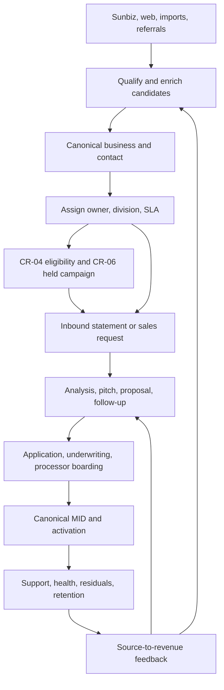
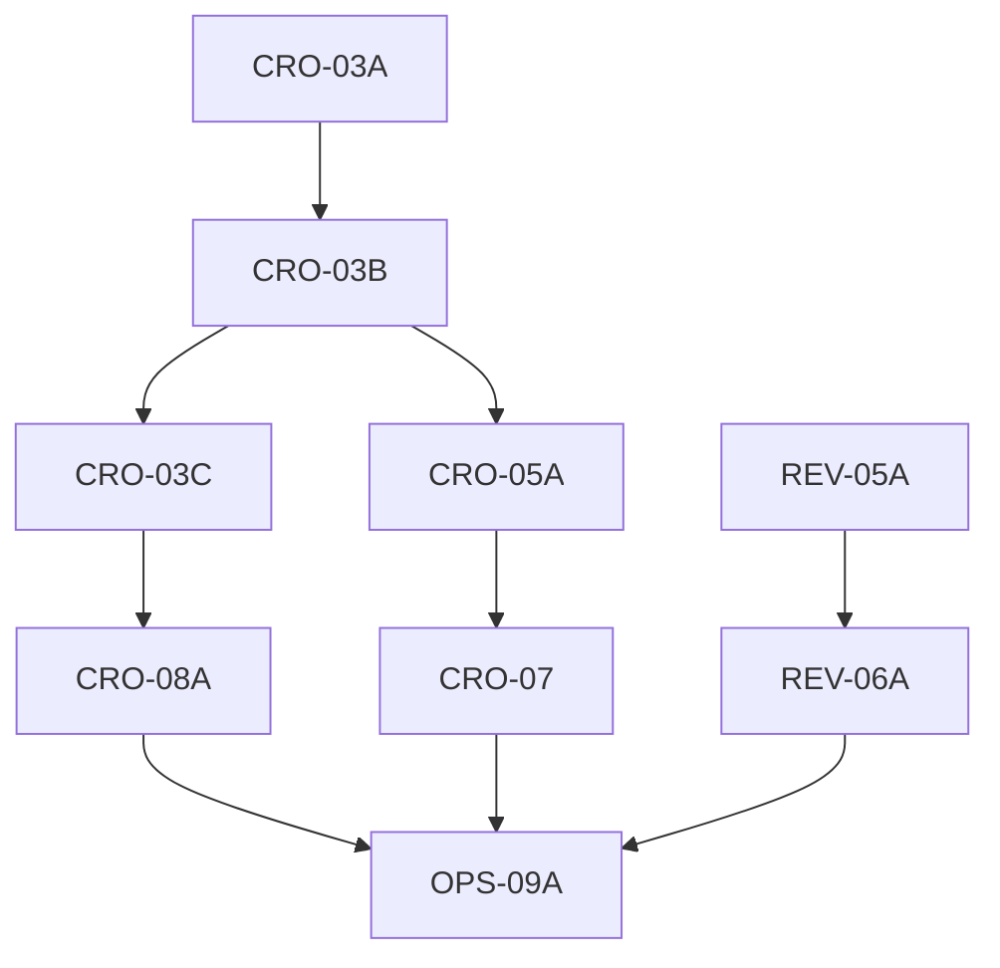

# Liberty Bancard End-to-End CRM Roadmap Audit

**Audit date:** 2026-08-30  
**Repository baseline:** `origin/main` at `32bbde5bb80c1f63fc0614c5d88e6a465c8642ef`  
**Current migration head:** `0186_cr06_scoped_reservation_contract.sql`  
**Purpose:** Determine the complete remaining build and activation roadmap from merchant discovery through cold-outreach readiness, inbound conversion, application, underwriting, processor boarding, MID activation, merchant support, and revenue reporting—without authorizing external sending during the build phase.

## Executive verdict

The previously discussed list—CRO-03A, CRO-03B, CRO-03C, CRO-05A, CRO-07, and CRO-08A—is **not sufficient by itself** to call the CRM complete end to end.

Those tasks can close the prospecting, enrichment, assignment, campaign, and growth loop. They do not fully close the merchant-application-to-live-processing path or the active-merchant/revenue path. Current main contains substantial onboarding and merchant-success functionality, but there are launch-critical authority gaps between processor approval, canonical MID activation, recurring processor status checks, success automations, and revenue truth.

The corrected finish line is:

- **Eight remaining product build tasks:** CRO-03A, CRO-03B, CRO-03C, CRO-05A, CRO-07, CRO-08A, REV-05A, and REV-06A.
- **One final operational certification:** OPS-09A.
- CRO-03A is already scoped and entering build, so after it merges there are **seven product tasks plus the final production certification**.
- CR-06 is complete and should not be rebuilt. It owns immutable campaign content, approval, preflight, frozen-cohort binding, and `READY_HELD` preparation. It does **not** currently provide final dispatch.

“Code complete,” “production connected,” and “sending enabled” must remain separate milestones:

1. **Code complete:** all authorities, workers, UI, tests, disabled transports, and activation controls exist.
2. **Production connected:** credentials, budgets, queues, webhooks, provider canaries, processor sandbox/canary, and monitoring are verified.
3. **Sending enabled:** a later owner-approved release opens a bounded CR-06 delivery batch. This audit does not authorize it.

## Verified current baseline

Current main includes the recent security, data-authority, revenue-command, enrichment-factory, CR-04, CR-05, and CR-06 work. Task #1726 is also merged. The migration chain reaches `0186`; migration integrity passed 427 checks with two historical duplicate-timestamp warnings, and the CI manifest validated 92 registered suites.

CR-06 is materially complete for its approved scope:

- 3 programs
- 3 sequences
- 12 immutable content versions
- 3 manual-task definitions
- immutable approvals and dependency snapshots
- frozen CR-04 cohort binding
- held delivery and manual-task intents
- attribution and synthetic feedback certification
- `READY_HELD — SENDING OFF`
- zero provider attempts
- final dispatch explicitly unavailable

The system also already contains real capabilities for public lead capture, CRM contacts and deals, statement analysis, proposals, merchant applications, encrypted protected fields, underwriting, durable boarding submission, merchant portal access, onboarding checklists, RFIs, processor adapters, MID records, daily processing statistics, residual imports, chargebacks, merchant health, support, NPS, and 30/60/90 merchant-success sequences.

The issue is not missing screens. The issue is that several important stages are not yet connected through one durable, fail-closed lifecycle.

## Target operating flow

Every arrow must be a durable, idempotent handoff with an owner, an audit trail, retry/recovery behavior, and a truthful operator-visible state. External email remains held until a separate release decision.

## What is already owned and should not be duplicated

| Domain | Current authority | Roadmap treatment |
|---|---|---|
| Canonical contact mutation and provenance | Existing canonical contact writer and provenance layers | Extend; do not add a second contact writer. |
| Consent, suppression, and channel eligibility | CRO-02 / CR-04 authorities | Read and enforce; do not copy consent flags into new routing logic. |
| Provider operation/economics/evidence foundation | CRO-03 durable factory | Extend in CRO-03A–C and CRO-08A. |
| Frozen campaign cohorts | CR-04 | CR-06 continues to consume frozen CR-04 contact cohorts only. |
| Operator work/task authority | CR-05 | CRO-05A must create work through this authority. |
| Campaign definitions and held preparation | CR-06 | Preserve immutable v1/v2 history; new content is a new governed version. |
| Deal-stage transitions | `advanceDealStage()` / deal-stage service | Make all stage-changing paths use it. |
| Merchant-application status | Merchant application service | Preserve its versioned state machine and protected-data boundary. |
| MID state | Merchant MID service and `merchant_mids` | Make processor approval project here atomically. |

## Launch-critical findings

### P0 — Processor adapters can simulate successful production operations

The processor registry defaults `ENABLED_PROCESSORS` to Payarc. Payarc is considered enabled even when `PAYARC_API_KEY` is missing. The adapter then falls back to simulation mode and can return a successful fake application ID, simulated approval, fake MID, and simulated daily data. The mock adapter can also be explicitly enabled in production with only a warning.

**Correction:** Production must fail closed. A real adapter is enabled only when its explicit activation record and required credentials are present. Mock/simulation behavior must be impossible under a production runtime. Provider readiness, endpoint identity, credentials, idempotency support, and a bounded sandbox/live canary must be certified before boarding is available.

### P0 — Processor approval is disconnected from canonical MID authority

Boarding status refresh writes `deals.mid`, `deals.boardingStatus`, and `boardingApprovedAt`, then advances the onboarding deal. It does not create or update `merchant_mids`. Manual MID assignment also updates only the deal.

Activation monitoring, 30/60/90 success sequences, portfolio eligibility, and portions of revenue reporting read `merchant_mids`, not `deals.mid`. A processor-approved merchant can therefore appear approved in one area while remaining invisible to the downstream merchant lifecycle.

**Correction:** Processor approval must atomically or durably project a single canonical MID record linked to the contact and deal. The projection must be replay-safe, detect conflicts, preserve processor evidence, and initiate activation monitoring only from the canonical MID authority.

### P0 — CR-06 is prepared but cannot dispatch

CR-06 correctly hard-disables final dispatch. That was its approved boundary, but it means the CRM is not code-ready to send a real cold-outreach batch yet.

**Correction:** CRO-07 must add the separately governed delivery-release authority, transport adapter boundary, event/reply ingress, stop conditions, and reconciliation. It must remain disabled after build and only become available through an explicit later activation receipt.

### P1 — Boarding status progression is manual

The system has manual single-deal and bulk refresh routes. No recurring owner was found for processor `getMerchantStatus()` polling, and no processor status webhook authority closes the same function.

**Correction:** REV-05A must implement a durable polling/webhook authority with leases, idempotent event receipts, RFI/decline/approval transitions, retry/dead-letter handling, and operator escalation.

### P1 — Inbound lead automation is fragmented and partly fire-and-forget

Public forms create contacts/deals and then start scoring, routing, GHL sync, workflow triggers, confirmation enrollment, offer routing, review queues, and analytics using multiple independent `.catch(...)` calls. `processNewLead()` describes itself as guaranteed, but it is invoked asynchronously and has no durable command/outbox around the whole request lifecycle.

Some form types follow different paths. Support creates tickets; integration requests do not run the same lead pipeline; callback requests lack email; other forms schedule promotional enrollment and legacy workflows independently.

**Correction:** CRO-05A must create one durable inbound-request envelope and one source-specific orchestration plan. The public response can still return quickly, but every required effect must be observable, retryable, and reconciled.

### P1 — Legacy smart routing is not the final governed campaign handoff

`smart-router.ts` uses hard-coded vertical synonyms and sequence-name keyword matching, then writes active legacy sequence enrollments. It checks contactability and CR-06 lifecycle classification, but it does not produce the CR-04 frozen-cohort and CR-06 prepared-intent chain.

**Correction:** CRO-05A should make deterministic assignment and CR-04/CR-06 readiness the canonical outcome. Legacy sequence enrollment should be fenced, migrated, or limited to explicitly classified non-promotional workflows.

### P1 — One operator stage route now uses a rejected writer

`PATCH /api/my-day/deals/:id/stage` passes `stage` to `storage.updateDeal()`. The storage boundary now throws `DEAL_STAGE_AUTHORITY_REQUIRED` when a caller supplies a stage, so this operator path can return a server error instead of advancing the deal.

**Correction:** Route stage changes through `advanceDealStage()` with the same authorization, expected-stage, go-live gate, audit, and side effects as the primary pipeline route.

### P1 — Growth and attribution telemetry has taxonomy drift

The repository has GA4 event constants, server-side analytics events, UTM/GCLID fields, SEO audits, content scheduling, acquisition dashboards, and an offline-conversion export. However:

- canonical upload events are `statement_upload_completed` and `statement_received`;
- acquisition reporting/export still queries `statement_uploaded`;
- the offline export queries additional non-canonical names such as `merchant_application_submitted`, `merchant_approved`, and `deal_closed_won` while the canonical map uses different names;
- its status response hard-codes `gclidCaptureActive: false` despite current forms carrying a GCLID field;
- form abandonment remains client-side only.

**Correction:** CRO-07 must establish one versioned event taxonomy and one source-to-processor-revenue attribution model, then migrate reports and exports to it without rewriting immutable historical facts.

### P1 — Merchant onboarding is not a mandatory end-to-end release gate

Security and static coverage is extensive, and form/go-live smoke tests exist. The Payarc smoke script explicitly accepts simulation behavior and is not a truthful production-activation certification. No single mandatory suite proves:

`inbound request → deal → statement/proposal → application draft/finalize → review/RFI → processor submission → approval → canonical MID → activation → portal → daily data → residual/revenue`

with disposable PostgreSQL/Redis, injected fake transports, restart/recovery, authorization, PII denial, and repeated migration replay.

**Correction:** REV-05A, REV-06A, and OPS-09A must supply this certification in layers.

## Corrected remaining product roadmap

### 1. CRO-03A — South Florida Candidate Intake & Merchant Qualification

**Status:** Prompt exists; entering build.  
**Owns:** Immutable source observations, South Florida geography/vertical/merchant-fit qualification, exclusions, policy versions, reproducible selection, and immutable CRO-03B handoff.  
**Does not own:** Provider calls, canonical contacts, campaign readiness, or sending.

**Exit:** A bounded, replay-safe set of qualified source subjects can be handed to CRO-03B without first fabricating CRM contacts.

### 2. CRO-03B — Unified Enrichment Recipe, AI Evidence & Canonical Projection

**Status:** Master prompt exists; build after CRO-03A.  
**Owns:** Field-level recipe planning; Sunbiz/public registry, safe website, Serper, Outscraper, Apollo, AI extraction, candidate evidence, deterministic arbitration, canonical business/contact projection, and final-email ZeroBounce intent. Uses injected transports for certification.  
**Does not own:** Live paid calls or recurring production schedules.

**Exit:** A qualified source subject becomes one canonical company/contact with evidence lineage, without external spend.

### 3. CRO-03C — Provider Activation & Bounded Production Canary

**Status:** Master prompt exists; build after CRO-03B.  
**Owns:** Real credentials/readiness, provider-specific request/response contracts, budgets, rate limits, bounded canaries, reconciliation, and production evidence for Sunbiz/public web, Serper, Outscraper, AI, Apollo, and ZeroBounce.  
**Does not own:** Continuous backfill or sending.

**Exit:** Every enrichment provider has a successful bounded live receipt or an explicit unavailable/blocking receipt. No provider is called merely because a key exists.

### 4. CRO-05A — Inbound Revenue Operations, Assignment & Sales Handoff

**Status:** Master prompt still required.  
**Owns:** One durable request envelope for every public/GHL/partner/manual intake; source-specific orchestration; deterministic territory/division/group/owner assignment; assignment history and manual override; CR-05 task creation; speed-to-lead SLA; next-best action; statement-review workflow; reviewed pitch/proposal preparation; application-invite handoff; and CR-04/CR-06 readiness handoff.

It must replace scattered fire-and-forget effects with durable intents, reconcile every existing public form, and stop direct promotional enrollment outside the CR-04/CR-06 path. Transactional confirmations may be prepared but remain transport-held during certification.

**Exit:** Every inbound request is deduplicated, owned, visible, SLA-bound, recoverable, and moved to a truthful next step without automatically sending promotional messages.

### 5. CRO-07 — Controlled Delivery, Reply, Growth & Conversion Feedback

**Status:** Scope correction and master prompt required.  
**Owns:** The layer after CR-06 preparation—not a replacement for CR-06. It adds a default-off release authority for held intents, bounded batch/cap controls, provider dispatch reconciliation, delivery/bounce/complaint/unsubscribe/reply webhook receipts, reply ownership/SLA, automatic stop conditions, and exact source-to-revenue attribution.

It also owns the governed optimization loop for website pages, offers, pitches, sales assets, content, SEO opportunity, CR-06 content-version recommendations, and experiments. It must never auto-declare a copy/offer winner without minimum sample and confidence rules, and it must create a new immutable CR-06 version rather than edit approved content.

**Exit:** The CRM is technically capable of releasing a bounded approved batch and learning from real outcomes, but release remains disabled until OPS-09A and owner approval.

### 6. CRO-08A — Continuous Candidate Factory & Enrichment Operations

**Status:** Master prompt still required.  
**Owns:** Recurring Sunbiz/source discovery, cursor/checkpoint ownership, incremental crawl schedules, stale-evidence refresh, selective backfill, provider budgets, daily/monthly spend caps, leases, recovery, dead letters, quality/economics reporting, and operator pause/resume controls.

It consumes the proven CRO-03A/B/C contracts. It must not invent a second enrichment pipeline or call all providers for every record.

**Exit:** The candidate factory runs continuously and exactly once per logical schedule, survives restarts, respects provider economics, and produces reconciliation receipts with no campaign or sending side effects.

### 7. REV-05A — Merchant Application, Underwriting & Processor Boarding Authority

**Status:** Newly required by this audit; master prompt required.  
**Owns:** The complete approved-prospect-to-processing path: application invite, draft/finalize, document/e-sign readiness, underwriting states, RFI lifecycle, boarding submission, processor status polling/webhooks, decline/resubmit behavior, canonical MID projection, equipment/terminal/go-live checklist, portal invite, and activation handoff.

Required corrections include:

- fail-closed production processor registry;
- no mock/simulation success in production;
- one explicit processor activation record and readiness snapshot;
- exact adapter contract for the processor Liberty will actually use;
- stable provider idempotency keys and provider reconciliation;
- recurring status authority or verified webhooks;
- atomic/recoverable processor approval to `merchant_mids` projection;
- repair of the My Day stage route and final deal/application/MID writer census;
- production-safe fake-provider E2E and bounded processor sandbox/live canary.

**Exit:** A real approved application can become one canonical assigned MID and reach activation without manual database repair or simulated provider truth.

### 8. REV-06A — Active Merchant Success, Support & Revenue Truth

**Status:** Newly required by this audit; master prompt required.  
**Owns:** The post-MID path: first-transaction activation, daily processor-data ingestion, merchant health, volume anomalies, chargebacks/RFIs, support SLAs, 30/60/90 success tasks/journeys, NPS/review requests, retention/rate-review workflow, residual import/reconciliation, partner/agent attribution, and actual revenue reporting.

All reporting must distinguish estimates from processor-confirmed activity and reconciled residuals. Every scheduled job must have one durable owner, and success/contact tasks must use canonical MID state and current contactability. External messages remain held until their channel is separately enabled.

**Exit:** An activated MID appears consistently in portfolio, support, health, residual, payout, and lifecycle views, with reconciled revenue and no orphaned deal-only MID.

## Final operational gate

### OPS-09A — Whole-Business Production E2E Certification & Controlled Activation

This is not a feature dump. It is the final exact-SHA production evidence gate.

It must certify:

- migrations applied and replayed from the production predecessor;
- deployed artifact matches reviewed commit;
- PostgreSQL and Redis capacity/health;
- one owner per recurring job and worker;
- all required provider and processor credentials present without exposing values;
- enrichment canaries pass within budget;
- a synthetic inbound request creates the correct contact, deal, owner, SLA, and tasks;
- a fake/sandbox merchant completes application, RFI/approval, MID projection, activation, and revenue ingest;
- website/UTM/GCLID and conversion events reconcile to the CRM;
- DNS, sender identities, reply inboxes, unsubscribe, bounce/complaint webhooks, and suppression work;
- CR-06 remains held and provider attempts remain zero until the explicit send-release sub-gate;
- rollback, pause, dead-letter, and incident runbooks work;
- operator dashboards show truthful state and no demo/test rows contaminate production KPIs.

After this passes, the owner may separately authorize a tiny internal proof and then a bounded prospect micro-batch. That authorization is an operating decision, not an implication of a green build.

## Dependency and parallelization plan

The enrichment chain itself should remain sequential: CRO-03A → CRO-03B → CRO-03C → CRO-08A.

REV-05A can be built in parallel with the CRO-03 chain if it uses a separate branch/worktree, reserves a non-conflicting migration range, and does not change canonical contact/enrichment schemas. REV-06A can begin only after REV-05A freezes the MID/activation contract. CRO-05A can be designed during CRO-03A/B but should integrate only after the canonical projection and assignment inputs are stable. CRO-07 depends on CRO-05A and current CR-06. OPS-09A waits for every lane.

In a single Replit branch with no migration-range coordination, merge these sequentially to avoid schema and generated-journal conflicts.

## What the CRM will be able to do after this roadmap

| Business capability | After product tasks | After OPS-09A | After send approval |
|---|---:|---:|---:|
| Continuously discover and enrich South Florida merchants | Code-ready | Production-running | N/A |
| Use Sunbiz, safe web, Serper, Outscraper, AI, Apollo, and ZeroBounce coherently | Code-ready | Canary-certified/live within budgets | N/A |
| Assign every lead to territory/division/group/owner with SLA | Code-ready | Production-verified | N/A |
| Prepare approved pitches, proposals, and campaign content | Code-ready | Production-verified | N/A |
| Send cold outreach | Default-off capability | Held and ready | Yes, only after explicit bounded release |
| Capture replies, stops, bounces, and campaign outcomes | Code-ready | Webhook/reply-path verified | Active once sending begins |
| Convert inbound requests through statement and application | Code-ready | E2E verified | Transactional channels separately enabled as approved |
| Submit and monitor a merchant with the real processor | Code-ready | Sandbox/live-canary verified | N/A |
| Create canonical MID, activate, support, and track revenue | Code-ready | E2E verified | N/A |
| Optimize traffic and pitches from real outcomes | Instrumented | Collecting truthful data | Meaningful only after adequate real volume |

## External decisions and assets code cannot supply

The following remain owner/operations inputs even after all code is complete:

- exact target counties, verticals, exclusions, score weights, and daily acquisition budget;
- Apollo, Outscraper, Serper, ZeroBounce, and AI accounts, credentials, billing limits, and permitted use;
- the contracted processor, correct Payarc/NMI/API environment, underwriting requirements, and sandbox/live credentials;
- division/group definitions, active reps, capacity, escalation owners, and service hours;
- approved offers, pricing guardrails, savings claims, equipment economics, and compliance review;
- sender domains, DNS, warmed mailboxes, reply inbox ownership, and reputation monitoring;
- public content calendar, distribution partnerships, ad budget, and human creative approvals;
- support, RFI, underwriting, and chargeback SLAs;
- explicit go/no-go approval for every production provider and outbound release.

Software can enforce these decisions; it cannot truthfully invent them.

## Primary repository evidence reviewed

| Finding area | Primary current-main evidence |
|---|---|
| CR-06 held preparation and disabled dispatch | `server/services/cr06-premium-campaigns.ts`, `server/routes/cr06.ts`, `scripts/test-cr06-disposable-certification.ts` |
| CR-06 feedback boundary | `server/services/cr06-feedback.ts`, `server/routes/cr06-feedback.ts` |
| Public lead/request intake | `server/routes/public.ts`, `server/routes/imports.ts`, `server/routes/documents.ts` |
| New-lead orchestration and legacy sequence routing | `server/services/process-new-lead.ts`, `server/services/smart-router.ts` |
| Deal transition authority and bypass protection | `server/services/deal-stage-service.ts`, `server/storage/deals.ts`, `server/routes/deals.ts`, `server/routes/my-day.ts` |
| Merchant application lifecycle and protected data | `server/services/merchant-application-service.ts`, `server/services/merchant-application-outbox-worker.ts`, `server/services/merchant-protected-data.ts` |
| Boarding submission and status | `server/routes/boarding.ts`, `server/services/deal-boarding-outbox-worker.ts` |
| Processor activation behavior | `server/services/processors/registry.ts`, `server/services/processors/payarc.adapter.ts`, `server/services/processors/nmi.adapter.ts`, `server/services/processors/mock.adapter.ts` |
| Canonical MID and merchant lifecycle | `server/services/merchant-mid-service.ts`, `server/services/merchant-activation-monitor.ts`, `server/services/merchant-success-sequences.ts` |
| Growth and attribution | `shared/analytics-events.ts`, `server/services/analytics-events.ts`, `server/routes/acquisition.ts`, `server/routes/analytics.ts`, `shared/seo-routes.ts`, `server/services/content-scheduler.ts` |
| Existing certification coverage | `scripts/ci-suite-manifest.ts`, `scripts/test-merchant-application-security.ts`, `scripts/test-payarc-adapter.ts`, `scripts/test-forms.ts`, `scripts/smoke-golive-gate.ts` |
| Historical roadmap and audit reconciliation | `CODEX_CRM_EXECUTION_ROADMAP`, `CODEX_CURRENT_STATE_AUDIT`, `LIBERTY_BANCARD_MASTER_AUDIT_ROADMAP`, `LIBERTY_BANCARD_NEXT_BUILD_TRANCHES` |

## Prompt inventory

Already written:

- CRO-03A master Replit prompt
- CRO-03B master Replit prompt
- CRO-03C master Replit prompt

Still required:

- CRO-05A master Replit prompt
- CRO-07 master Replit prompt
- CRO-08A master Replit prompt
- REV-05A master Replit prompt
- REV-06A master Replit prompt
- OPS-09A production certification prompt/runbook

These prompts should be generated from this audit in dependency order. CRO-05A and CRO-08A should not be drafted from the earlier shorthand descriptions because the current code audit materially changes their boundaries.

## Final answer to the finish-line question

No: CRO-03A–C, CRO-05A, CRO-07, and CRO-08A alone do not finish the CRM. They finish the acquisition, enrichment, assignment, campaign, and conversion-learning side if scoped as above. The codebase still requires REV-05A and REV-06A to make onboarding, processor boarding, MID activation, merchant success, and revenue truth one governed lifecycle, plus OPS-09A to prove the integrated production system.

The honest completion target is therefore **eight product tasks total from the current point, including CRO-03A, plus one final production certification**. Cold outreach remains disabled until the final release approval; merchant onboarding and production provider activation require their own live/sandbox evidence and cannot be declared ready from static code alone.
