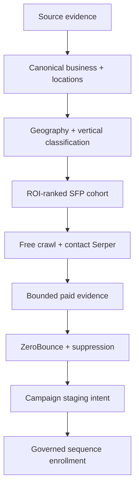

# Liberty Bancard Enrichment-to-Outreach Execution Roadmap

**Objective:** Produce a continuously replenished, deduplicated, South Florida, five-vertical pool of high-ROI businesses with validated, suppression-clean email candidates and governed campaign/sequence assignments.

## Operating principles

1. Source evidence is not a canonical business.
2. A discovered email is not a validated email.
3. A validated email is not automatically outreach-eligible.
4. Provider availability is not provider authorization.
5. Paid evidence is used only when cheaper evidence cannot resolve a high-value candidate.
6. Cold outreach is email plus manual task unless stronger consent evidence permits another channel.
7. Every record must have a terminal disposition and provenance.

## Target pipeline

## Phase 0 — Stabilize and preserve safety

**Outcome:** No accidental global validation, enrollment, or send while the funnel is repaired.

- Keep the independent SFP program non-recurring.
- Do not globally promote the 6,147 staged candidates.
- Do not activate Apollo/Outscraper/OpenAI globally just because credentials exist.
- Keep target campaigns in draft and new governed sequences paused.
- Quarantine the 18 test/kill/gate-like sequences and the active test campaign from production lists.
- Record a configuration snapshot: background profile, workers, provider controls, pricing versions, aggregate cap, and release SHA.

**Exit criteria:** Zero paid SFP operations, zero SFP enrollments, and zero outreach while migration/classification work is deployed.

## Phase 1 — System-wide inventory and canonicalization

**Outcome:** Every source occurrence is either linked, queued for materialization, parked, excluded, or marked insufficient.

Create an append-only materialization ledger spanning:

- 1,919,454 Sunbiz/source entities;
- CRO03A source census pools;
- provider CSV/Outscraper occurrences;
- public-web evidence;
- existing 6,471 canonical businesses;
- existing 154,418 contacts.

Required disposition values:

`linked_existing`, `materialized_new`, `duplicate_merged`, `identity_review`, `outside_program`, `excluded_dbpr`, `excluded_test`, `insufficient_identity`, `retryable_error`, `dead_letter`.

Register every real source adapter and backfill `canonical_source_links`. Do not materialize all 1.919M rows blindly. First select evidence with South Florida geography or target-industry signals, then resolve identity and deduplicate.

**Exit criteria:**

- 100% of processed source rows have a disposition.
- At least 95% of canonical businesses have one or more valid source links or an explicit `operator_created` provenance.
- Duplicate merge decisions and rejected fuzzy matches are auditable.

## Phase 2 — Geography truth

**Outcome:** All 6,471 canonical businesses have a truthful geography state.

Resolution order:

1. normalized `business_locations` county FIPS;
2. normalized street/city/state/ZIP mapped to county;
3. source-address evidence with confidence;
4. review queue;
5. terminal unresolved.

Evaluate **all** location rows, not only target-county matches. Distinguish:

- `inside_sfp_verified`;
- `inside_sfp_inferred`;
- `outside_sfp_verified`;
- `conflicting_locations`;
- `geography_unresolved`.

For multi-location businesses, create location-level candidacy and roll up to the business; do not let one non-target location erase a qualifying South Florida location.

**Exit criteria:**

- Funnel totals reconcile exactly to 6,471.
- `outsideGeography` is no longer zero merely because non-target locations were ignored.
- Every SFP candidate points to a qualifying location ID and county FIPS.

## Phase 3 — Five-vertical classification

**Outcome:** The current 257 SFP-resolved businesses and every future candidate receive a versioned vertical disposition.

Evidence order:

1. existing canonical vertical/subvertical and source categories;
2. business name and structured source evidence;
3. free homepage/JSON-LD/contact/about/services/menu/team page evidence;
4. cached OpenAI structured classification only when deterministic rules remain ambiguous;
5. manual review for conflicts.

Persist:

- target vertical ID;
- classifier version;
- confidence;
- evidence hashes/source URLs/page types;
- positive and negative rule hits;
- resolver method;
- review/terminal reason.

**Exit criteria:**

- All 257 current SFP rows have one of `resolved_high`, `resolved_medium`, `review_required`, `not_target`, or `unresolved`.
- Raw `Auto`, `Healthcare`, and `Salon/Spa` labels no longer fail solely because the target names are `Auto Repair`, `Dental`, and `Med Spa`.
- No AI result overwrites stronger deterministic evidence without review.

## Phase 4 — Exact ROI cohort

**Outcome:** A reproducible ranked list of exact businesses exists before any paid call.

Run scoring across all SFP target-vertical candidates using the existing 13 dimensions, corrected as follows:

- score location-level market fit;
- distinguish provider-valid from merely active/unvalidated email;
- use real evidence freshness;
- do not reward a decision-maker unless the person-to-business evidence is corroborated;
- include expected deal value and provider marginal cost explicitly;
- persist the full score and policy version.

Freeze at most 100 for the program and 25 for the first paid canary. Export masked candidate details and disposition reasons.

**Exit criteria:** Top candidates are non-empty, stable under rerun, and every exclusion is counted.

## Phase 5 — Free-first enrichment at usable throughput

**Outcome:** All selected businesses exhaust free evidence before a paid provider is considered.

- Fix the free scheduler so `running`, `nextRunAt`, repeatable-job registration, queue depth, heartbeat, and last run agree.
- Use one canonical producer.
- Run per-domain caching and fan-out results to linked businesses and contacts.
- Crawl homepage, contact, about, services/menu/team pages, JSON-LD, `mailto`, obfuscated email text, and safe first-party links.
- Persist all normalized candidates with page/source confidence, role/named classification, and rejection reason.
- Target at least 500 terminal business attempts per 24 hours, configurable to 1,000/day after soak.

**Exit criteria:** Current 6,471-business backlog has a truthful ETA; scheduler has a non-null next run; 24-hour throughput is measured by terminal outcomes, not cumulative counters.

## Phase 6 — Contact backlog and shared evidence

**Outcome:** Existing contacts and canonical businesses benefit from the same domain evidence without duplicate crawls.

- Continue the active contact Serper lane for the 14,349 production contacts missing at least one channel/domain.
- Resolve contact-to-business links before or during enrichment.
- Route discovered domains through the shared free crawler.
- Fan out a domain result to eligible linked contacts/businesses.
- Keep the 24-hour contact-attempt cooldown.
- Preserve contact Serper budget/circuit controls independently from canonical paid-provider controls, but label both clearly in UI.

**Exit criteria:** Backlog, attempts/day, domain-hit rate, email-candidate rate, and validated-email yield are visible separately.

## Phase 7 — Value-based paid waterfall

**Outcome:** Paid calls are limited to exact unresolved needs in the frozen high-ROI cohort.

| Step | Provider/evidence | Use only when | Stop condition |
|---:|---|---|---|
| 1 | Free first-party crawl | Domain known | Sufficient candidate + vertical evidence found |
| 2 | OpenAI classification | Vertical still ambiguous and page evidence exists | Target/non-target resolved with required confidence |
| 3 | Serper | Trusted domain or public business identity missing | Domain/identity found |
| 4 | Outscraper | Location/category corroboration still missing | Geography/category sufficiently corroborated |
| 5 | Apollo | High-ROI business lacks corroborated decision maker or usable address | Suitable named candidate found or credit cap reached |
| 6 | ZeroBounce | A selected address exists and all policy gates pass | Provider-valid, invalid, catch-all/review, or retryable failure |

Refactor the existing canonical provider executors into reusable adapters callable by the SFP provider-operation boundary. Every call must retain reservation, settlement, pricing version, purpose, caller, cohort, and business/candidate ID.

**Exit criteria:** SFP can execute Serper, Outscraper, OpenAI, Apollo, and ZeroBounce without invoking the legacy pilot generation/handoff model and without exposing the global candidate pool.

## Phase 8 — Outreach eligibility and materialization

**Outcome:** A validated candidate becomes an outreach prospect only after all final gates pass.

Required gates:

- target location and vertical;
- frozen cohort membership;
- fresh provider-valid email;
- suppression/complaint/bounce/DNC recheck;
- DBPR and existing-customer recheck;
- no test/demo/internal classification;
- outreach policy version and consent tier;
- approved campaign and sequence mapping.

Current policy should remain conservative:

- first-party role inbox + provider valid: eligible for governed cold email;
- named address + provider valid: operator review until person/business attribution is confirmed;
- catch-all/unknown: review;
- invalid/abuse/spamtrap/do-not-mail: terminal reject.

**Exit criteria:** `/api/outreach-queue/count` returns an exact integer with complete reason buckets; no `count=null`/`incomplete=true`.

## Phase 9 — Campaign and sequence application

**Outcome:** Five governed, paused campaign/sequence packages exist and can accept staged candidates without sending.

| Vertical | Campaign source | Governed sequence target | Primary business angle |
|---|---|---|---|
| Med Spa | Split from campaign 6; content from 11 only where medically relevant | New `SFP Med Spa — Cold Email + Manual Call` | High-ticket card volume, memberships, chargeback/documentation, financing/recurring payments |
| Dental | Split from campaign 6 | New `SFP Dental — Cold Email + Manual Call` | Treatment-plan payments, card-on-file, financing, reconciliation |
| Auto Repair | Narrow campaign 8 | New `SFP Auto Repair — Cold Email + Manual Call` | Ticket size, deposits, keyed/card-not-present mix, chargebacks, faster funding |
| Restaurant | Review campaign 5 | New `SFP Restaurant — Cold Email + Manual Call` | Margin pressure, POS/payment costs, online ordering, chargebacks/tips |
| Retail | Narrow campaign 7 | New `SFP Retail — Cold Email + Manual Call` | Omnichannel acceptance, inventory/POS integration, chargebacks, fees |

Base governance on sequence 85:

- channels: email and manual task only;
- eligible tiers: `cold_no_consent`, `warm_no_pewc`, `pewc_full_automation`;
- SMS, voice AI, and ringless voicemail excluded unless PEWC is independently proven;
- explicit unsubscribe and company identity in every cold email;
- versioned content approval and send limits.

Add an idempotent consumer that converts an approved `sfp_campaign_staging_intent` into the chosen campaign membership and sequence enrollment. Keep it in `staged/paused` until a separate launch command. Never make campaign staging itself send.

**Exit criteria:** Each staged prospect shows one campaign, one governed sequence, policy decision, and idempotency key; reruns create no duplicates.

## Phase 10 — Deliverability and controlled launch

**Outcome:** Launch only after sender infrastructure and content are proven.

Verify in production:

- SPF, DKIM, DMARC alignment;
- sending-domain and mailbox reputation/warm-up;
- reply routing and unsubscribe handling;
- bounce and complaint feedback loops;
- per-mailbox/domain daily caps;
- suppression propagation latency;
- CAN-SPAM footer and physical address;
- seed/inbox placement test.

Launch sequence:

1. 25 total records, balanced across available verticals;
2. observe 48 hours;
3. stop on hard-bounce, complaint, provider, or suppression thresholds;
4. increase to 50/day only after clean canary evidence;
5. scale by measured reply/meeting/opportunity yield, not raw send volume.

## Phase 11 — Production certification

One post-deploy certification report must prove:

- source counts reconcile;
- geography and vertical funnels reconcile;
- exact frozen business IDs and masked candidates;
- free/Serper/Outscraper/OpenAI/Apollo/ZB calls by reason and cost;
- no provider call outside the cohort;
- validation and suppression outcomes;
- campaign/sequence assignments without sends;
- idempotent rerun;
- exact outreach-ready count;
- zero outreach until explicit operator launch.

## Earliest safe path to first outreach

The minimum critical path is Phases 0, 2, 3, 4, 5, 7 (only needed providers), 8, 9, and the deliverability checks in Phase 10. Phase 1 must begin immediately, but the first bounded cohort does not need to wait for all 1.919M source records to be materialized. The same canonical contracts must nevertheless be used so the pilot does not become another isolated path.

