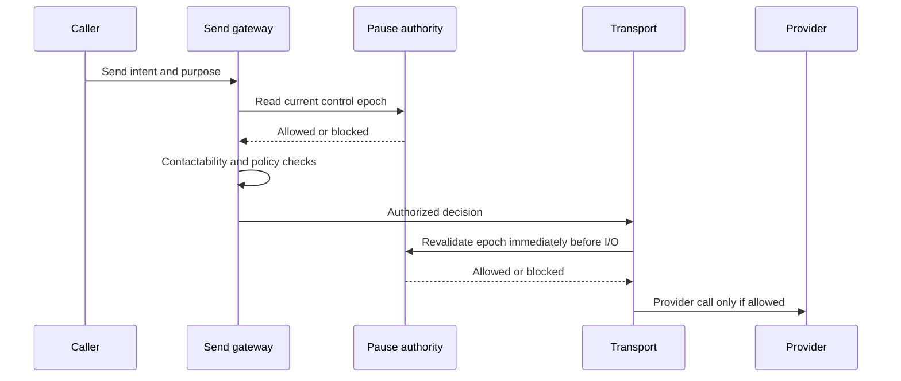

# Task #1522A — Unavoidable Global Outbound Pause Authority

**Priority:** P0  
**Type:** compliance/safety authority and mutation consistency  
**Repository baseline:** `4819cefac1478ae700c9996427174e822d97c5a5`  
**Depends on:** none; this is the global-pause slice of BT-04  
**Runtime closure:** RV-05 required  
**Queue pause/resume:** out of scope; handled by optional #1522B

## Objective

Make `outboundGlobalPaused` an unavoidable, fail-closed decision immediately before every external email, SMS, voice/RVM, and workflow-enrollment provider action, regardless of queue, route, service, scheduler, or direct caller. Make pause mutation atomic, ordered, auditable, and safe at startup without requiring a process restart.

## Safety model

The database control state is authoritative. Queue pause is not the security boundary because:

- an active job cannot be interrupted by `Queue.pause()`;
- sends occur outside BullMQ in routes/services;
- raw transport primitives currently bypass queue/orchestrator gates;
- mixed and future pooled queues cannot be safely classified by one physical queue name.

The enforcement sequence is:



## Attached findings

- `activation.ts:1466-1510` persists settings and then audit-logs them, but the mutation is not one serialized/atomic state transition.
- QueueManager startup begins asynchronously before missing pause settings are seeded in `index.ts`; null/error behavior is not uniformly fail closed.
- `channel-orchestrator.ts` reads the pause but exposes `skipGlobalPauseCheck`.
- `ghl.ts:598-804` raw email/SMS primitives do not read the pause or full contactability decision.
- Static audit found 57 raw GHL send invocation matches across 27 files outside `ghl.ts`.
- `scripts/pre-deploy.ts` exempts raw transports, workflow/recovery services, numerous other services, and the entire route layer.
- Selected workers hot-read the pause, so restart is not the principal gap.
- Physical queue pause cannot stop active jobs or nonqueued send paths.

## VFC table

| ID | Claim | Verdict |
| --- | --- | --- |
| VFC-A01 | A restart is required for canonical workers to observe pause | FALSE |
| VFC-A02 | Every outbound provider action currently checks pause | FALSE |
| VFC-A03 | Raw GHL email/SMS enforce pause | FALSE |
| VFC-A04 | Existing PATCH is atomic under conflicting requests | FALSE |
| VFC-A05 | Missing/unreadable pause uniformly blocks outbound | FALSE |
| VFC-A06 | Queue pause alone can guarantee no send | FALSE |
| VFC-A07 | Existing predeploy scan proves no bypass | FALSE |
| VFC-A08 | Selected worker guards are useful defense in depth | TRUE |
| VFC-A09 | Global/channel pause and contactability are the same decision | FALSE |
| VFC-A10 | This task closes full BT-04/BT-10 | FALSE |

## Message-purpose contract

Every outbound intent must declare one of:

| Purpose | Default global-pause behavior | Requirements |
| --- | --- | --- |
| `promotional` | Blocked | Contact identity, channel, consent/contactability, idempotency, campaign/source. |
| `lifecycle` | Blocked unless explicitly classified otherwise | Contact identity, triggering business event, channel policy, idempotency. |
| `transactional` | Blocked by default; exception only through registry | Enumerated template/action, evidence, owner, expiry, allowed channels, audit. |
| `legal_or_security` | Explicit narrow exception possible | Named policy, recipient class, approving owner, immutable audit, no marketing content. |
| `internal_operational` | Policy decision, not silently exempt | Verified internal recipient role/domain and explicit exception registry. |

“Human initiated,” “route handler,” “recovery,” “workflow,” or “admin test” is not by itself an exception.

## Canonical control state

Keep compatibility with `system_settings.key = 'outboundGlobalPaused'`, but make one service the mutation/read owner.

Add related settings:

- `outboundGlobalPaused`
- `outboundGlobalPausedReason`
- `outboundGlobalPauseEpoch`
- `outboundGlobalPauseUpdatedAt`
- `outboundGlobalPauseUpdatedBy`

Mutation rules:

1. Use a database transaction and transaction-scoped advisory lock dedicated to outbound control.
2. Re-read current state while holding the lock.
3. Increment the epoch for every accepted state transition.
4. Write pause, reason, epoch, timestamp, actor, and audit event in the same transaction.
5. Return the committed epoch and normalized state.
6. If the requested value equals current value, record an idempotent no-op with the existing epoch unless the reason changes.
7. Concurrent `true` and `false` requests are serialized; last committed epoch is authoritative.
8. The audit event records before/after, epoch, actor, request correlation ID, and reason without credentials or recipient data.

If atomic audit insertion cannot use the existing abstraction, implement the transaction in a dedicated repository/service rather than retaining `Promise.all` plus a later audit write.

## Canonical pause read

Create `server/services/outbound-pause-authority.ts` with a contract similar to:

```ts
interface OutboundPauseState {
  paused: boolean;
  reason: string | null;
  epoch: number;
  updatedAt: string | null;
  source: "database" | "safe_default";
}

interface OutboundPauseDecision {
  allowed: boolean;
  epoch: number | null;
  reasonCode: string;
  stateSource: "database" | "safe_default";
}
```

Rules:

- Normalize only explicit persisted `false`/`"false"` as unpaused.
- `true`/`"true"` is paused.
- Missing row, malformed value, database error, timeout, stale/uninitialized state, or unknown epoch is paused for external automated actions.
- Optional caches must be bounded, epoch-aware, synchronously invalidated by mutation, and fail closed on refresh failure.
- A caller cannot provide or override the pause result.
- Return structured reason codes; do not infer from log strings.

## Authorized send decision

All provider transports accept an internal `AuthorizedSendDecision` created by the canonical gateway. At minimum it contains:

- contact/recipient reference appropriate to the policy;
- channel;
- message purpose and policy version;
- pause epoch;
- contactability decision reference when applicable;
- idempotency key;
- caller/action identity;
- creation/expiry timestamp.

The transport validates the decision and rechecks the current pause epoch immediately before network I/O. A stale/missing/invalid decision or changed/unknown pause state blocks the provider call.

Do not serialize the decision into a client-controlled request or persist sensitive recipient values in logs.

## Primary files

- new `server/services/outbound-pause-authority.ts`
- new `server/services/outbound-control-service.ts`
- `server/services/channel-orchestrator.ts`
- `server/services/contactability.ts`
- `server/services/ghl.ts`
- `server/services/smtp-email.ts`
- transport adapters under `server/services/transports/`
- GHL workflow/enrollment primitives
- `server/routes/activation.ts`
- `server/index.ts`
- `scripts/pre-deploy.ts`
- `scripts/compliance-scan.ts`
- `scripts/test-channel-orchestrator.ts`
- new `scripts/test-global-pause-authority.ts`
- `.github/workflows/wave12-ci.yml`

## Build steps

### Step 0 — Freeze safety posture and inventory

1. Keep global, email, SMS, and cold-email pauses true.
2. Record HEAD, release, worktree, current pause rows/normalized values, and current startup order.
3. Generate the complete outbound primitive/caller inventory across GHL, SMTP, Gmail, SMS, RVM/voice, and workflow enrollment.
4. Classify each call by purpose, automation/manual source, contact identity, current gate, and approved exception.
5. Preserve the baseline of 57 raw GHL invocation matches / 27 files as an audit snapshot, not a permanent expected count.
6. Capture RV-05 aggregate send/caller/gateway evidence without recipients.

### Step 1 — Implement atomic control mutation

1. Move outbound-setting mutation from direct route saves into `OutboundControlService`.
2. Serialize with a transaction-scoped lock and monotonically increasing epoch.
3. Commit state and audit atomically.
4. Validate reason requirements: pausing requires a nonempty operational reason; unpausing requires an explicit reason and authorized actor.
5. Return committed state/epoch, not merely `{ok:true}`.
6. Reject malformed values; do not silently ignore unsupported fields.
7. Keep admin-only authorization and add request correlation/idempotency support.

### Step 2 — Fix startup ordering

1. Seed/read/validate all outbound pause settings before starting QueueManager, legacy workers, schedulers, or any service capable of external outbound.
2. Missing/malformed/read-error state resolves to paused.
3. Only after control state is known may workers initialize.
4. Startup logs include normalized state, epoch, and source without secrets.
5. Remove the asynchronous post-QueueManager pause-seeding race.

### Step 3 — Make the gateway authoritative

1. Make ChannelOrchestrator request a canonical pause decision before arbitration/contactability.
2. Remove `skipGlobalPauseCheck` from general production options.
3. If a narrow exception is required, replace the boolean with an enum/reference that must resolve through a versioned exception registry.
4. Require message purpose, contact/recipient identity, idempotency key, and caller/action identity.
5. Preserve contactability as a separate mandatory decision for applicable messages.
6. Emit allowed/blocked decision logs with policy version, pause epoch, purpose, channel, caller, and reason code.

### Step 4 — Close raw primitive bypasses

1. Make raw GHL/SMTP/Gmail/SMS/RVM/workflow primitives private to transport adapters where practical.
2. Require an internal authorized decision at every provider boundary.
3. Add a final pause-epoch recheck immediately before provider I/O.
4. Migrate all production callers or temporarily wrap legacy callers through the same mandatory pause authority.
5. A legacy path may not remain exempt merely because it is transactional, recovery, a route, or human initiated.
6. Enumerate true exceptions with owner, purpose, channel, expiry, and test.
7. Keep existing worker-level checks as early defense in depth.

### Step 5 — Replace broad static exemptions

1. Change scanners from “file contains pause token” to an architectural boundary test.
2. Fail when a production module imports/invokes a raw provider primitive outside its adapter/gateway.
3. Fail when `skipGlobalPauseCheck` or an unregistered exception is used.
4. Allow only generated code, tests, and the explicitly approved provider adapter/exception definitions.
5. Require justification, owner, and expiry for each exception; routes are not categorically exempt.

### Step 6 — Preserve layered controls

The final decision remains the conjunction of independently observable controls:

- global pause;
- channel pause;
- message-purpose/exception policy;
- contactability/consent/suppression;
- sender/provider readiness;
- idempotency/rate/daily caps;
- communication arbitration where applicable.

Global unpause must not override channel pause, DNC, consent, PEWC, quiet hours, validation, automation kill switch, or provider readiness.

### Step 7 — Release safely

1. Run tests with fake transports and all real outbound pauses true.
2. Do not call a real provider to prove the gate.
3. Deploy the exact green SHA.
4. Verify mutation propagation and blocked decisions across all processes.
5. Capture RV-05 by caller/category/gateway and confirm zero unclassified provider actions.

## API behavior

`PATCH /api/system/outbound-settings` returns:

```json
{
  "ok": true,
  "control": {
    "outboundGlobalPaused": true,
    "reason": "operator incident hold",
    "epoch": 42,
    "committedAt": "ISO-8601"
  },
  "sendEnforcement": {
    "status": "active",
    "policyVersion": "..."
  },
  "queueBackpressure": {
    "status": "not_configured"
  }
}
```

Queue backpressure status is separate and supplied by #1522B. A Redis failure cannot rewrite the committed send control or cause a false global success/failure claim.

## Entry gates

- All channel/global pauses remain true.
- Complete provider primitive/caller inventory captured.
- Exception taxonomy and owners approved.
- No overlapping unowned changes in control/gateway/transport files.
- Fake transport test harness available.
- Atomic DB mutation design reviewed.

## Exit gates

- Missing/malformed/unreadable pause blocks all external automated provider actions.
- Every provider call has an authorized decision and last-moment epoch recheck.
- Static scan finds no production raw transport import/call outside approved boundaries.
- Concurrent opposing PATCHes produce a deterministic committed epoch and matching audit.
- Startup cannot start outbound-capable workers before pause state is known.
- Global unpause does not clear channel/consent/automation/provider controls.
- Exact-release CI passes.
- RV-05 shows all external actions categorized and zero unknown/bypass callers.
- No real outbound message is sent during implementation/testing.

## Kill lines

- Stop if any raw provider primitive can send without canonical pause authorization.
- Stop if missing/DB-error/malformed pause fails open.
- Stop if a caller-controlled boolean can skip the global pause.
- Stop if state and audit can commit independently or concurrent PATCH order is ambiguous.
- Stop if QueueManager/workers start before pause initialization completes.
- Stop if a file-path exemption substitutes for a purpose-based exception.
- Stop if global unpause clears any channel, consent, DNC, validation, automation, or provider hold.
- Stop if tests disable real pauses or invoke a real provider.
- Stop if logs expose recipient data, message bodies, credentials, or provider tokens.
- Stop if this ticket is declared to close full BT-04 or BT-10 without their remaining gates.

## Tests

### Unit

- Normalize true/false strings/booleans; null/malformed/error/timeouts fail closed.
- Epoch increment, idempotent same-state request, reason update, and actor validation.
- Message-purpose/exception decision matrix.
- Authorized-decision expiry, channel/contact mismatch, stale epoch, and tamper rejection.
- Global/channel/contactability precedence.

### Concurrency and transaction

- Simultaneous true/false PATCH requests serialize and audit the final epoch.
- Transaction fault after each state/audit write rolls back fully.
- Cache invalidation across processes; stale cache cannot permit provider I/O.
- Retry with same idempotency/correlation key does not duplicate transitions.

### Startup

- Missing row, DB unavailable, malformed value, and slow DB all prevent outbound-capable startup or start it paused.
- QueueManager cannot initialize before control-state gate.
- Multiple processes observe the same committed epoch.

### Provider boundary

- Fake GHL email/merchant email/SMS, SMTP, Gmail, voice/RVM, and workflow enrollment all block under pause.
- Direct legacy caller and route attempts block exactly like queued callers.
- Active job paused between early check and provider dispatch is blocked by the final recheck.
- Approved exception works only for its purpose/channel/owner/expiry.

### Static/release

- 57-match baseline decreases as callers migrate; new bypass fails.
- Broad route/service exemptions are prohibited.
- Production use of `skipGlobalPauseCheck` fails.
- Exact-release CI runs the authority suite.

### Runtime

- RV-05: pause values, aggregate sends by gateway/caller/purpose, blocked reasons, process/release identity.
- No recipient data and no real test send.
- 24-hour blocked-send/bypass observation before closure.

## Rollback

Rollback must preserve `outboundGlobalPaused=true` and all channel pauses. If the new authority fails operationally, deploy the prior artifact only after confirming the legacy DB pause is true and provider credentials/outbound automations remain disabled as necessary. Never roll back by setting pause false or restoring a raw bypass. Preserve committed control/audit epochs.

## Migration

No new application table is required if the existing `system_settings` and audit table can be updated atomically under one transaction/advisory lock. If the current abstractions cannot guarantee this, add a reviewed additive singleton control-state migration rather than accepting non-atomic behavior. Do not use `db:push`.

## Out of scope

- Physical BullMQ pause/resume optimization (#1522B).
- Full consent/suppression reconciliation (BT-10).
- Email validation semantics (BT-11).
- Redis capacity/pooling (#1523/BT-05/BT-12).
- Lifting any pause or starting a real campaign.

## Done looks like

The committed global pause epoch is known before outbound-capable startup and is revalidated at every external provider boundary. No queue, route, recovery service, raw GHL/SMTP/Gmail function, or active job can bypass it, and mutation remains atomic and auditable under concurrency.
