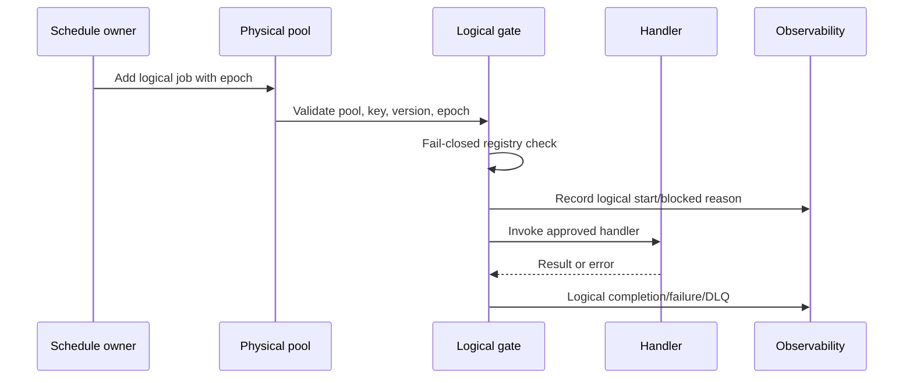

# #1523B — Conditional Logical-Job Pooling and Safe Redis Cutover

**Priority:** P1 unless an evidenced capacity incident and no safer capacity remedy elevate it  
**Type:** runtime architecture, scheduler ownership, compatibility migration, and rollback  
**Repository baseline:** re-record at entry; original audit HEAD `4819cefac1478ae700c9996427174e822d97c5a5`  
**Depends on:** #1523A, RV-07, RV-08, exact-release gate  
**Default decision:** do not open unless topology reduction remains justified

## Objective

Replace nine low-frequency physical Workers with two physical pools while preserving nine independent logical automations, their schedules, retries, backoff, startup behavior, authorization, idempotency, heartbeat, registry/history/DLQ attribution, and rollback. Perform an additive compatibility cutover with zero abandoned unfinished jobs.

## Non-goal

This task is not a mechanism for forcing a dashboard boolean to green. It is a permanent logical-job/physical-pool architecture and migration. If adequate provider headroom resolves the incident, pooling remains optional and should be scheduled on architectural merit.

## Entry decision record

Before implementation, attach:

- #1523A release SHA and 24-hour diagnostics;
- actual provider/plan/connection limit and evidence date;
- steady and rolling-deploy process/client peaks;
- redacted exact error classification;
- per-queue waiting/active/delayed/retryable/failed/completed/repeat inventory;
- capacity-increase option, cost, approval outcome, and reason it is insufficient or not selected;
- side-effect/idempotency review for all nine candidates;
- approved cutover/rollback window and named operator.

If any item is missing, the task is blocked.

## Corrected candidate roster — nine logical jobs

### Background infrastructure pool

| Logical key | Current attempts | Backoff | Current schedule | Current handler/behavior |
| --- | ---: | ---: | --- | --- |
| `db-backup` | 2 | 60 s | Cron `0 3 * * *` | `runDatabaseBackup("scheduled")`; external process/files/storage side effects |
| `executive-snapshot` | 2 | 60 s | `EXEC_SNAPSHOT_CRON` or `0 12 * * 1` | Snapshot/AI/DB work; currently uses job lock |
| `system-audit` | 2 | 30 s | `SYSTEM_AUDIT_CRON` or `0 11 * * 1` | `runSystemAudit("schedule")` |

### Background business/communications pool

| Logical key | Current attempts | Backoff | Current schedule | Current handler/behavior |
| --- | ---: | ---: | --- | --- |
| `onboarding-reminder` | 3 | 60 s | Every 4 h | Reminder workflow; communication side effects |
| `activation-monitor` | 2 | 60 s | Every 24 h | MID activation checks/alerts; currently uses job lock |
| `merchant-success` | 2 | 60 s | Every 24 h | Success-sequence enrollment; currently uses job lock |
| `winback-outreach` | 2 | 60 s | Every 24 h | Outreach sends; currently uses job lock |
| `abandoned-statement` | 3 | 60 s | Every 24 h | Statement follow-up communication |
| `partner-monthly-digest` | 2 | 60 s | `PARTNER_MONTHLY_DIGEST_CRON` or `0 9 1 * *` | Partner earnings-summary email |

The list contains nine jobs. Any design, formula, test, migration loop, or documentation referring to eight candidates fails review.

## Jobs that remain standalone

Do not pool or otherwise change:

- `ghl-sync`
- `sla-checks`
- `sequences`
- `enrichment`
- `discovery`
- `digests`
- `mid-ingestion`
- `enrollment-recovery`
- `ghl-enrollment-recovery`
- `health-monitor`
- `pipeline-silence-check`
- `proposal-followup`
- `voicemail-sync`
- `post-enrichment`

`health-monitor` and `voicemail-sync` specifically remain standalone. Discovery and re-enrichment ownership are handled by the broader BT-12 task and are not silently changed here.

## Correct topology arithmetic

| Mode | Before | Change | After physical Workers | Shared client | Estimated process connections |
| --- | ---: | --- | ---: | ---: | ---: |
| Default | 23 | remove 9, add 2 | 16 | 1 | 17 |
| Legacy GHL claimed | 22 | remove 9, add 2 | 15 | 1 | 16 |

### Additive cutover bound

The preferred cutover temporarily supports both the 23 old Workers and two new pool Workers: approximately 26 connections in one default-mode process, or 52 across two overlapping processes, before other clients. Legacy-GHL mode is approximately 25/50. #1523A must prove the environment can support this temporary state. If not, obtain temporary provider headroom or use a separately approved maintenance-window plan with a Redis backup, zero unfinished jobs, and rehearsed rollback. Do not improvise an in-place destructive switch.

## Finding disposition

| ID | Finding | Verdict | Required treatment |
| --- | --- | --- | --- |
| B-01 | The proposal identified eight candidates | FALSE | Nine-job manifest and tests. |
| B-02 | Pooling can strand old waiting/delayed/retry work | CONFIRMED | Compatibility Workers plus drain-to-zero gate. |
| B-03 | Physical-pool key would collapse independent kill switches | CONFIRMED | Mandatory logical-key gate before handler dispatch. |
| B-04 | Worker callbacks currently attribute by physical config name | CONFIRMED | Resolve and validate logical key for history, registry, heartbeat, failures, review queue, and DLQ. |
| B-05 | One serial pool causes head-of-line blocking | CONFIRMED | Two failure-domain pools; concurrency only after idempotency proof. |
| B-06 | Per-job attempts/backoff differ | CONFIRMED | Store and apply per logical definition on each add. |
| B-07 | Startup-immediate work is currently per config | CONFIRMED | Explicit per-logical startup policy and one-per-release ownership. |
| B-08 | Repeat schedules can be orphaned/duplicated | CONFIRMED | Deterministic schedule identity, one owner, exact old-key inventory and removal after drain. |
| B-09 | Three candidate registry seeds are missing | CONFIRMED | Add `activation-monitor`, `merchant-success`, and `winback-outreach`. |
| B-10 | Unknown/DB-error kill-switch checks fail open | CONFIRMED | New pooled logical-job execution gate fails closed. |
| B-11 | No on-demand producer exists for candidate queue keys | STATICALLY SUPPORTED, RUNTIME PENDING | Preserve compatibility until runtime inventory confirms. Direct manual handler routes still require concurrency/idempotency review. |
| B-12 | Two pools will solve the provider incident | NOT GUARANTEED | Incident closure is a runtime result, not a static acceptance criterion. |
| B-13 | A feature-disabled Worker may still consume a connection | CONFIRMED for `voicemail-sync` construction | Keep it standalone here; record a separate conditional-instantiation follow-up and do not count it as savings. |
| B-14 | Pool queueing can delay a logical schedule even when repeat production continues | CONFIRMED risk | Measure scheduled-to-start lag per logical key and gate pool concurrency on idempotency/SLA proof. |

## Target architecture

### Physical pool names

Add:

```ts
BACKGROUND_INFRA: "background-infra",
BACKGROUND_BUSINESS: "background-business",
```

Use “business” rather than “comms” because `activation-monitor` is not purely communications. Pool names identify physical execution only; they are never logical automation identities.

### Logical-job definition

Create a dedicated module such as `server/services/job-manifest.ts`:

```ts
interface LogicalJobDefinition {
  logicalKey: string;
  physicalPool: "background-infra" | "background-business";
  jobName: string;
  handler: (job: Job) => Promise<unknown>;
  attempts: number;
  backoff: { type: "exponential"; delay: number } | null;
  schedule:
    | { kind: "every"; everyMs: number }
    | { kind: "cron"; pattern: string; expectedIntervalMs: number };
  startup: {
    enabled: boolean;
    minDelayMs: number;
    maxDelayMs: number;
    idempotencyScope: "release";
  };
  timeoutMs: number;
  idempotencyStrategy: string;
  sideEffectClass: "database" | "filesystem" | "provider" | "communication" | "mixed";
  heartbeatExpectedMs: number;
  owner: string;
  enabledWhen?: string;
}
```

Contract rules:

- `logicalKey` is the existing automation-registry key.
- `jobName` is unique and stable, for example `db-backup:tick`.
- `physicalPool` is validated against a fixed pool definition.
- Handler mapping is code-owned; arbitrary `job.data.logicalKey` cannot select an unregistered function.
- Attempts/backoff are applied directly to each `queue.add()` options object; do not rely on one pool default for heterogeneous jobs.
- Repeat and startup jobs include `{ logicalKey, manifestVersion, cutoverEpoch }` only—no contact or merchant PII.
- Every definition declares idempotency, timeout, side-effect class, expected heartbeat, and owner.
- Manifest version/cutover epoch is persisted in deployment evidence.

### Physical pool definition

```ts
interface PhysicalPoolDefinition {
  name: "background-infra" | "background-business";
  concurrency: number;
  lockDurationMs: number;
  stalledIntervalMs: number;
  maxStalledCount: number;
}
```

Initial target concurrency may be 2 only after every member passes idempotency/concurrent-overlap tests. Otherwise start the affected pool at 1 and change concurrency in a later evidence-backed release. A green connection count is not permission to increase side-effect parallelism.

## Primary files

- `server/services/queue-manager.ts`
- new `server/services/job-manifest.ts`
- `server/services/queue-connection.ts`
- `server/services/automation-kill-switch.ts`
- `server/services/startup-reconcile.ts`
- `server/services/job-registry.ts`
- `server/services/health-monitor.ts`
- `server/routes/queue-metrics.ts`
- `server/routes/admin.ts`
- nine candidate handler modules
- `scripts/test-bullmq-resilience.ts`
- new `scripts/test-logical-job-pools.ts`
- new `scripts/inventory-legacy-queues.ts`
- new `scripts/verify-logical-pool-cutover.ts`
- `package.json`
- `.github/workflows/wave12-ci.yml`

## Implementation phases

### Phase 0 — Re-preflight the exact implementation baseline

1. Record HEAD, worktree, migration head, BullMQ version, deploy mode, and queue manifest checksum.
2. Recount `QUEUE_CONFIGS`; stop if it is not understood and reconciled with the 23 baseline.
3. Re-run static producer search and runtime RV-08 inventory for all nine old queue names.
4. Capture all current configs, repeat keys, state counts, oldest job ages, automation registry rows, heartbeats, history, and DLQ counts.
5. Capture current pause/outbound state. This task must not unpause communications.
6. Confirm temporary Redis headroom for additive old-plus-new topology and rolling deploy.

### Phase 1 — Extract and prove handlers without changing topology

1. Extract a named handler for each logical job. Reuse existing named helpers where present.
2. Do not change internal behavior, schedule, retry, or side effects during extraction.
3. For `executive-snapshot`, preserve its job-lock acquisition/release and failure semantics.
4. Preserve activation, merchant-success, and winback job locks.
5. Inventory manual routes that directly invoke underlying handlers; test overlap with scheduled execution.
6. Add handler contract tests and record idempotency outcome for every candidate.
7. For communication handlers, prove the existing outbound authority/pause/contactability path remains mandatory. Pooling does not authorize sends.

**Phase gate:** extracted handlers pass behavior-equivalence tests while all 23 old Workers remain active.

### Phase 2 — Introduce the manifest in compatibility mode

1. Add all nine logical definitions and two physical pool definitions.
2. Add the three missing automation rows (`activation-monitor`, `merchant-success`, and `winback-outreach`) from an explicit desired-state record. Default each missing row to kill-switched unless an authorized operator records the intended enabled state. Never overwrite an existing row's kill-switch value.
3. Add a pooled logical execution gate that:
   - validates physical pool, job name, logical key, manifest version, and cutover epoch;
   - looks up the exact logical automation row;
   - fails closed if the row is missing, disabled, unreadable, or the lookup errors;
   - records the blocked reason without job payloads;
   - invokes no handler before successful authorization.
4. Keep existing `isAutomationEnabled()` behavior unchanged for nonpooled jobs unless a separate reviewed task changes it.
5. Build topology/metrics code that reports physical pools and logical jobs separately.
6. Add logical attribution for start/completion/failure, heartbeat, history, job registry, automation registry, review queue, DLQ, and alerts.
7. Preserve legacy queue readers for metrics, history, and DLQ during the compatibility window.
8. Deploy manifest code with pooling disabled; no new pool Worker or schedule is created yet.

**Phase gate:** manifest parity tests show nine definitions, unique keys/names, exact current scheduling/retry values, handler coverage, and registry coverage. Any intentional change caused by safely creating a previously missing registry row is documented and approved; no other runtime behavior changes.

### Phase 3 — Add dormant pool consumers

1. Add physical pool Queue/Worker construction behind a deployment-scoped cutover state.
2. New Workers must reject unknown, stale-epoch, wrong-pool, or malformed jobs.
3. Event listeners derive logical identity through the validated manifest resolver, never directly from untrusted job data.
4. Do not register pool repeat schedules or startup jobs yet.
5. Confirm old Workers continue consuming old queues.
6. Test the pool with synthetic, side-effect-disabled jobs in a nonproduction environment.

**Capacity gate:** additive Workers may deploy only when RV-07 proves sufficient transient/rolling headroom. Otherwise use an approved maintenance window after a nonproduction rehearsal.

### Phase 4 — Establish singleton schedule ownership

1. Create one durable schedule-reconciliation owner using an existing proven DB/Redis lease pattern or a dedicated lease with fencing token and expiry.
2. Only the current fenced owner may create/remove repeat schedules or startup-immediate jobs.
3. Use deterministic repeat identity per `logicalKey + manifestVersion`.
4. Preserve the current schedule expression and timezone semantics exactly.
5. Preserve startup-immediate behavior initially, but emit at most one startup job per `releaseSha + logicalKey` across all processes.
6. Startup job IDs must deduplicate within the release and differ for a later release.
7. Do not use “remove every repeatable in this queue.” Remove only the exact manifest-owned schedule key after inventory.
8. Expose desired owner, actual owner/fencing token, schedule key, next run, and duplicate/stale status without secrets.

**Phase gate:** multi-process and rolling-deploy tests prove one repeat schedule and one startup-immediate job per logical job/release.

### Phase 5 — Inventory and freeze old schedule production

For each of the nine old physical queues:

1. Capture repeat keys and counts for waiting, active, delayed, retryable, failed, and completed jobs.
2. Under the fenced schedule owner, stop creating new old-queue repeat/startup jobs.
3. Remove only the exact old repeat key after its replacement definition is verified but not yet activated.
4. Keep the old Worker active to process existing waiting/delayed/retryable work.
5. Prevent another process/release from recreating the old schedule through the cutover epoch.
6. Continue observing old heartbeats, metrics, history, and DLQ.

Do not claim “no producers” from static grep alone. The runtime freeze and queue-state evidence are required.

### Phase 6 — Drain old unfinished work to zero

Wait until every old queue has:

- `active = 0`;
- `waiting = 0`;
- `delayed = 0`;
- no failed job with retry remaining;
- no repeat schedule capable of producing another old job.

Completed and exhausted-failed history may remain for retention, but the compatibility reader must keep it visible. Do not delete or silently abandon it.

If a job cannot drain:

- stop the cutover;
- keep the old Worker/reader;
- classify the job and decide retry, quarantine, or operator resolution through an approved action;
- record the decision and idempotency implications.

### Phase 7 — Activate new logical schedules and startup policy

1. Under the fenced owner, add one new repeat schedule per logical job to its physical pool.
2. Apply attempts/backoff directly on each add operation.
3. Include deterministic job/repeat identity and current cutover epoch.
4. Emit at most one startup-immediate job per logical job for this release if its manifest startup policy is enabled.
5. Enable pool dispatch only for the current epoch.
6. Leave old Workers deployed but with no unfinished work and no schedule producer during the observation window.

At no point may both old and new schedule producers be active for the same logical job.

### Phase 8 — Observe before removing old Workers

Observe at least one execution of every high-frequency/daily logical job and use controlled nonproduction/manual proof for weekly/monthly jobs. Require:

- logical kill-switch independence;
- correct handler routing;
- attempts/backoff parity;
- one execution per intended occurrence;
- logical heartbeat/history/registry/DLQ attribution;
- no duplicate communication/provider/database side effects;
- physical/logical metrics reconciliation;
- stable connection/client/error measurements;
- no old unfinished jobs or recreated repeat keys.

Maintain old Worker code and rollback controls through the observation window.

### Phase 9 — Remove old Worker configs in a later release

Only after Phase 8:

1. Remove the nine old physical Worker configs.
2. Retain logical definitions, compatibility readers, and legacy-key inventory until retention/rollback expiry.
3. Verify default `QUEUE_CONFIGS` physical count is 16 and legacy-GHL active count is 15.
4. Verify estimated single-process connections are 17/16 respectively.
5. Do not hardcode these values in the capacity calculation; derive them from the manifest. Baseline assertions may document the approved topology.
6. Remove compatibility readers only in a separate cleanup after old failed/completed data and rollback obligations expire.

## Logical execution sequence



## Admin and observability requirements

### Metrics

Return separate structures:

- physical pools: Worker state, Queue counts, connection contribution, paused state;
- logical jobs: schedule, next run, waiting/active/delayed/failed counts by logical key, last start/completion/failure, expected interval, heartbeat age, attempts/backoff, kill-switch status, owner, and cutover epoch;
- legacy queues: unfinished counts and retained failed/completed history through compatibility expiry.

Never estimate logical job count from physical pool count.

For each logical execution, retain its intended schedule time and record `scheduleLagMs = startedAt - scheduledFor`. Alerting and stale-heartbeat decisions use logical cadence/SLA, not the physical pool's aggregate activity.

### Controls

- Physical `Queue.pause()` pauses every logical job in that pool and must be labeled as a pool-wide emergency control.
- Normal independent control uses the logical automation-registry key.
- The nine logical rows must exist before activation.
- Missing row, DB error, unknown key, stale epoch, or manifest mismatch blocks dispatch.
- Cache invalidation must occur on every kill-switch mutation.

### Heartbeats and registry

Preserve `worker_heartbeat_<logicalKey>` compatibility or migrate atomically to a structured logical-run store. A physical pool heartbeat alone is insufficient. `recordWorkerSuccess`, `recordWorkerFailure`, automation registry updates, review queue items, audit logs, alerts, and DLQ records all use the validated logical key and also retain the physical pool for diagnosis.

## Migration VFC table

| ID | Claim | Required verdict |
| --- | --- |
| VFC-B1 | Candidate count is eight | FALSE; exactly nine |
| VFC-B2 | Default post-pool `QUEUE_CONFIGS.length` is 17 | FALSE; physical count is 16 |
| VFC-B3 | Default estimated process connections are 17 | TRUE under one-shared-client formula |
| VFC-B4 | Legacy-GHL physical count is 15 | TRUE |
| VFC-B5 | Logical controls use pool names | FALSE |
| VFC-B6 | Unknown/missing logical control may run | FALSE |
| VFC-B7 | Old waiting/delayed/retry jobs may be abandoned | FALSE |
| VFC-B8 | Old repeat keys may be removed before inventory/freeze | FALSE |
| VFC-B9 | Both old and new schedule producers may overlap | FALSE |
| VFC-B10 | Pool concurrency 2 is automatically safe | FALSE; handler proof required |
| VFC-B11 | Physical and logical metrics are interchangeable | FALSE |
| VFC-B12 | Provider incident is closed by static topology math | FALSE; runtime proof required |

## Entry gates

- #1523A complete with RV-07/RV-08 and exact-release evidence.
- Provider headroom supports additive/rolling topology or approved maintenance alternative.
- Nine-candidate manifest review complete.
- All current attempts, backoff, schedules, environment overrides, locks, and startup behavior captured.
- Current registry rows and their kill-switch values are captured. Missing candidate rows have an approved desired state and must exist before any pooled job can activate.
- Outbound global/channel pauses and contactability controls remain unchanged.
- Every handler has idempotency, timeout, concurrency, and side-effect classification.
- Nonproduction migration and rollback rehearsal passes with seeded queue states.
- Named operator, observation window, and rollback authority assigned.

## Phase gates

| Phase | Gate |
| --- | --- |
| Handler extraction | Behavior-equivalence tests pass on old topology. |
| Manifest | Nine definitions, unique keys/names, exact config parity, zero behavior change. |
| Dormant pools | Unknown/stale/malformed jobs fail; no schedules or side effects. |
| Schedule owner | One owner/repeat/startup job across multi-process restart/rolling deploy. |
| Freeze | Exact old repeat keys inventoried and no old producer can recreate them. |
| Drain | All unfinished old job categories are zero. |
| Activation | One new schedule per logical key; no overlapping old producer. |
| Observation | Correct logical execution/attribution, no duplicate effects, stable Redis. |
| Removal | 16/15 derived physical counts; legacy evidence/rollback retained. |

## Exit gates

- One manifest is the source for logical keys, handlers, pools, schedules, retries, timeouts, startup policies, controls, and telemetry.
- Exactly nine logical jobs are mapped into two physical pools.
- Default/legacy physical counts derive to 16/15 and process estimates to 17/16.
- Each logical job independently blocks on its original key and fails closed on lookup problems.
- Each logical job retains exact attempts/backoff and one owned schedule.
- Per-logical scheduled-to-start lag remains within its approved SLA, with no health or business job hidden behind unrelated pool work.
- No abandoned unfinished job or unowned repeat key exists under an old queue.
- Logical heartbeat/history/registry/review/DLQ attribution remains complete.
- Pool-wide controls are distinguished from logical controls.
- Restart and rolling deployment create no duplicate schedules/startup runs.
- 24-hour runtime observation is healthy; weekly/monthly paths have controlled proof.
- Rollback remains available until the approved window closes.

## Kill lines

- Stop if any document or implementation counts eight candidates.
- Stop if default physical count is asserted as 17; it is 16 after replacing nine with two.
- Stop if provider headroom cannot support the chosen cutover topology.
- Stop if an unknown, missing, stale, malformed, wrong-pool, or DB-error logical decision can run a handler.
- Stop if any logical job loses independent kill switch, schedule, retry, backoff, heartbeat, history, registry, review, DLQ, cost, or owner attribution.
- Stop if `worker_heartbeat_background-*` replaces the logical heartbeat.
- Stop if both old and new schedule producers are active for the same logical job.
- Stop if an old Worker is removed while active, waiting, delayed, or retryable work remains.
- Stop if old repeat keys are removed by a broad “remove all” operation without exact ownership/inventory.
- Stop if a communication, provider, backup, or AI handler runs concurrently without idempotency proof.
- Stop if pool queueing causes a logical job to breach its approved schedule-lag SLA.
- Stop if global/channel outbound pauses or contactability are weakened.
- Stop if `health-monitor` or `voicemail-sync` enters a pool.
- Stop if discovery/re-enrichment behavior changes as a side effect.
- Stop if logs, jobs, migration evidence, or DLQ payloads expose secrets or contact/merchant PII.
- Stop if the release SHA lacks its own required green checks.

## Tests

### Manifest contract

- Exactly nine logical definitions.
- Unique `logicalKey` and `jobName`.
- Every handler defined and assigned to exactly one approved pool.
- Every logical key has an automation seed.
- No logical key remains as a physical config after final removal.
- Attempts/backoff/schedule/startup parity with the preflight snapshot.
- Standalone queue roster unchanged.

### Topology

- Compatibility mode: 23 old Workers, no pools scheduled.
- Additive mode: 25 physical Workers default before old removal; capacity gate enforced.
- Final default: 16 physical Workers, 17 estimated process connections.
- Final legacy-GHL: 15 physical Workers, 16 estimated process connections.
- Calculations derive from production structures; no stale literal drives capacity status.

### Authorization and routing

- Each logical key allowed/kill-switched independently.
- Missing row, DB timeout/error, unknown key, wrong pool, wrong job name, stale manifest, and stale epoch all fail closed.
- No handler executes before the gate.
- Physical pool emergency pause affects the whole pool and is labeled accordingly.
- Cache invalidation takes effect immediately after mutation.

### Scheduling

- Exact interval/cron parity for all nine jobs and environment overrides.
- One repeat schedule per logical key across multiple processes.
- One startup-immediate job per logical key/release.
- Restart and rolling deployment create neither duplicates nor missed ownership.
- Schedule-owner fencing prevents stale owner mutation.
- No old schedule can reappear after freeze.
- Scheduled-to-start lag is recorded and tested independently for every logical key, including slow-job head-of-line scenarios.

### Retry, failure, and telemetry

- Exact per-logical attempts/backoff on added jobs.
- Failed job retries in the correct physical pool while retaining logical identity.
- Exhaustion creates one logical DLQ/review item with physical-pool context.
- Completion/failure updates the correct logical registry/history/heartbeat.
- Unknown/malformed jobs quarantine without side effects.

### Handler idempotency and concurrency

For each candidate, test duplicate delivery, retry after partial failure, overlapping manual/scheduled execution, process crash, and concurrent pool slot. Specifically verify:

- one database backup artifact/ledger result per run token;
- one executive snapshot per period;
- one system audit run per schedule token;
- no duplicate reminder, winback, abandoned-statement, or partner email;
- no duplicate merchant-success enrollment;
- no duplicate activation alert.

If any handler fails, set its pool concurrency to 1 or keep it standalone until repaired.

### Migration fixtures

Seed old queues with:

- waiting jobs;
- active job simulation;
- delayed jobs;
- failed jobs with retries remaining;
- exhausted failed jobs;
- completed history;
- repeat entries;
- stale/duplicate repeat keys.

Prove freeze, drain, activation, retained legacy visibility, no abandonment, and rollback. The cutover must refuse to advance while any unfinished category is nonzero.

### Release/runtime

- Add stable package commands for the logical-pool contract suite, legacy-queue inventory, and cutover verifier; CI and operator runbooks invoke those commands rather than duplicating shell commands.
- Clean-clone typecheck/build/focused integration suite.
- Exact-release CI.
- Controlled nonproduction multi-process restart/rolling deployment.
- Production canary with outbound pauses unchanged.
- 24-hour connection/error/queue/logical-run observation.
- Controlled proof for weekly/monthly handlers without sending external communications unless separately authorized.

## Rollback plan

Rollback is a state transition, not a code-only redeploy.

### Before new schedules activate

- Disable dormant pools.
- Leave old Workers/schedules unchanged or restore the exact old repeat keys from the inventory.
- No job migration should be necessary.

### After new schedules activate but before old Worker removal

1. Fence schedule reconciliation.
2. Stop new pool schedule/startup production for the affected logical keys.
3. Keep pool Workers active until new-pool unfinished work drains to zero.
4. Restore exact old repeat schedules under the new rollback epoch.
5. Verify only old producers are active.
6. Observe old logical executions and registry/heartbeat recovery.
7. Disable pool dispatch after drain.

### After old Worker removal

Use the retained compatibility release:

1. Reintroduce old Workers without schedules.
2. Stop/fence new producers.
3. Drain new pool unfinished work.
4. Restore old schedules and startup policy under a unique rollback epoch.
5. Verify zero overlapping producers.
6. Preserve pool failed/completed history through retention.

Never roll back by simultaneously enabling old and new schedules or by deleting unfinished pool jobs.

## Runtime evidence packet

Record for every phase:

- environment, release SHA, process identities, manifest version, cutover epoch, schedule-owner token;
- actual provider limit, observed clients, estimated physical contribution, peak/headroom;
- physical and logical topology;
- per-old/new queue state counts and repeat keys;
- logical start/completion/failure/blocked/DLQ counts;
- idempotency/duplicate-side-effect counters;
- outbound pause state;
- gate result, reviewer, timestamp, and rollback status.

All evidence is aggregate/redacted. Do not include job payloads or customer/merchant values.

## Out of scope

- Changing Redis provider/plan inside this code ticket.
- Migrating every queue into pools.
- Migrating BullMQ repeatable jobs to Job Schedulers API.
- Fixing discovery versus daily-outreach semantics.
- Starting re-enrichment.
- General fail-closed conversion for every nonpooled automation.
- Outbound-authority remediation beyond preserving existing gates.
- Deleting historical old queue keys before retention/rollback expiry.

## Done looks like

Nine logical automations run on two physical Workers without losing individual control or evidence. The old queues have no unfinished work or active schedule producer, the new topology is derived and observable, rolling deployment is singleton-safe, external side effects remain idempotent and paused as required, and rollback is proven rather than assumed.
