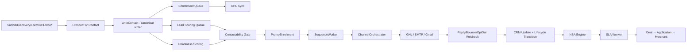

# Liberty Bancard — Master Knowledge Brief

> **Canonical technical and product orientation document. Created August 13, 2026.**
> Future agents: treat this as orientation, not unquestionable truth. Verify current Git SHA before every major task. Use live code as source of truth.

---

## 0. Document Metadata

| Field | Value |
|-------|-------|
| Audit date | 2026-08-13 |
| Branch | `main` |
| Commit SHA | `2075729957b5592504bbd49584c98c2ac684ebf9` |
| Latest merge | Task #1493 — Ready-for-Outreach rep queue |
| Database observed | `heliumdb` (dev/staging, PostgreSQL 16.10) |
| Database size | 3,208 MB |
| Migration head | id=156, hash=`c196392a...` |
| Drizzle tables defined | 139 (167 actual tables in `public` schema) |
| Audit method | Static code analysis + read-only DB aggregates |
| Limitations | No production DB access; all counts are from the development database. Some sequence/campaign IDs cannot be confirmed without live DB query. |

---

## 1. Executive Summary

Liberty Bancard is a Florida-based ISO (Independent Sales Organization) / merchant services reseller that acquires small-business merchants, analyzes their current payment processing costs, and converts them to Liberty's processing program. The platform is a full-stack CRM + outreach automation system built on Node.js/Express, React, PostgreSQL (Drizzle ORM), GoHighLevel (GHL), BullMQ/Redis, and several enrichment providers.

**As of this audit:**
- **156,063 contacts** in the CRM, predominantly Sunbiz-sourced Florida businesses
- **387 deals** across sales and onboarding pipelines
- **28 sales agents, 3 admins, 2 managers**
- **All outbound is globally paused** (`outboundGlobalPaused = true` in system_settings) — no sequences are actively sending
- **98% of contacts (153,459) have no GHL ID** — the vast majority have never been synced to GoHighLevel
- **75% of contacts (117,315) have no data readiness score** — bulk enrichment has not been run
- **444 sequence enrollments are in "paused" state** — the outbound global pause is enforced at the enrollment level
- The pre-deploy gate runs 30 suites and is currently **30/30 green** — the platform is publishable

The system is architected carefully with compliance fences, consent tracking, DNC enforcement, and a multi-layer contactability gate. The primary operational gaps are: (1) outbound is not yet live, (2) most contacts lack enrichment and readiness scoring, (3) ZeroBounce validation has only run on a small fraction of records, and (4) the import provenance system exists but has 0 import_executions rows (imports haven't been tracked yet).

---

## 2. What Liberty Bancard Is

**CONFIRMED** from public routes, sequence copy, application fields, and enrichment configuration.

Liberty Bancard is a **merchant processing ISO/MSP** operating in Florida. It:
- Sells payment processing services (credit/debit card acceptance) to small businesses
- Offers savings analysis by reviewing merchants' current processing statements
- Provides surcharge / cash-discount programs ("0% processing" for merchants)
- Offers Liberty Smart Terminals and POS equipment
- Provides funding speed, chargeback defense, and PCI compliance assistance as value propositions
- Targets Florida small businesses primarily via Sunbiz (Florida business registry) sourcing
- Uses a field + inside-sales model with SDR agents

**Products/services evidenced:**
- Merchant processing (core) — statement audit → savings analysis → application → boarding
- Surcharge / cash-discount programs (`interestedIn0Percent` field, sequence copy)
- POS terminals / smart terminals (`needTerminal` field, "Liberty Smart Terminal" sequence)
- Payment links / text-to-pay
- Chargeback defense program (sequence: "Chargeback Defense")
- Business funding (referenced in sequence copy)
- Subscription/recurring billing support

**Geographic focus:** Florida (Sunbiz ingestion, OSM/discovery targets FL cities, vertical sequences mention "FL Auto Repair", "FL Med Spa", "FL Medical/Dental", "FL Construction")

**Role:** CONFIRMED — Liberty acts as ISO/agent, not as direct processor. It sources merchants, boards them through a processor (unnamed in code), and earns residuals.

**Revenue model:** Residual income from merchant processing volume. Partner organizations share residuals (partner_organizations, partner_residuals tables). `estimatedResidual` is tracked per contact.

---

## 3. Business Goals

### Confirmed business objectives (evidenced in code/data)
1. **Generate qualified merchant leads** — Sunbiz ingestion (1.9M FL entities), discovery via BBB/OSM/YellowPages/Serper/Outscraper/Apify
2. **Convert raw prospects into CRM contacts** — prospect promotion system, writeContact canonical writer
3. **Enrich incomplete records** — multi-provider enrichment pipeline (Serper, Outscraper, Apify, Sunbiz)
4. **Score and qualify contacts** — lead scoring (0–100) + data readiness scoring (0–100)
5. **Automate appropriate follow-up** — 75+ named sequences across cold outbound, nurture, application completion, vertical campaigns
6. **Improve statement-audit conversion** — statement upload form, StatementChain (11-step pipeline), abandoned statement worker
7. **Generate merchant applications** — merchant application flow with PEWC consent, EIN dedupe, finalize gate
8. **Onboard approved merchants** — Go-Live gate (checklist + MID + underwriting), merchant portal
9. **Retain active merchants** — churn scoring, attrition monitor, 30/60/90-day success sequences, save cases
10. **Centralize merchant intelligence** — unified CRM with lifecycle states, NBA engine, SLA tracking

### Inferred from architecture
- Improve SDR productivity (NBA engine, outreach queue, ready-for-outreach rep queue)
- Measure pipeline and campaign performance (analytics_events, KPI dashboards, executive snapshot)
- Expand via partner/referral network (partner_organizations, co-branded proposals, referral flywheel sequence)

### Open product questions
- Is Liberty the processor or purely an ISO? (No processor name visible in code)
- Are chargebacks table rows real residuals or placeholders?
- What is the relationship between "merchant_mids" and the external processor boarding system?

---

## 4. User / Operator Roles

| Role | Count (DB) | Capabilities |
|------|-----------|--------------|
| `admin` | 3 | Full access to all routes, bulk operations, system settings, overrides, exports, enrichment controls |
| `manager` | 2 | CRM, deals, campaigns, sequences, imports, ZeroBounce validation, admin-only ops minus system config |
| `agent` | 28 | Own-portfolio contacts/deals only (scope-fenced), outreach queue, task management, no bulk actions |
| `merchant` | 26 | Merchant portal only — onboarding checklist, document upload, deal status |
| `sdr` | (not in DB role list) | SDR-specific routes under `/api/sdr/*`, separate from main CRM |

**Auth implementation:** Session-based (`express-session` + Redis). Middleware chain: `isAuthenticated` (session check) → `isDashboardUser` (role ∈ admin/manager/agent) → `requireRole(...)` (specific role gate). Merchant routes use `isAuthenticated` only without `isDashboardUser`.

**Agent portfolio scoping:** `GET /api/portfolio` and contact/deal reads filter by `assignedTo = currentUser.id` for agents. Hostile `?owner=` parameter override is blocked — agents cannot see other reps' contacts.

---

## 5. Product & Service Offering

**CONFIRMED from schema and sequence copy:**
- Core processing with rate savings ("Switch & Save — Statement Audit")
- Surcharge/cash discount ("Surcharge & Cash Discount — Compliance")
- POS/terminal ("Liberty Smart Terminal — Product Showcase")
- Text-to-pay / payment links ("Text-to-Pay & Payment Links")
- Omnichannel (online + in-person)
- Chargeback defense program
- PCI compliance
- Funding speed/reliability
- Contract escape assistance ("Contract Escape — Switch Help")
- Business funding (referenced in sequence copy)

**Vertical focus:** Restaurant/Retail, Healthcare/Medical/Dental, Med Spa/Salon/Gym, Auto/Auto Repair, Landscaping/Construction, Legal, Hotel, Fitness — with dedicated "V-[Vertical]: SDR Outbound Prospecting / Inbound Lead Nurture / Account Management" sequence families per vertical.

---

## 6. Architecture Overview

```
┌─────────────────────────────────────────────────────────┐
│                    CLIENT (React/Vite)                   │
│  Dashboard · CRM · Sequences · Campaigns · SDR · Mobile │
└─────────────────────────────┬───────────────────────────┘
                              │ REST API + CSRF
┌─────────────────────────────▼───────────────────────────┐
│                Express Server (Node.js/TypeScript)       │
│  Routes: contacts · deals · sequences · campaigns ·     │
│          SDR · public forms · webhooks · admin ·        │
│          auth · boarding · analytics · AI               │
│                                                         │
│  Services: ContactWriter · ChannelOrchestrator ·        │
│   PromoEnrollment · LifecycleService · NBAEngine ·     │
│   SenderPolicy · Contactability · Arbitration ·        │
│   StatementChain · UnderwritingChecklist · SLA          │
└──────┬────────────┬──────────────────┬──────────────────┘
       │            │                  │
┌──────▼──────┐ ┌───▼────────┐  ┌─────▼──────────────────┐
│ PostgreSQL  │ │   Redis    │  │  External Integrations  │
│ (Drizzle)  │ │ (Upstash)  │  │  GHL · SMTP · Gmail ·  │
│ 139 tables │ │ BullMQ     │  │  ZeroBounce · Serper ·  │
│ 3.2 GB     │ │ 23 queues  │  │  Outscraper · Apify ·  │
│            │ │ 24 conns   │  │  Sunbiz · OpenAI       │
└────────────┘ └────────────┘  └────────────────────────┘
```

**Mermaid flow — lead lifecycle:**


---

## 7. Technology Stack

| Layer | Technology |
|-------|-----------|
| Runtime | Node.js (TypeScript via tsx) |
| Web framework | Express.js |
| Frontend | React + Vite, TailwindCSS, shadcn/ui, Radix UI |
| ORM | Drizzle ORM |
| Database | PostgreSQL 16.10 (Neon/direct) |
| Job queue | BullMQ + Redis (Upstash) |
| Session | express-session + connect-pg-simple |
| Email send | GHL (primary) + SMTP (nodemailer) + Gmail OAuth (transactional) |
| Email validation | ZeroBounce |
| CRM overlay | GoHighLevel (GHL) |
| Enrichment | Serper, Outscraper, Apify, Sunbiz, YellowPages, BBB, OSM |
| AI | OpenAI GPT-4o / GPT-4o-mini (chat, NBA, statement analysis, subject lines) |
| File storage | Local disk (`uploads/`) |
| Auth | Session-based (bcrypt passwords) |
| Deployment | Replit (dev) + production deploy |
| Build | tsx (dev hot-reload) |

**Notable:** No SendGrid. No Stripe (payments handled externally by processor). No test framework (Vitest/Jest) — QA is done via custom `npx tsx scripts/*.ts` smoke tests.

---

## 8. Repository Structure

```
/
├── client/                    # React SPA
│   └── src/
│       ├── pages/             # Dashboard pages (CRM, sequences, SDR, etc.)
│       ├── components/        # Shared + feature components
│       └── lib/               # apiRequest, CSRF, hooks
├── server/
│   ├── index.ts               # Express entrypoint, middleware, route registration
│   ├── routes/                # Route handlers (contacts, deals, sequences, campaigns, SDR, public, auth, admin, boarding...)
│   ├── services/              # Business logic services
│   │   ├── contact-writer.ts  # CANONICAL contact create/update
│   │   ├── queue-manager.ts   # BullMQ queue/worker setup (23 queues)
│   │   ├── channel-orchestrator.ts # CANONICAL outbound send gate
│   │   ├── sender-policy.ts   # From/Reply-To/CAN-SPAM policy
│   │   ├── contactability.ts  # DNC/consent/email-status gate
│   │   ├── lifecycle.ts       # Lifecycle state machine
│   │   ├── nba-service.ts     # Next Best Action engine
│   │   ├── sla-worker.ts      # SLA checks, deal progression
│   │   ├── promotional-enrollment.ts  # CANONICAL enrollment
│   │   ├── sequence-worker.ts # Sequence step processor
│   │   ├── campaign-engine.ts # Campaign audience + send
│   │   ├── lead-scoring.ts    # Lead score computation
│   │   ├── contact-readiness.ts # Readiness scoring
│   │   ├── enrichment.ts      # Enrichment orchestrator
│   │   ├── ghl-sync.ts        # GHL sync worker
│   │   ├── arbitration.ts     # Communication collision prevention
│   │   ├── sdr/               # SDR subsystem (20+ files)
│   │   └── ...
│   ├── storage/               # DB access layer (Drizzle)
│   ├── middleware/             # Auth, rate limiting, CSRF
│   └── db/
│       └── migrations/        # 156 migration files
├── shared/
│   └── schema.ts              # 139 Drizzle table definitions (5,514 lines)
├── scripts/                   # 50+ admin/QA/backfill scripts
└── docs/                      # Audit reports, checklists, this document
```

---

## 9. Canonical Entity Model

### contacts
- **Table:** `contacts`
- **Purpose:** Primary CRM entity — every prospect, lead, and active merchant contact
- **PK:** `id` (serial)
- **Key FKs:** `businessId` → `businesses`, `partnerOrgId` → `partner_organizations`, `primarySourceEventId` → `contact_source_events` (DEFERRABLE)
- **Creation paths:** `writeContact()` (canonical) | GHL webhook | CSV import | Sunbiz cron | SDR orchestrator | prospect conversion
- **Dedup:** Partial unique index on normalized email (non-archived); partial unique index on `ghlContactId` (non-blank). No phone dedup constraint.
- **Lifecycle field:** `lifecycleState` text NOT NULL default `'PROSPECT'` (27 states)
- **Email status:** `emailStatus` text NOT NULL default `'active'` — **"active" means "not validated", not "confirmed deliverable"**
- **Mutation owner:** `updateContactGhlFirst()` for identity fields; `storage.updateContact()` for other fields; lifecycle transitions through `LifecycleService`
- **GHL sync:** Bidirectional. `REPLIT_OWNED_FIELDS` list protects local authoritative fields from GHL overwrite.
- **Archival:** `archived_at` timestamp (soft delete). DB count: 0 contacts currently archived.

### deals
- **Table:** `deals`
- **Purpose:** Opportunity tracking — one per merchant relationship in each pipeline
- **PK:** `id` (serial)
- **Key FKs:** `contactId` → `contacts`, `userId` (assigned rep)
- **Pipeline values:** `'sales'`, `'onboarding'` (confirmed from DB)
- **Stage values (DB):** sales: New Lead, Statement Requested, Statement Received, Proposal Sent, proposal, Closed Won | onboarding: Go-Live Scheduled
- **Count:** 387 total deals

### companies / businesses
- **Table:** `companies` (and `businesses` referenced by contacts)
- **Count:** 1,222 companies
- **Purpose:** Business entity dedupe and relationship hub

### sdr_merchants
- **Table:** `sdr_merchants`
- **Purpose:** SDR system's view of a merchant/business target (separate from main CRM contact)
- **Count:** 357 sdr_merchants, 101 sdr_lead_states
- **Relationship:** Linked to contacts and deals but maintained by the SDR subsystem separately

### sequence_enrollments
- **Table:** `sequence_enrollments`
- **Count:** 447 total (444 paused, 3 completed)
- **Status values:** `active`, `paused`, `completed`, `cancelled`, `stopped`
- **Note:** All 444 paused enrollments reflect the global outbound pause. No active sends are occurring.

### users
- **Table:** `users`
- **Count:** 59 total (3 admin, 28 agent, 2 manager, 26 merchant)

### merchant_applications
- **Table:** `merchant_applications`
- **Count:** 2 total
- **Purpose:** Merchant processing application (EIN, SSN, banking, PEWC consent)

### import_executions
- **Table:** `import_executions`
- **Count:** 0 rows — table exists but has never been used (all imports predated the provenance system or were inserted directly)

### contact_source_events
- **Table:** `contact_source_events`
- **Count:** 325 rows
- **Purpose:** Provenance records — where each contact came from

### consent_audit_logs
- **Table:** `consent_audit_logs`
- **Count:** 193 rows (out of 156K contacts — very few have formal consent records)

### communication_events
- **Table:** `communication_events`
- **Count:** 219 rows (Wave A3 table added recently; most historical sends predate it)

### audit_logs
- **Table:** `audit_logs`
- **Count:** 451,408 rows (primary observability table)

---

## 10. Source-of-Truth Matrix

| Concept | Canonical Source | Secondary Copies | Mutation Owner | Drift Risk |
|---------|-----------------|-----------------|----------------|------------|
| Contact identity (email, name) | `contacts` table | GHL contact | `updateContactGhlFirst()` | LOW — REPLIT_OWNED_FIELDS blocks GHL overwrite |
| Email | `contacts.email` | GHL contact field | `writeContact()` / `updateContactGhlFirst()` | LOW |
| Phone | `contacts.phone` | GHL contact field | Same | LOW |
| GHL Contact ID | `contacts.ghlContactId` | GHL | Identity conflict guard in ghl-sync.ts | MEDIUM — 153K contacts have no GHL ID yet |
| `emailStatus` | `contacts.emailStatus` | None | ZeroBounce batch, bounce webhook, opt-out webhook | HIGH — default 'active' conflates "unvalidated" with "valid" |
| `consentEmail` | `contacts.consentEmail` | `consent_audit_logs` | Public forms (PEWC), manual admin | HIGH — only 1,442 of 156K have true; most never formally consented |
| `consentSms` | `contacts.consentSms` | Same | Same | HIGH — only 177 of 156K |
| `doNotContact` | `contacts.doNotContact` | GHL custom field | `contacts.ts` DNC route (admin/manager only) | LOW — route requires role + reason |
| `doNotAutoContact` | `contacts.doNotAutoContact` | None | Various — opt-out webhook, route | MEDIUM — 384 set; can also be set from several paths |
| `lifecycleState` | `contacts.lifecycleState` | GHL custom field | `LifecycleService.transition()` | LOW — forward-only guard, admin override audited |
| Deal stage | `deals.stage` | GHL opportunity stage | `DealStageService` | LOW — GHL_DEAL_STAGE_AUTHORITY='liberty' blocks GHL overwrite |
| Lead score | `contacts.leadScore` | None | `lead-scoring.ts` canonical worker + several direct writes | MEDIUM — multiple non-canonical write sites found |
| Data readiness | `contacts.dataReadinessScore` | None | `contact-readiness.ts` / `storage/contacts.ts` | LOW — single persistence path |
| Vertical | `contacts.vertical` | GHL custom field, SDR, enrichment | Last write wins (multiple sources) | HIGH — no single owner; enrichment, Sunbiz, SDR, manual all write it |
| Sequence enrollment | `sequence_enrollments` | GHL workflow enrollment | `promotional-enrollment.ts` (canonical) / `campaigns.ts` vertical bulk (bypass) | MEDIUM — vertical bulk enrollment bypasses canonical gates |
| Provenance | `contact_source_events` + `contacts.primarySourceEventId` | None | `writeContact()` | MEDIUM — 0 import_executions; provenance not captured for most historical contacts |
| Application status | `merchant_applications.status` | `deals.stage` | Application routes | LOW |

---

## 11. Lead Acquisition & Intake

**Sources confirmed (CONFIRMED from code/routes):**

| Source | Entry Point | Creates |
|--------|-------------|---------|
| Sunbiz registry | `sunbiz-cron.ts` daily | `sdr_merchants` → prospect → contact promotion |
| BBB discovery | `sdr/bbb-discovery.ts` | `sdr_merchants` |
| OSM discovery | `sdr/osm-discovery.ts` | `sdr_merchants` |
| YellowPages | `sdr/yellowpages-discovery.ts` | `sdr_merchants` |
| Serper/Google | `sdr/serper-enrichment.ts` | Enriches existing |
| Outscraper | `sdr/outscraper.ts` | Enriches existing |
| Apify (Yelp/FB/Google) | `sdr/apify.ts` | Enriches existing |
| Statement Upload form | `POST /api/public/statement-upload` | Contact + deal + document |
| Estimate form | `POST /api/public/estimate` | Contact + deal |
| Get Started form | `POST /api/public/get-started` | Contact + deal |
| Merchant Application | `POST /api/merchant-applications/draft` | Application + contact |
| Manual CRM | `POST /api/contacts` | Contact |
| GHL inbound webhook | `sdr/webhook-handlers.ts` | Contact (if no match) or update |
| CSV import | `routes/imports.ts` | Contacts (direct, not prospect-first) |
| GHL contact sync | `ghl-sync.ts` periodic | Updates existing contacts |
| Referral | Attribution system | Tags existing contact |

**Rate limiting on public forms:** 10 requests/IP/15 minutes (`publicLeadRateLimit`). GHL webhook: 30/min/IP.

---

## 12. Prospect Lifecycle

**PARTIALLY CONFIRMED** — A prospect system exists (tables: `prospects`, `prospect_lists`, `import_executions`) but the import_executions table has 0 rows and the prospect-to-contact conversion path is implemented but rarely used.

Key distinction: The system has TWO intake paths:
1. **SDR path:** `sdr_merchants` → enrichment → `sdr_lead_state` → promotion to `contacts` via SDR conversion
2. **Direct path:** `writeContact()` creates contacts directly (CSV imports, public forms, manual CRM)

The prospect system as designed is meant to hold raw imported records before they are promoted to full contacts. In practice, most contacts were created directly.

**Gate for promotion:** Contact creation requires `writeContact()` with valid `sourceCategory/sourceType` pair (22 valid combinations). Lead scoring and readiness fire post-creation.

---

## 13. Contact Lifecycle

**CONFIRMED from `server/services/lifecycle.ts` and schema**

27 lifecycle states are defined. The state machine enforces forward-only transitions (backwards prohibited, except via admin `adminOverrideTransition` which is audited).

Key states (in order):
```
PROSPECT → ENGAGED → STATEMENT_REQUESTED → STATEMENT_RECEIVED → STATEMENT_ANALYZED
→ PROPOSAL_SENT → APPLICATION_STARTED → APPLICATION_SUBMITTED → UNDERWRITING
→ ACTIVATION_PENDING → ACTIVE_MERCHANT
```
Parallel branches for AT_RISK, CHURNED, WINBACK, APPOINTMENT_SCHEDULED, etc.

**Side effects on transition:** GHL field sync, NBA invalidation, SLA timer set/clear, sequence enrollment/stop, notification creation — all wired through `LifecycleService.transition()`.

**Lifecycle trigger sources:** Deal stage changes (via PUT /api/deals/:id), form submissions, statement uploads, GHL webhook replies, manual admin overrides, automated workers.

---

## 14. CRM Architecture

### Contact creation (canonical path)
```
POST /api/contacts → parseBody → writeContact(mode='ghl_upsert_first', provenance='manual_crm')
  → validate sourceCategory/sourceType
  → upsertGhlContact (GHL first, retries on failure)
  → DB transaction: INSERT contacts + contact_source_events + update primarySourceEventId
  → post-create: lead scoring + readiness + promotional enrollment + NBA + workflow triggers
```

### Contact update (canonical path)
```
PUT /api/contacts/:id → agent scope check → strip protected fields → updateContactGhlFirst()
  → GHL upsert first → storage.updateContact()
  → lifecycle side-effects async
```

### Deduplication
- **Email:** Partial unique index on `contacts(lower(email))` WHERE `archived_at IS NULL`
- **GHL ID:** Partial unique index on `contacts(ghlContactId)` WHERE `ghlContactId != ''`
- **No phone dedup constraint** — phone collisions are possible and documented (test isolation issue)
- Concurrent write race: Check-then-insert on unique email; DB constraint is final guard

### Key compliance fields (never overwritten by GHL)
`doNotContact`, `doNotAutoContact`, `consentEmail`, `consentSms`, `emailStatus`, `smsStatus`, `lifecycleState`, `leadScore` (8 fields in REPLIT_OWNED_FIELDS)

---

## 15. Merchant / SDR Architecture

The SDR system is a semi-autonomous subsystem in `server/services/sdr/` (20+ files):

| File | Purpose |
|------|---------|
| `orchestrator.ts` | Main SDR loop — scores, routes, enrolls |
| `lead-finder.ts` | Finds new leads from discovery sources |
| `re-enrichment.ts` | Re-enriches stale SDR merchants |
| `scheduling.ts` | Appointment booking, `handleAppointmentBooked()` |
| `proposal-tracking.ts` | Proposal status tracking |
| `statement-flow.ts` | Statement request/chase flow |
| `terminal-shipping.ts` | Equipment/terminal fulfillment |
| `webhook-handlers.ts` | GHL inbound webhook processing |
| `dedupe.ts` | Business-level deduplication (name/domain/phone/place matching) |
| `serper-enrichment.ts` | Serper-powered merchant enrichment |
| `zerobounce.ts` | ZeroBounce email validation |
| `orchestrator.ts:global-pause` | **BUG: reads outboundGlobalPaused at startup but does not reload from DB** |

**SDR merchants vs contacts:** `sdr_merchants` are business targets in the SDR discovery pool. When an SDR merchant qualifies, it is "promoted" to a full CRM contact. `sdr_lead_state` tracks per-merchant SDR progress (current_stage: NEW/RESEARCHING/OUTREACH_READY/CONTACTED/MEETING_SET/etc.).

---

## 16. Data Provenance

**System:** `server/services/intake-provenance.ts` — `writeContact()` canonical writer

**Tables:** `contact_source_events`, `import_executions`

**Provenance fields on contacts:** `primarySourceCategory`, `primarySourceType`, `primarySourceEventId`, `sourceCategory`, `importBatchId`, `rowProvenance`

**Valid source combos (22):** manual_crm/dashboard, public_form/statement_upload, public_form/estimate, public_form/get_started, public_form/appointment, ghl_inbound/webhook, csv_import/admin_upload, registry/sunbiz, discovery/bbb, discovery/osm, discovery/yellowpages, discovery/serper, discovery/outscraper, discovery/apify, sdr/prospect_conversion, referral/partner, referral/affiliate, and others.

**Current state:** `import_executions` table has 0 rows — historical contacts lack batch provenance records. `contact_source_events` has 325 rows. Most of the 156K contacts were created before the provenance system existed or via paths that did not use `writeContact()`.

---

## 17. Contact Readiness

**Service:** `server/services/contact-readiness.ts`

**Score:** 0–100 integer; grades: A (80+), B (60–79), C (40–59), D (<40)

**Scored fields (confirmed verticals for bonus):** Restaurant, Retail, Healthcare, Salon, Auto Repair, Dental, Med Spa, Hotel, Gym, Landscaping, Construction, Legal, Fitness, Barbershop, Contractor

**Scoring factors:** email presence/quality, phone presence/type, company name, vertical match, monthly volume estimate, website, address completeness, enrichment timestamp recency, consent tier, decision-maker confidence

**Triggers:** `writeContact()` post-create, enrichment completion, scheduled re-scoring

**Persistence:** `contacts.dataReadinessScore`, `contacts.readinessBreakdown` (JSON), `contacts.readinessVersion`, `contacts.lastReadinessAt`

**Current state:** 117,315 of 156,063 contacts (75%) have `dataReadinessScore IS NULL` — bulk readiness has not been run on the majority of the database.

**CRITICAL DISTINCTION:** Data readiness ≠ consent ≠ contactability ≠ lead quality ≠ promotional eligibility. A contact with readiness A (great data) can still be DNC, opted-out, or globally paused. These are separate gates.

---

## 18. Lead Scoring

**Service:** `server/services/lead-scoring.ts`

**Score:** 0–100 integer

**Taxonomy used:** Restaurant, Medical/Dental/Medspa, Retail, Automotive, Home Services, Salon/Spa, Professional Services, E-commerce, Other — **different from readiness vertical taxonomy** (mismatch confirmed, see §20)

**Factors:** vertical match, monthly volume bracket, enrichment completeness, engagement signals, data quality

**Canonical write path:** `lead-scoring.ts` BullMQ enrichment queue job

**Non-canonical write sites found (risk: inconsistent scores):**
- `sunbiz-cron.ts:202` — initializes leadScore from prospect tier
- `routes/imports.ts:1080,1094` — writes leadScore during CSV import
- `sdr/orchestrator.ts:1216` — writes lastScoredAt
- `sdr/chat-handlers.ts:116`, `routes/sdr.ts:1658`, `sdr/re-enrichment.ts:131`, `sdr/lookalike.ts:261` — write lastScoredAt

**Current state:** All 156,063 contacts have a leadScore (no NULL lead scores). However, many may have been scored by non-canonical paths with simplified logic.

---

## 19. Enrichment

**Orchestrator:** `server/services/enrichment.ts` (general) + `server/services/sunbiz-enrichment.ts` (Sunbiz-specific)

**Queue:** BullMQ `enrichment` queue (concurrency 2, 10-minute repeat)

**Providers:**

| Provider | Config | Purpose | Fields written |
|----------|--------|---------|----------------|
| Serper (Google) | `SERPER_API_KEY` | Website, email, phone discovery | website, email, phone, businessName |
| Outscraper | `OUTSCRAPER_API_KEY` | Maps business data | phone, website, address, category |
| Apify | `APIFY_API_TOKEN` | Yelp/Facebook/Google Places | contact info, categories |
| Sunbiz | FL registry | Business registration data | businessName, address, state, entityType |
| YellowPages | scrape | Phone, address | phone, address |
| BBB | scrape | Business profile | businessName, phone, category |
| OSM | OpenStreetMap | Location category | vertical, address |

**Retry:** 3 attempts, exponential backoff 15s

**Cost tracking:** Outscraper and Apify track usage/cost per query. Serper tracks credit usage.

**OOM risk:** Enrichment worker had a documented OOM crash (`server/services/post-enrichment-worker.ts`) — fix requires re-entrancy flags + capped streaming body reads + `SUNBIZ_ENRICHMENT_ENABLED` gating.

---

## 20. Vertical Classification

**CONFIRMED issue: dual taxonomy mismatch**

| System | Vertical taxonomy |
|--------|------------------|
| Readiness scoring | Restaurant, Retail, Healthcare, Salon, Auto Repair, Dental, Med Spa, Hotel, Gym, Landscaping, Construction, Legal, Fitness, Barbershop, Contractor |
| Lead scoring | Restaurant, Medical/Dental/Medspa, Retail, Automotive, Home Services, Salon/Spa, Professional Services, E-commerce, Other |

These two taxonomies do not map 1:1. A contact classified as "Auto Repair" in readiness could score as "Automotive" or "Home Services" in lead scoring depending on normalization.

**Classification sources (multiple, no single owner):**
- Sunbiz keyword + AI classification (`sunbiz-enrichment.ts`)
- OSM category tags
- BBB `VERTICAL_SEARCH_TERMS` mapping
- Apollo/Outscraper/Apify caller-supplied vertical
- Manual operator entry (with `manualVerticalOverride` flag)
- SDR orchestrator assignment

**Risk:** Last-write-wins on `contacts.vertical`. No provenance on vertical changes post-creation (except `verticalSource` and `verticalConfidence` fields). Template routing can use the wrong vertical if source is lost.

**DB state:** 2,103 contacts (1.3%) have no vertical — low rate but represents ~$2K+ monthly volume estimate gap in funnel targeting.

---

## 21. Registry / Sunbiz / Discovery

**Sunbiz ingestion:** `server/services/sunbiz-cron.ts` + `server/services/sunbiz-enrichment.ts`

- 1.9M FL entities in lead pool; ~190K "hot" (qualified by vertical/employee count)
- Runs via BullMQ `discovery` queue (24h repeat) + daily cron
- Matching: `server/services/sdr/dedupe.ts` — weighted name/domain/phone/place ID/city/state similarity (source strength: Sunbiz = 80)
- Creates `sdr_merchants` first; qualified ones become CRM contacts via promotion
- Ambiguity handling: confidence threshold check; stores aliases and leadSources; source-strength/freshness conflict resolution

**Discovery workflow:**
```
Registry row → dedupe.ts matching → sdr_merchants upsert → enrichment queue
→ readiness/scoring → SDR lead state → outreach eligibility
→ prospect_conversion → contacts via writeContact()
```

**Risk:** Automated identity merge in dedupe.ts is capable of merging a new registry row into an existing merchant record. This could corrupt merchant data if the match confidence threshold is too low.

---

## 22. Deals / Pipeline

**Pipelines confirmed (DB):** `sales` and `onboarding`

**Sales pipeline stages (DB distribution):**
- Proposal Sent: 119 deals
- Statement Received: 96 deals  
- New Lead: 51 deals
- Closed Won: 41 deals
- proposal: 30 deals (likely legacy stage name)
- Statement Requested: 25 deals

**Onboarding pipeline stages:**
- Go-Live Scheduled: 25 deals

**Deal creation:** `POST /api/deals` — requires authenticated dashboard user; fires `handleNewDeal()` which triggers lifecycle side-effects, SLA setup, GHL opportunity creation, and checklist auto-initialization.

**Stage mutations:** `PUT /api/deals/:id` — GHL opportunity stage is pushed by Liberty (not pulled), enforced by `GHL_DEAL_STAGE_AUTHORITY = 'liberty'`.

**Automation on stage change:** Lifecycle transition, SLA timer reset, GHL sync, NBA invalidation, sequence enrollment/stop, underwriting trigger (on Statement Received → auto-approve path), merchant invite (on Go-Live Scheduled).

**Go-Live gate:** `PUT /api/deals/:id` with stage = "Go-Live Scheduled" requires MID present + checklist complete (422 if missing). Admin can override with reason (writes audit log).

---

## 23. Applications / Merchant Onboarding

**Route:** `POST /api/merchant-applications/draft` → `PATCH /api/merchant-applications/:id/finalize`

**Key fields:** EIN (dedup key), SSN, banking info, PEWC consent (timestamp + disclosure version + IP + consented phone), business details

**Consent:** `recordPewcDecision()` writes `consent_audit_logs` on finalize. `PewcCheckbox` is always optional in the form.

**Duplicate enforcement:** Second finalize with same EIN returns 409 (confirmed by pre-deploy suite).

**Merchant creation:** On Go-Live Scheduled stage change → `MerchantInvite` creates merchant user + `merchantProfile` + sends invitation email via SMTP.

**Current state:** Only 2 applications in DB — system is in pre-launch state.

**Underwriting:** `initUnderwritingConditions()` + doc-chase email + SLA alert + admin pending-conditions route wired. Merchant upload portal is described in code but merchant-facing UX may not be fully built.

---

## 24. Sequence Architecture

**75+ sequences defined in seed data** (confirmed from `server/data/seeds/sequences.json`).

**Categories:**
| Category | Examples |
|----------|---------|
| Statement audit / core sales | Switch & Save, Statement Audit, Fast Approval |
| Education/nurture | Payment Stack 101, Trust Builder, Security & PCI |
| Vertical SDR outbound | V-Retail/Auto/Medical/Med Spa/Dental/Auto Repair/Salon/Gym/Hotel/Landscaping/Construction/Legal (3 sequences each) |
| FL vertical campaigns | FL Auto Repair, FL Med Spa, FL Medical/Dental, FL Construction Playbooks |
| SDR-specific | SDR: Cold Outbound (Auto/Med Spa/Dental/Construction), SDR: Reply Engaged, SDR: Statement Chase, SDR: Proposal Follow-Up |
| Transactional | Inbound Confirmation, No-Show Reschedule, Post-Call Review |
| Reactivation | Long-Term Nurture, Reactivation — Cold Lead Revival, Contract Escape |
| Referral | Referral Flywheel — Merchant to Merchant |

**Canonical sequence flow:**
```
trigger → enqueuePromotionalEnrollment() → BullMQ enrichment queue
→ sequence-worker.ts picks up enrollment
→ evaluates next_action_at
→ ChannelOrchestrator.send() → compliance fence
→ GHL / SMTP send
→ delivery webhook → reply/bounce/unsubscribe handler
→ CRM update + enrollment advancement
```

**Worker:** `server/services/sequence-worker.ts` — BullMQ `sequences` queue, concurrency 1, 10-minute repeat. Processes due enrollments (`next_action_at <= now()`), dispatches via ChannelOrchestrator, advances step or completes enrollment.

**Important:** `sequence_enrollments` table (not `sequences` table) — confirmed the DB table storing enrollment state. The sequences/steps are stored in tables named differently than `sequences` (the sequence metadata table does exist but requires direct query to confirm exact name).

**Current state:** All 444 active enrollments are paused (global outbound pause). No sequences are actively sending.

---

## 25. Promotional Enrollment

**Canonical function:** `enqueuePromotionalEnrollment()` in `server/services/promotional-enrollment.ts`

**Eligibility gates (in order):**
1. Global outbound pause check
2. Contact `doNotContact` / `doNotAutoContact` check
3. Email/SMS status check (not bounced/opted-out)
4. Contactability fence (`evaluateContactability()`)
5. Readiness threshold check (minimum score required)
6. Consent tier check
7. Sequence-level dedup (one active enrollment per sequence per contact)
8. Trigger identity dedup (idempotency key)

**Call sites classified:**
- ✅ **Canonical:** `contact-writer.ts` post-create, `routes/contacts.ts` SDR enrollment, `sla-worker.ts`, `sequence-worker.ts` chained enrollments
- ⚠️ **Bypass risk:** `routes/campaigns.ts:1209-1232` vertical bulk enrollment calls `createSequenceEnrollment` directly, **not** `enqueuePromotionalEnrollment()`. This skips the full compliance fence.
- ✅ **Safe admin-only:** `routes/campaigns.ts` campaign send path (uses canonical)

**Key finding:** The vertical bulk enrollment in campaigns.ts bypasses the canonical promotional enrollment service. A raw imported contact with no consent record could enter a sequence via this path.

---

## 26. Outbound Queue / Workers

**23 BullMQ queues** managed by `server/services/queue-manager.ts`. All use `lockDuration: 120000ms`, `stalledInterval: 30000ms`, `maxStalledCount: 2`.

| Queue | Repeat | Concurrency | Purpose |
|-------|--------|-------------|---------|
| ghl-sync | 45s (dev: 5m) | 1 | GHL contact/deal/task sync |
| sla-checks | 5m (dev: 15m) | 1 | SLA monitoring, deal progression |
| sequences | 10m (dev: 5m) | 1 | Sequence step processing |
| enrichment | 10m | 2 | Contact enrichment |
| discovery | 24h | 1 | Business discovery |
| health-monitor | 5m | 1 | System health checks |
| post-enrichment | ad hoc | 1 | Post-enrichment automation |
| enrollment-recovery | daily 6am | 1 | Recover deferred enrollments |
| ghl-enrollment-recovery | 30m | 1 | Retry deferred GHL enrollments |
| pipeline-silence-check | daily 9am | 1 | Detect silent pipeline stages |
| proposal-followup | daily 10am | 1 | Proposal follow-up automation |
| abandoned-statement | daily | 1 | Chase stale statement requests |
| executive-snapshot | weekly Mon | 1 | KPI + AI briefing |
| system-audit | weekly Mon | 1 | System health audit |
| db-backup | daily 3am | 1 | Database backup |
| onboarding-reminder | 4h | 1 | Application abandon reminders |
| activation-monitor | 24h | 1 | Unactivated MID monitoring |
| merchant-success | 24h | 1 | 30/60/90-day success program |
| winback-outreach | 24h | 1 | Winback NBA emails |
| partner-monthly-digest | monthly | 1 | Partner residual digest |
| voicemail-sync | 15m (if enabled) | 1 | Voicemail sync |
| mid-ingestion | 24h | 1 | MID data ingestion |
| digests | 1h | 1 | Contact digests |

**Redis connection count:** ~24 connections (1 shared + 23 worker blocking). Upstash free tier cap is 20. **The system currently exceeds the free tier cap by 4 connections**, causing periodic `ETIMEDOUT` errors on BullMQ workers. Upgrade to Upstash Pay-As-You-Go required for stable production operation.

**Legacy/fallback setInterval schedules** exist in: `ghl-sync.ts`, `daily-outreach.ts`, `sdr/orchestrator.ts`, `sdr/re-enrichment.ts`, `sdr/funnel-metrics.ts`, `sdr/inbox-rotation.ts`, `sdr/lead-finder.ts`. These run if BullMQ is unavailable.

**Fire-and-forget patterns** (`.catch(() => {})`) confirmed in: `onboarding-reminder.ts`, `deals.ts`, `integrations.ts`, `imports.ts`, `sdr/terminal-shipping.ts`. Risk: silent failure of audit logs, enrollment triggers, push notifications.

---

## 27. Email Architecture

**Sending providers (in priority order):**
1. **GHL** — primary for sequence/campaign sends, GHL workflow enrollments, confirmation emails
2. **SMTP** — cold sequences and campaign engine prefer SMTP for `List-Unsubscribe` header compliance; configured via SMTP_HOST/SMTP_USER/SMTP_PASS
3. **Gmail OAuth** — transactional (staff-sent emails, merchant invitations); GOOGLE_CLIENT_ID/SECRET

**From-address policy:** `server/services/sender-policy.ts` — central registry. Every send passes `category: "X"` to wrappers. `noreply@` on Liberty Bancard domains is prohibited. `onboarding@libertybancard.com` is the onboarding sender.

**CAN-SPAM compliance:** Footer injection required on all marketing/sequence emails. Sender policy enforces `List-Unsubscribe` headers on cold sequences (SMTP path).

**Email functions inventory (confirmed):**
- `sendGhlEmail()` — GHL API direct send (Wave 2 backlog — should migrate to ChannelOrchestrator)
- `channelOrchestrator.sendEmail()` — canonical compliant send
- `smtp.sendMail()` — raw SMTP (used by onboarding/transactional)
- Gmail OAuth send (transactional staff emails)

**Suppression:** ZeroBounce `invalid/abuse/spamtrap/do_not_mail` → `emailStatus = 'unsafe'` blocks send. `emailStatus = 'bounced'` blocks send and pauses all active enrollments. `emailStatus = 'opted_out'` blocks send.

**Tracking:** GHL handles open/click tracking for GHL-sent emails. No SendGrid. No separate tracking pixel.

**Reply handling:** GHL webhook → `sdr/webhook-handlers.ts` → CRM contact match → `reply-intelligence` intent routing → sequence enrollment advancement/stop.

---

## 28. SMS / Phone Architecture

**Provider:** GHL SMS (via GHL workflow or direct API)

**A2P registration:** `A2P_REGISTRATION_ID` and `GHL_PHONE_NUMBER_ID` are **NOT SET** in the current environment. SMS sending is not live.

**Consent:** `contacts.consentSms` (only 177 of 156K contacts have true). `contacts.smsStatus` defaults to `'active'`.

**STOP handling:** GHL opt-out webhook → `webhook-handlers.ts` → sets `optedOutEmail=true`, `emailStatus='opted_out'`, `consentTier='opted_out'`, suppresses auto-enrollment.

**Call tasks:** GHL task creation for call follow-ups is wired in `sla-worker.ts`. Call outcomes (`handleCallOutcome()`) trigger the statement-request flow (`Appointment-to-Statement` pipeline).

**Voicemail sync:** `voicemail-sync` BullMQ queue (15m, gated by `VOICEMAIL_SYNC_ENABLED`).

---

## 29. Consent / Contactability / Suppression

### Consent fields
| Field | Count set (DB) | Purpose |
|-------|---------------|---------|
| `consentEmail` | 1,442 | Explicit email marketing consent |
| `consentSms` | 177 | Explicit SMS consent |
| `doNotContact` | 136 | Hard DNC — blocks all channels |
| `doNotAutoContact` | 384 | Blocks automated sends only |

**Consent recording:** `recordPewcDecision()` is the only write path to `consent_audit_logs` (193 rows total). PEWC consent always optional on forms.

**Consent tier field:** `contacts.consentTier` (default: `cold_no_consent`) — values: `cold_no_consent`, `inbound_soft`, `opt_in`, `opted_out`

### Contactability fence (ChannelOrchestrator)
Order: global pause → DNC → arbitration → contactability (ZeroBounce/email status) → per-channel gates

### Suppression
- Opted-out email: `emailStatus = 'opted_out'` (set by opt-out webhook)
- Bounced: `emailStatus = 'bounced'` (set by bounce webhook + pauses all enrollments)
- Unsafe: `emailStatus = 'unsafe'` (set by ZeroBounce for abuse/spamtrap/invalid)
- DNC: `doNotContact = true` (requires admin/manager role + reason to set)

### Critical risk
**155,660 contacts have `emailStatus = 'active'`** which means "not yet validated" (the DB default). These are NOT confirmed deliverable. If outbound pause is lifted without ZeroBounce validation, sends will go to potentially invalid/inactive addresses — bounce risk is HIGH.

---

## 30. GHL Integration

**Mode:** GHL Private Integration Token (not OAuth). Token in `GHL_PRIVATE_INTEGRATION_TOKEN`.

**Sync direction:** Bidirectional but Liberty-authoritative for all compliance fields.

**Key behaviors:**
- Contact upsert: `upsertGhlContact()` in contact-writer.ts — creates or updates by GHL ID
- GHL→Liberty: Inbound webhooks for replies, bounces, opt-outs, appointments
- Liberty→GHL: Contact sync (periodic ghl-sync worker), deal/opportunity stage push, task creation, custom field sync
- GHL ID uniqueness: Partial unique index. Identity conflict guard prevents relinking a GHL ID owned by another contact.
- `REPLIT_OWNED_FIELDS` (8 fields): Protected from GHL sync overwrite

**Custom fields:** Liberty creates custom fields in GHL (`lb_lifecycle_state`, `lb_lead_score`, etc.) via `ghl-setup.ts`. `lb_*` fields must be manually created in GHL Settings → Private Integrations before sync works.

**Circuit breaker:** Opens after 10 consecutive GHL failures; skips are not counted as failures (identity conflicts, 400-not-found are skips).

**Current state:** 153,459 of 156,063 contacts (98%) have no GHL contact ID. The vast majority of the contact database has never been synced to GHL. Only contacts that arrived via GHL webhook or were explicitly synced have GHL IDs.

**GHL deal stage authority:** `GHL_DEAL_STAGE_AUTHORITY = 'liberty'` — Liberty owns deal stages; GHL opportunity stage writes are blocked from overwriting local state.

---

## 31. Public Forms

All public forms are under `/api/public/*` with no authentication, `publicRateLimit` (10/15min/IP), CSRF validation.

| Endpoint | Form | Key behavior |
|----------|------|-------------|
| `POST /api/public/statement-upload` | Statement Upload | Creates contact + deal + document; triggers 11-step StatementChain |
| `POST /api/public/estimate` | Estimate | Creates contact + deal; attributon to partner/referral |
| `POST /api/public/get-started` | Get Started | Creates contact + deal; deterministic offer-path router |
| `POST /api/merchant-applications/draft` | Merchant Application | Draft with token; PEWC consent on finalize |
| `POST /api/public/newsletter` | Newsletter | Creates/updates contact for nurture |
| `POST /api/public/equipment` | Equipment | Equipment lead |
| `POST /api/public/contact` | Contact page | Generic inquiry |

**Dedup on re-submission:** Existing-contact email match → updates instead of creates. Second application finalize with same EIN → 409.

**Field injection risk:** Zod validation on all forms. `strict()` mode would be needed to fully block extra fields — verify each handler.

---

## 32. Import Systems

**CSV import:** `routes/imports.ts` — admin-only. Creates contacts **directly** (not via prospect system), writes `leadScore` and `lastScoredAt` directly (non-canonical). `import_executions` table has 0 rows — imports have not used the provenance tracking system.

**Prospect import:** `prospect_lists` table exists. Conversion path exists in code. Not heavily used based on DB counts.

**GHL sync:** Periodic ghl-sync worker syncs Liberty contacts to GHL. No bulk GHL→Liberty import observed.

**Sunbiz:** `sunbiz-cron.ts` daily job — the primary bulk import path.

**Replay safety:** `onConflictDoNothing()` used in some paths — silently drops duplicate rows without throwing, making total row counts unreliable (see memory note on CSV import row accounting).

---

## 33. Campaign / Audience Architecture

**Service:** `server/services/campaign-engine.ts`

**Audience:** Filter by vertical, readiness score, lead score, lifecycle state, consent tier, contactability, last contacted date, geographic region

**Preview:** Audience preview is computed and hashed before send. Preview is documented as side-effect free — verify `setImmediate` campaign execution path.

**Send:** Campaign send atomically consumes the audience preview, enrolls each contact via canonical enrollment (except vertical bulk — see §25)

**Cohort monitoring:** `GET /api/admin/outbound/cohort-metrics` — 4-tile panel: bounce rate, opt-out rate, open rate, reply rate. Thresholds: red > 5% bounce, amber > 1% opt-out.

---

## 34. Scheduled Jobs / Recovery

**Primary scheduler:** BullMQ repeatables (see §26 for full queue list)

**Recovery mechanisms:**
- `enrollment-recovery` queue (daily 6am): Recovers deferred sequence enrollments
- `ghl-enrollment-recovery` queue (30m): Retries deferred GHL workflow enrollments
- `QueueManager.moveStaleJobs()`: Moves stale active jobs to failed state
- `maxStalledCount: 2`: Stalled jobs auto-fail after 2 stalled cycles

**Weekly digest / executive snapshot:** `executive-snapshot` queue runs Monday 12:00 UTC. Generates GPT narrative + KPI summary.

**System audit:** `system-audit` queue runs Monday 11:00 UTC. Probes 7 subsystems, generates Slack delivery.

**Known idempotency gap:** `weekly-digest` uses in-memory `lastSentWeek` (loses on restart). `daily-outreach` uses boolean `workerRunning` (not mutex-safe). Both should use `acquireJobLock` with durable keys.

---

## 35. Authentication / RBAC

**Auth method:** `express-session` + `connect-pg-simple` (sessions stored in PostgreSQL)

**Login:** `POST /api/auth/login` — bcrypt password verify, rate-limited (10 attempts before lockout — error message is same for wrong password and rate limit, indistinguishable)

**Middleware stack:**
- `isAuthenticated` — session check (all authenticated routes)
- `isDashboardUser` — role ∈ {admin, manager, agent} (blocks merchant users from dashboard)
- `requireRole(...roles)` — specific role gate

**CSRF:** `csrf-sync` package. `x-csrf-token` header required on all state-changing requests. Token from `GET /api/csrf-token`. Raw `fetch()` bypasses CSRF (must use `apiRequest()` helper).

**Portfolio scoping:** Agent users see only contacts where `assignedTo = currentUser.id`. Hostile `?owner=` override blocked.

**Role matrix (key operations):**

| Operation | admin | manager | agent |
|-----------|-------|---------|-------|
| View all contacts | ✅ | ✅ | own only |
| Create contact | ✅ | ✅ | ✅ |
| ZeroBounce validate | ✅ | ✅ | ❌ |
| Bulk delete contacts | ✅ | ✅ | ❌ |
| Mass score | ✅ | ✅ | ❌ |
| Campaign send | ✅ | ✅ | ❌ |
| Sequence CRUD | ✅ | ✅ | ❌ |
| System settings | ✅ | ❌ | ❌ |
| Admin override (lifecycle) | ✅ | ✅ | ❌ |
| Export CSV | ✅ | ✅ | ❌ |

---

## 36. Database / Migrations

**Technology:** PostgreSQL 16.10 via Drizzle ORM

**Migration directory:** `server/db/migrations/` — 156 migration files (Drizzle journal format)

**Migration head:** id=156, hash=`c196392a45030f1761bb7b7b7b4ae10982abf7c0c7ed7ff78d88ed8d93613aca`

**Key constraints:**
- Partial unique index on contact email (non-archived)
- Partial unique index on `ghlContactId` (non-blank)
- `tasks_sla_stalling_active_unique` partial unique index for SLA idempotency
- `ai_decision_log` FK on `contact_id` (can 500 when contactId=0 used in tests)

**Known schema quirks:**
- `contacts.emailStatus` default `'active'` means "unvalidated" — confusing semantics
- `contacts.archived_at` is the archive flag (not `archived` boolean) — caused past query errors
- `deals.stage` not `deals.status` — caused past query errors
- `drizzle.__drizzle_migrations` `when` timestamp must exceed current high-water mark or Drizzle silently skips

**CONCURRENTLY index:** Cannot use `CREATE INDEX CONCURRENTLY` inside Drizzle migrate() transaction — use plain `CREATE INDEX IF NOT EXISTS` instead.

**Do not run `db:push`** — confirmed kill line.

---

## 37. Dashboard / Operator Experience

**Main navigation surfaces (confirmed from `client/src/App.tsx`):**

| Route | Page |
|-------|------|
| `/dashboard` | Main dashboard / KPIs |
| `/dashboard/contacts` | CRM contact list |
| `/dashboard/contacts/:id` | Contact detail |
| `/dashboard/deals` | Pipeline / deals |
| `/dashboard/sequences` | Sequence management |
| `/dashboard/campaigns` | Campaign management |
| `/dashboard/sdr` | SDR lead ops center |
| `/dashboard/lead-ops` | Lead Ops Center (1.9M Sunbiz pool) |
| `/dashboard/nba` | Next Best Action queue |
| `/dashboard/outreach-queue` | Ready-for-Outreach rep queue (new #1493) |
| `/dashboard/chat` | AI advisors |
| `/dashboard/merchant-portal` | Merchant portal |
| `/dashboard/system-audit` | System audit panel |
| `/dashboard/ai-learning-center` | AI memory/corrections |
| `/dashboard/operator` | Operator dashboard |

**Mobile shell:** Separate mobile component tree (`MobileShell`, `MobileContacts`, `MobileInbox`, `MobileContactDetail`) for mobile-optimized CRM access.

---

## 38. Analytics / Reporting

**Events table:** `analytics_events` (migration 0040). `recordAnalyticsEvent()` is the single write path. `ALL_CANONICAL_EVENTS` set validates event names.

**Server-side events:** Use `dynamic import("./analytics-events")` to avoid circular dependencies.

**Executive snapshot:** Weekly GPT-generated KPI narrative (`executive-snapshot` queue, Monday 12:00 UTC).

**Leaderboard:** Agent performance tracking.

**KPI dashboard:** Volume, conversion rates, pipeline metrics.

**Referral tracking:** `referrals`, `affiliate_clicks`, `merchant_referrals` tables.

**Cohort monitoring:** Real-time bounce/opt-out/open/reply rates on the Outbound Preflight panel.

---

## 39. Observability / Production Health

**Health monitor:** `server/services/health-monitor.ts` — BullMQ `health-monitor` queue (5m repeat)

**CRITICAL_CHECKS set:** `db`, `sequenceWorker`, `redis`, `kpiQuery` — failures here trigger immediate admin email alert

**Other checks:** `emailTransport`, `smsTransport`, `ai`, enrichment workers, GHL connectivity

**Startup grace period:** 3-minute grace on first start before health alerts fire

**Recovery alert:** RESOLVED email sent after critical issue clears (15-min cooldown)

**Live health endpoint:** `GET /api/admin/live-health` — has its OWN inline checks separate from `health-monitor.ts`; both must be updated when adding new critical checks.

**Audit log:** `audit_logs` table (451,408 rows) — primary structured event store. Every significant action writes here.

**Silent failure surfaces:**
- ZeroBounce validation errors logged but not retried
- Enrichment provider failures → silent skip with audit log only
- GHL task creation failures logged but non-fatal
- `consent_audit_logs` write failures swallowed in some paths

---

## 40. External Integrations

| Integration | Purpose | Direction | Auth | Retry | Risk |
|-------------|---------|-----------|------|-------|------|
| GoHighLevel (GHL) | CRM, email, SMS, workflows | Bidirectional | Private Integration Token | 3 attempts + circuit breaker | HIGH — token expiry causes all GHL ops to fail silently with N/A |
| Serper | Google web search | Outbound | API key | 3 attempts | MEDIUM — SERPER_API_KEY not set = email discovery crippled |
| Outscraper | Maps business data | Outbound | API key | Rate limiter | MEDIUM — costs per query |
| Apify | Yelp/FB/Google scrape | Outbound | API token | Sync dataset | MEDIUM — costs per actor run |
| ZeroBounce | Email validation | Outbound | API key | Per-call | HIGH — most contacts never validated |
| OpenAI | AI chat, NBA explanations, statement analysis | Outbound | API key (via Replit integration) | 1 attempt | MEDIUM — gpt-5 needs max_completion_tokens |
| Gmail OAuth | Transactional email | Outbound | Client ID/Secret | None | LOW — transactional only |
| SMTP | Cold/campaign email | Outbound | SMTP credentials | None | LOW — configured |
| Sunbiz | FL business registry | Inbound scrape | None | Backoff | LOW — daily cron |
| Redis/Upstash | BullMQ job queues | Internal | Redis URL | Built-in | HIGH — 24 connections vs 20 cap |

---

## 41. Environment / Configuration

**Required for production:**

| Variable | Purpose | Set? | Risk if missing |
|----------|---------|------|-----------------|
| `DATABASE_URL` | PostgreSQL connection | ✅ | App won't start |
| `SESSION_SECRET` | Session signing | ✅ | Auth broken |
| `REDIS_URL` | BullMQ/Redis | ✅ | All queues fail |
| `GHL_PRIVATE_INTEGRATION_TOKEN` | GHL API | ✅ | All GHL ops fail |
| `GHL_LOCATION_ID` | GHL location | ✅ | GHL ops fail |
| `GHL_WEBHOOK_SECRET` | Webhook auth | ✅ | Webhooks 401 |
| `GHL_CALENDAR_ID` | Appointment booking | ✅ | Booking fails |
| `CREDENTIAL_ENCRYPTION_KEY` | Credential encryption | ✅ | Credential ops fail |
| `SMTP_HOST/USER/PASS/PORT` | SMTP email | ✅ | Cold email fails |
| `GOOGLE_CLIENT_ID/SECRET` | Gmail OAuth | ✅ | Transactional email fails |
| `ZEROBOUNCE_API_KEY` | Email validation | ✅ | Validation unavailable |
| `AI_INTEGRATIONS_OPENAI_API_KEY` | OpenAI | ✅ | AI features fail |
| `ADMIN_SEED_EMAIL/PASSWORD` | Admin user seeding | ✅ | Admin seeding fails |
| `A2P_REGISTRATION_ID` | SMS A2P compliance | ❌ NOT SET | SMS cannot be sent |
| `GHL_PHONE_NUMBER_ID` | GHL SMS number | ❌ NOT SET | SMS cannot be sent |
| `SERPER_API_KEY` | Web search enrichment | ❌ NOT SET | Email discovery crippled |
| `OUTSCRAPER_API_KEY` | Maps enrichment | ❌ NOT SET | Outscraper unavailable |
| `APIFY_API_TOKEN` | Yelp/FB enrichment | ❌ NOT SET | Apify unavailable |
| `APP_URL` | Unsubscribe links | ✅ | Broken email links |
| `SENDER_DOMAIN_SPF_VERIFIED` | SPF/DKIM confirmation | ✅ | Manual check |

**Feature flags (system_settings DB keys):**
- `outboundGlobalPaused` — master kill switch for all outbound (currently `true`)
- `SUNBIZ_ENRICHMENT_ENABLED` — gates Sunbiz enrichment worker
- `GHL_DEAL_STAGE_AUTHORITY` — `'liberty'` blocks GHL stage overwrite

---

## 42. Production Data Quality

**Based on development DB (156,063 contacts):**

| Metric | Count | % | Notes |
|--------|-------|---|-------|
| Total contacts | 156,063 | — | |
| Missing email | 1,555 | 1.0% | |
| Missing phone | 18,098 | 11.6% | |
| Archived (archived_at set) | 0 | 0% | No contacts have been archived |
| DNC (doNotContact) | 136 | 0.1% | |
| Bounced email | 83 | 0.1% | |
| Invalid email | 0 | 0% | |
| "Active" email status (unvalidated) | 155,660 | 99.7% | Default — NOT confirmed deliverable |
| Null lead score | 0 | 0% | All scored (many via non-canonical path) |
| Null readiness score | 117,315 | 75.2% | Bulk readiness not yet run |
| Missing vertical | 2,103 | 1.3% | |
| No GHL contact ID | 153,459 | 98.3% | Not synced to GHL |
| Test/libertybancard.test email | 343 | 0.2% | QA accounts |
| wh-test-ghl-* GHL IDs | 210 | 0.1% | Test contacts from pre-deploy suites |

**Total deals:** 387 (predominantly sales pipeline)

**Sequence enrollments:** 447 (444 paused, 3 completed — all paused by global outbound pause)

**Users:** 59 (3 admin, 28 agent, 2 manager, 26 merchant)

**Key insight:** The 155,660 "active" email status contacts are not validated. Sending to this audience without ZeroBounce validation first carries HIGH bounce risk. The pre-deploy gate confirms compliance fencing is in place, but bulk validation must precede outbound launch.

---

## 43. Test / Dummy / Demo Data

**Identified test data patterns:**

| Pattern | Count | Classification |
|---------|-------|---------------|
| `@libertybancard.test` email | 343 | Legitimate QA test accounts from pre-deploy suites |
| `wh-test-ghl-*` GHL IDs | 210 | Pre-deploy smoke test contacts |
| `ghl-deal-test-*` GHL IDs | ~50 (estimated) | Deal creation smoke tests |
| `QA_RELEASE_TEST*` names | ~10 | Statement chain tests |
| `glg-agent-*@libertybancard.test` | ~10 | Portfolio scoping test users |
| `qa-appt-*` | ~5 | Appointment smoke tests |

**Cleanup policy:** Test cleanup utilities are disabled outside `NODE_ENV=test` and require `DATABASE_URL` to be the explicitly configured, separate `TEST_DATABASE_URL`. Production data must never be selected or deleted by name, email, provider-ID, or tag heuristics. Use the commercial-classification reconciliation reports for production investigation.

---

## 44. Security / Privacy

**Authentication:** Session-based with bcrypt. No 2FA implemented in code (admin accounts noted as 2FA risk in memory).

**CSRF:** `csrf-sync` package. `x-csrf-token` required on all state-changing requests. Raw `fetch()` bypasses header — must use `apiRequest()` helper.

**Role authorization:** Three-tier middleware (`isAuthenticated → isDashboardUser → requireRole`). Some routes use only `isAuthenticated` where `isDashboardUser` may be expected — SDR merchant contact routes upgraded to `isDashboardUser + requireRole("admin","manager")` in prior work.

**PII exposure:** `/api/sdr/merchants/:id/contacts` and `/api/sdr/merchant-contacts` expose email/mobile/directPhone for all merchants — requires admin/manager. Verify no agent-accessible PII exposure remains.

**SQL injection:** Drizzle ORM parameterizes all queries. Direct `db.execute(sql`...`)` calls use tagged template literals (safe). No raw string concatenation observed.

**File uploads:** Statement PDF upload to `uploads/statements/`. No SSRF risk (local disk). Webhook test connection button has SSRF-safe pattern (DNS resolve + block private ranges).

**Webhook auth:** GHL webhooks validated via HMAC signature (`GHL_WEBHOOK_SECRET`). Signature mismatch → 401.

**Secrets:** All secrets in Replit secrets manager. No secrets in code or `.env` files (confirmed by memory notes).

**Audit trail:** All sensitive operations write to `audit_logs`. DNC changes require role + reason.

---

## 45. Existing Tests & QA Gates

**Pre-deploy gate:** `bash scripts/run-pre-deploy.sh` — 30 suites, currently **30/30 green**

| Suite | Status |
|-------|--------|
| Compliance Scan | ✅ 127/127 (2 allowlist entries) |
| Sender Policy | ✅ |
| Sequence Compliance | ✅ 114 cases |
| Contactability Engine | ✅ |
| New-Lead Enrollment Policy | ✅ |
| Intake Provenance | ✅ |
| Speed-to-Lead Pipeline | ✅ |
| Lifecycle State Machine | ✅ |
| Transport Dispatch | ✅ |
| GHL Inbound Webhooks | ✅ |
| GHL CRM Decoupling | ✅ |
| Appointment-to-Statement | ✅ (polling fix applied) |
| BullMQ Resilience | ✅ |
| Sunbiz Timeout & Recovery | ✅ |
| Role Guards | ✅ |
| API Coverage | ✅ |
| Live Health Monitor | ✅ |
| SEO Audit | ✅ |
| Chat Business Hours | ✅ |
| Outbound Pause Fence | ✅ |
| Email Signature Coverage | ✅ |
| Communication Arbitration | ✅ |
| Statement Acquisition | ✅ |
| Channel Orchestrator (Wave 1A) | ✅ 72/72 |
| NBA Engine (Wave 1B) | ✅ 24/24 |
| AI Assistant Boundaries | ✅ |
| Public Forms | ✅ 34/34 |
| Portfolio Scoping | ✅ 15/15 |
| Go-Live Gate | ✅ |
| Attrition Monitor Cooldown | ✅ |

---

## 46. Legacy / Deprecated Paths

| Path | Status | Risk |
|------|--------|------|
| `createContactGhlFirst()` | Compatibility wrapper → delegates to `writeContact()` | LOW — safe wrapper |
| `sendGhlEmail()` / `sendGhlSms()` direct calls | Wave 2 backlog — 16 files still use direct GHL calls | MEDIUM — bypass ChannelOrchestrator compliance fence |
| `setInterval` GHL sync fallback | Runs if BullMQ unavailable | LOW — intentional fallback |
| `scripts/archive/reroute-sequence-ctas.DONE.js` | Archived — completed | None |
| Python repair scripts (`fix-server-errors-pass*.py`) | Historical repair scripts | None (archivable) |
| Legacy `waveStatus` field on sequences | Replaced by `status` | LOW |
| `campaigns.ts:1209` direct `createSequenceEnrollment` | Bypasses canonical enrollment | **HIGH** |

---

## 47. Known Bugs / Risks

| ID | Issue | Severity | Evidence |
|----|-------|----------|---------|
| B-01 | `emailStatus = 'active'` conflates "unvalidated" with "valid" | P1 | Schema default, ZeroBounce memory note |
| B-02 | Vertical bulk enrollment bypasses canonical promotional enrollment gates | P1 | `campaigns.ts:1209-1232` |
| B-03 | SDR orchestrator `outboundGlobalPaused` not reloaded from DB on restart | P1 | Memory: `sdr-merchant-contacts-security.md` |
| B-04 | ZeroBounce missing from `queueCampaignMessages` prospect path | P1 | Task audit 2026-08-12 finding #1451 |
| B-05 | 24 Redis connections vs 20 Upstash free-tier cap → periodic ETIMEDOUT | P1 | BullMQ logs, memory note |
| B-06 | `import_executions` table empty — provenance not captured for historical contacts | P2 | DB query: 0 rows |
| B-07 | Two separate vertical taxonomies (readiness vs lead scoring) cause mismatch | P2 | Enrichment subagent report |
| B-08 | 98% of contacts have no GHL ID — bulk GHL sync not yet run | P2 | DB: 153,459 without ghlContactId |
| B-09 | 75% of contacts have no readiness score — bulk readiness not run | P2 | DB: 117,315 null readiness |
| B-10 | `consent_audit_logs` has only 193 rows for 156K contacts — consent not formally captured | P2 | DB query |
| B-11 | Fire-and-forget `.catch(() => {})` patterns can silently drop audit/enrollment events | P2 | Workers subagent report |
| B-12 | Raw `fetch()` calls in client bypass CSRF header | P2 | Memory: csrf-raw-fetch-gap.md |
| B-13 | `weekly-digest` in-memory `lastSentWeek` lost on restart | P3 | Memory: scheduler-idempotency-gaps.md |
| B-14 | Drizzle `onConflictDoNothing()` silently drops rows without counting | P3 | Memory: csv-import-row-accounting.md |

---

## 48. Current Kill Lines

The following must be preserved:
1. **`outboundGlobalPaused = true`** — do not flip until ZeroBounce validation and compliance review are complete
2. **`A2P_REGISTRATION_ID` not set** — SMS cannot be sent legally without A2P registration
3. **`db:push` is forbidden** — use migration files only
4. **`REPLIT_OWNED_FIELDS`** — do not remove any field from this list without a compliance review
5. **Canonical `writeContact()` writer** — do not bypass for new contact creation paths
6. **Canonical `enqueuePromotionalEnrollment()`** — fix the `campaigns.ts` bypass before enabling outbound

---

## 49. Recommended Audit Priorities

1. **Fix `campaigns.ts` vertical bulk enrollment bypass** — most urgent compliance gap; allows un-gated sequence enrollment
2. **Run ZeroBounce validation** on all 155,660 "active" email contacts before lifting outbound pause
3. **Fix SDR orchestrator global-pause restart gap** — reads pause state only at startup, not from DB
4. **Upgrade Upstash to Pay-As-You-Go** — 24 connections vs 20 cap causes ETIMEDOUT storms
5. **Run bulk readiness scoring** — 75% of contacts have no readiness score
6. **Harmonize vertical taxonomies** — readiness and lead scoring use different vertical sets
7. **Populate `import_executions`** — historical contacts lack provenance records
8. **Bulk GHL sync** — 98% of contacts have no GHL ID
9. **Audit all Wave 2 backlog direct GHL call sites** — 16 files bypass ChannelOrchestrator
10. **Run test data cleanup** before production traffic

---

## 50. Open Questions / Unverified Areas

- What processor does Liberty board merchants through? Not visible in code.
- What is the exact DB table name for sequence definitions? (`sequences` table query returned "does not exist" in DB; seeded via JSON but actual table may have different name)
- Are the 41 "Closed Won" deals generating actual residuals in the processor system?
- What is `chargebacks` table structure and data? (Referenced in task #1285)
- Are there any production-only contacts/data not visible in the dev DB?
- Full GHL workflow IDs (many are `WORKFLOW_KEY_UNRESOLVED` in logs — GHL_WORKFLOW_* env vars not set)
- Is the merchant upload portal fully built for the underwriting portal?
- What happens to the 25 "proposal" stage deals (lowercase) vs "Proposal Sent" — pipeline stage mismatch?

---

## 51. Glossary

| Term | Definition |
|------|-----------|
| ISO | Independent Sales Organization — a company that resells payment processing |
| MID | Merchant ID — the unique identifier assigned when a merchant is boarded |
| A2P | Application-to-Person — SMS regulatory framework requiring registration for business SMS |
| GHL | GoHighLevel — the CRM/marketing automation platform used as Liberty's communication layer |
| PEWC | Pre-enrollment Written Consent — the formal consent captured in merchant applications |
| DNC | Do Not Contact — hard suppression flag |
| SDR | Sales Development Representative — the outbound prospecting role |
| NBA | Next Best Action — the AI-driven recommendation for what rep should do next with a contact |
| SLA | Service Level Agreement — time-bound requirements for deal stage progression |
| Surcharge | Cash discount / 0% processing — fee model where card processing cost passes to cardholder |
| BullMQ | Bull Message Queue — the Redis-backed job queue library |
| Drizzle | TypeScript ORM used for all PostgreSQL access |
| Sunbiz | Florida Division of Corporations business registry — primary lead source |
| Contactability | Whether a contact can legally be contacted via a specific channel |
| Readiness | Data completeness score (0–100) — separate from contactability or lead quality |
| Lead score | Conversion potential score (0–100) — separate from readiness |
| Lifecycle state | The 27-state contact journey from PROSPECT to ACTIVE_MERCHANT |
| ChannelOrchestrator | The canonical outbound send gateway — all compliant sends go through this |
| REPLIT_OWNED_FIELDS | The 8 compliance fields that GHL sync cannot overwrite |

---

## 52. Important File Index

### Contacts / CRM
- `server/services/contact-writer.ts` — CANONICAL contact create/update; never bypass
- `server/routes/contacts.ts` — All contact routes, auth guards, lifecycle side-effects
- `server/services/lifecycle.ts` — 27-state lifecycle machine; transition logic
- `server/storage/contacts.ts` — DB access layer for contacts

### Sequences / Enrollment
- `server/services/promotional-enrollment.ts` — CANONICAL promotional enrollment; gate order
- `server/services/sequence-worker.ts` — BullMQ sequence step processor
- `server/routes/campaigns.ts` — Campaign audience, send, vertical bulk enrollment (bypass risk at :1209)
- `server/data/seeds/sequences.json` — Sequence definitions seed (75+ sequences)

### Email / Send
- `server/services/channel-orchestrator.ts` — CANONICAL outbound gate; compliance fence
- `server/services/sender-policy.ts` — From/Reply-To/CAN-SPAM policy; prohibited senders
- `server/services/contactability.ts` — DNC/consent/emailStatus gate
- `server/services/arbitration.ts` — Communication collision prevention

### GHL
- `server/services/ghl-sync.ts` — GHL bidirectional sync; REPLIT_OWNED_FIELDS; identity conflict guard
- `server/services/sdr/webhook-handlers.ts` — GHL inbound: replies, bounces, opt-outs, appointments

### Enrichment
- `server/services/enrichment.ts` — Enrichment orchestrator
- `server/services/sunbiz-enrichment.ts` — Sunbiz-specific enrichment (1.9M entities)
- `server/services/sdr/serper-enrichment.ts` — Serper/Google enrichment
- `server/services/sdr/outscraper.ts` — Outscraper Maps enrichment
- `server/services/sdr/apify.ts` — Apify Yelp/FB/Google enrichment

### Readiness / Scoring
- `server/services/contact-readiness.ts` — Data readiness scoring (0–100, A–D grades)
- `server/services/lead-scoring.ts` — Lead score computation (0–100)

### SDR
- `server/services/sdr/orchestrator.ts` — Main SDR loop (contains global-pause restart gap bug)
- `server/services/sdr/dedupe.ts` — Business identity deduplication
- `server/services/sdr/scheduling.ts` — Appointment handling

### Registry
- `server/services/sunbiz-cron.ts` — Daily Sunbiz ingestion cron
- `server/services/sdr/bbb-discovery.ts`, `osm-discovery.ts`, `yellowpages-discovery.ts` — Discovery sources

### Deals / Applications
- `server/routes/deals.ts` — Deal CRUD, Go-Live gate
- `server/services/deal-stage.ts` — Stage transition automation
- `server/routes/merchant-applications.ts` — Application draft/finalize/PEWC

### Workers / Cron
- `server/services/queue-manager.ts` — ALL BullMQ queues/workers (23 queues); the scheduler heart
- `server/services/sla-worker.ts` — SLA checks, deal progression, task creation
- `server/services/health-monitor.ts` — System health checks

### Auth / Schema
- `server/middleware/auth.ts` — `isAuthenticated`, `isDashboardUser`, `requireRole`
- `shared/schema.ts` — 139 Drizzle table definitions (5,514 lines)
- `server/db/migrations/` — 156 migration files

### Tests / Scripts
- `scripts/run-pre-deploy.sh` — 30-suite pre-deploy gate
- `scripts/compliance-scan.ts` — Send-gate coverage scan (127/127)
- `scripts/smoke-role-guards.ts` — Role guard validation
- `scripts/check-api-coverage.ts` — API route coverage

---

# Codex Agent Operating Instructions

You are starting work on the Liberty Bancard platform. Read this section carefully before making any changes.

## Orientation principles

1. **This brief is orientation, not law.** Verify the current Git SHA before every major task. The code is the source of truth. If this document conflicts with the code, trust the code and update the document.

2. **Evidence before action.** Before claiming something is broken, find the file path, function name, and approximate line range. "The memory says X" is not the same as "X exists now."

3. **Canonical writers are sacred.** The system has carefully designed canonical writers:
   - `writeContact()` for contact creation — never bypass
   - `enqueuePromotionalEnrollment()` for sequence enrollment — fix the bypass in `campaigns.ts:1209`, do not add more bypasses
   - `ChannelOrchestrator.sendEmail/sendSms/sendRvm()` for outbound sends — migrate Wave 2 backlog files
   - `LifecycleService.transition()` for lifecycle changes — never set `lifecycleState` directly in SQL

4. **Outbound is globally paused.** `outboundGlobalPaused = true` in `system_settings`. Do not flip this without explicit instruction from the operator. Do not write any code that bypasses this gate.

5. **High-risk operations require blast-radius analysis before proceeding:**
   - Consent/contactability changes
   - Sequence enrollment (enrollment of 156K contacts could send thousands of emails)
   - GHL sync (can overwrite GHL contact data for 156K contacts)
   - Migrations on large tables (contacts has 156K rows, audit_logs has 451K rows)
   - Production DB writes of any kind
   - Import scripts

6. **Test realistic failure conditions.** The test suite uses polling (`pollUntil()`) for async assertions, not fixed timeouts. GHL rate-limit waits can take 40+ seconds. Tests that assume 2s waits will flap.

7. **Prefer focused tasks over giant rewrites.** The codebase is large and has many subsystems. Make surgical changes. Verify with the pre-deploy gate (30/30 is the bar).

8. **Never use `db:push`.** Always create proper migration files.

9. **The pre-deploy gate is 30/30.** Any change that breaks a suite is a blocker. Run `bash scripts/run-pre-deploy.sh` before declaring work complete.

10. **Secrets are in Replit secrets manager.** Never print or hardcode them. Use `ADMIN_SEED_EMAIL` / `ADMIN_SEED_PASSWORD` for test auth.

## Current system state (as of this brief)

- Gate: 30/30 ✅ — publishable
- Outbound: PAUSED (global kill switch active)
- SMS: NOT CONFIGURED (A2P_REGISTRATION_ID not set)
- Most contacts: NOT validated (ZeroBounce not run on 99.7% of email addresses)
- GHL sync: 98% of contacts have no GHL ID
- Readiness: 75% of contacts unscored
- Highest risk code: `campaigns.ts:1209` vertical bulk enrollment bypass

## Your first audit steps

1. Run `git log --oneline -5` to confirm current SHA
2. Check `system_settings` for `outboundGlobalPaused` value
3. Read `server/services/channel-orchestrator.ts` to understand the compliance fence
4. Read `server/services/promotional-enrollment.ts` to understand enrollment gates
5. Check `campaigns.ts:1200-1240` for the bypass risk before touching anything enrollment-related
